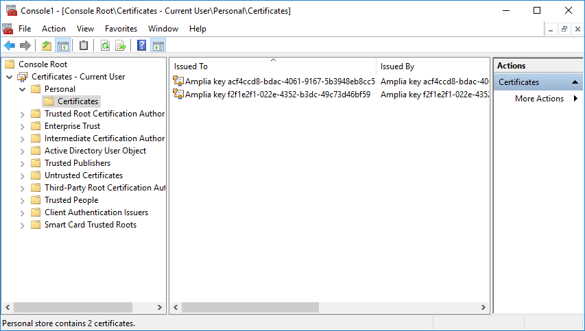

# Native Key Stores - Amplia

> [!IMPORTANT]
> **Native Key Stores are deprecated**. Please use the [Database Key Store](database.md) instead, which offer the same capabilities, are more widely compatible
> and can be used on high-availability scenarios.

> [!NOTE]
> Native Key Stores are compatible with Windows Server and Linux installations only. On Azure App Services, use an [Azure Key Vault key store](azure.md) instead.

Keys can be stored on the operating system's **native key store**, which is actually an abstract concept with different
meanings depending on the platform on which Amplia is running.

In this abstraction, two key stores are defined:

* The **user store** is a key store dedicated to the application user and does not require the application to have administrative privileges
* The **machine store** is a key store shared among all applications running on the same machine, and requires administrative privileges to be accessed

> [!TIP]
> Since using the machine store requires elevating the application user, it is generally preferrable to use the **user store**.

Native key stores have the following advantages:

* Keys are stored with no additional cost
* Keys can be backed up (unless you opt to generate non-exportable keys)

However, they also have disadvantages:

* Since the keys are usually stored on files on the server file system, it can be difficult to restrict access to them
* Since each web server has its own native stores, deployments with multiple web servers (either for failover or load balacing) cannot use native stores

See the sections below to understand the actual meaning of native key stores on each of the supported platforms, how to backup keys and how to configure
Amplia to use native key stores.

## Windows Server native key stores

On Windows Server, keys stored on native key stores are actually persisted as self-signed certificates with an associated private key on either
the current user or local machine's *Personal* certificate stores (also called the store *My*):



> [!WARNING]
> In order to use native key stores on Windows Server you must [configure Amplia to use a local user account](../windows/configure-app-user.md), otherwise
> you will not be able to backup the generated keys.

To backup keys stores on the *user store*:

1. On *Windows Explorer*, navigate to the folder *C:\Windows\System32* and locate the executable **mmc.exe**
1. **Hold the SHIFT key and right-click the file**, then click on **Run as different user**
1. Enter the username and password of the local account created for Amplia (see warning above)
1. Click *File* and then *Add/Remove Snap-in...*
1. Select the **Certificates** snap-in and click *Add*
1. Choose the **My user account** option, and then *Finish*, and *OK* on the previous dialog
1. Expand the item *Certificates - Current User*, and the folder **Personal** under it
1. Click the folder *Certificates*
1. Right-click the certificate corresponding to the key you want to backup, select *All Tasls*, then **Export...**
1. Choose **Yes, export the key**
1. Leave the default options on the next step (*Export File Format*)
1. Enter a strong password to protect the .PFX file
1. Enter a location for the .PFX file

To use the *machine key store* on Windows Server, after you [configure Amplia to use a local user account](../windows/configure-app-user.md)
you must [add the application user to the local *Administrators* user group](../windows/configure-app-user.md#grant-admin).

To backup keys stored on the *machine store*, repeat the process above but, on **step 6**, choose **Computer account** instead.

## Linux native user key store

On Linux, keys stored on the native user store are stored as PFX files containing a self-signed certificate with the corresponding key,
stored on the directory */var/amplia/.dotnet/corefx/cryptography/x509stores/my*.

> [!NOTE]
> The native machine key store is not supported on Linux.

The PFX files have no password, so the keys are essencially stored in plain text. Therefore, it is essencial to restrict access to the directory.
That is why, during the installation, a `sudo chmod -R a=,g=rX,u=rwX /var/amplia` is performed, removing all access from "others" (except members of the
*amplia* group and sudo users).

> [!TIP]
> For additional key protection on Linux environments, consider using an HSM or Azure Key Vault.

To backup the keys, simply backup the directory mentioned above (sudo required).

## Configuring Amplia to use native key stores

Unlike other key stores, you don't need to add entries to the **KeyStores** configuration section to use native key stores. Instead,
they can be enabled on the section **Amplia** of the configuration file:

* `NativeUserKeyStoreEnabled`: set this setting to `true` to enable the native user store, called *NativeUser*
* `NativeMachineKeyStoreEnabled`: set this setting to `true` to enable the native machine store, called *NativeMachine* (not available on Linux)

You can use the names of the stores mentioned above to configure the `DefaultKeyStore`. For instance:

```json
	...,
	"Amplia": {
		...,
		"NativeUserKeyStoreEnabled": true,
		"DefaultKeyStore": "NativeUser",
		...
	},
	...
```

### Generating non-exportable keys

If you want to generate non-exportable keys on a native key store, instead of using the simplified configuration method mentioned above,
you must add an entry to the **KeyStores** configuration section, like either of the illustrated below:

```json
	...,
	"KeyStores": {
		...,

		"NativeUser": {
			"Type": "Native",
			"ExportableKeys": true
		},

		...,

		"NativeMachine": {
			"Type": "Native",
			"UseMachineStore": true,
			"ExportableKeys": true
		},

		...
	},
	...
```

> [!WARNING]
> Non-exportable keys on native stores cannot be backed up!

## See also

* [Key Stores](index.md)
* [Amplia on premises](../index.md)
