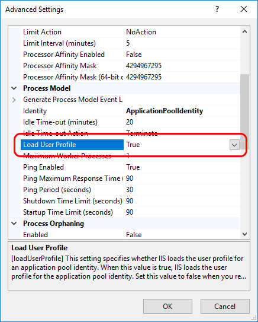

# Installing Amplia on Windows Server

To install an [on-premises](../index.md) instance of [Amplia](../../index.md) on Windows Server, follow the steps below. For other platforms, [click here](../index.md).

[!include[See planning](../includes/see-planning.md)]

## Prerequisites

* Windows Server 2016 or newer (any edition)

[!include[Common prerequisites](../includes/common-requisites.md)]

<a name="install-asp-net-core" /> <!-- TODO: move this to a better place once proper instructions are written -->

## Installation

1. Install IIS
1. https://aka.ms/dotnetcore-3-1-windowshosting
1. Create folder for site
1. Create folder for logs
1. Create site
   * Set no managed code
   * Set load user profile to `True`

     

1. Extract files

<!--
> [!NOTE]
> If you intend to to use one of the operating system's native key stores, [configure Amplia to use a local user account](configure-app-user.md)
-->

## Configuration

On the installation folder, move the file **appsettings.iis.json** from the folder **config-templates** to the root folder of the site. Then, edit the file
to configure your Amplia instance.

[!include[Database config](../includes/database-config.md)]

### Logging

Under section **Serilog**, configure the application logging:

```json
...
"Serilog": {
	"MinimumLevel": {
		"Default": "Warning",
	},
	"WriteTo": [
		{
			"Name": "File",
			"Args": {
				"path": "C:\\Logs\\Amplia.log",
				"outputTemplate": "{Timestamp:yyyy-MM-dd HH:mm:ss.fff zzz} [{Level:u3}] [{SourceContext}] {Message:lj}{NewLine}{Exception}",
			}
		}
	],
}
...
```

Change the **path** setting to the log file path.

> [!NOTE]
> Remember to grant full access to the application user on the log folder

<a name="encryption-key-generation" /> <!-- This anchor actually belongs a bit farther below, placing it here is a workaround -->

[!include[General config](../includes/general-config.md)]

To generate the *EncryptionKey*, run the following on a Powershell:

```ps
$k = New-Object byte[] 32;
[System.Security.Cryptography.RandomNumberGenerator]::Create().GetBytes($k);
[Convert]::ToBase64String($k);
```

<!--
$p = Read-Host -AsSecureString
$c = New-SelfSignedCertificate `
	-Subject "CN=Amplia Encryption Certificate,O=Contoso Inc" `
	-CertStoreLocation "Cert:\CurrentUser\My"
Export-PfxCertificate $c -FilePath amplia-encryption.pfx -Password $p
$c|rm
Import-PfxCertificate amplia-encryption.pfx -Password $p -CertStoreLocation "cert:\CurrentUser\My"
-->

[!include[Common config](../includes/common-config.md)]

## Starting up application

1. Start site
1. Access site

## See also

* [Key Store configuration](../key-stores/index.md)
* [Updating Amplia on Windows Server](update.md)
* [Troubleshooting](troubleshoot/index.md)
