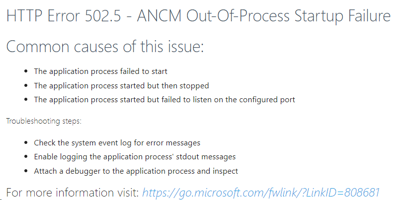

# HTTP Error 502.5 - ANCM Out-Of-Process Startup Failure (Windows Server)

After installing or updating the system, you may receive the error *HTTP Error 502.5 - ANCM Out-Of-Process Startup Failure* upon accessing the website:



The main cause for this problem is not having previously installed the .NET Core Runtime 2.2 ([download it here](https://dotnet.microsoft.com/download/thank-you/dotnet-runtime-2.2.5-windows-hosting-bundle-installer)).

To check that the .NET Core Runtime 2.2 is installed, run the following command on a command prompt or Powershell:

```sh
dotnet --info
```

Look for the section *.NET Core runtimes installed* on the output. There should be at least one *AspNetCore* entry with version 2.2.x:

```
...
.NET Core runtimes installed:
  Microsoft.AspNetCore.All 2.2.4 [C:\Program Files\dotnet\shared\Microsoft.AspNetCore.All]
  Microsoft.AspNetCore.App 2.2.4 [C:\Program Files\dotnet\shared\Microsoft.AspNetCore.App]
  Microsoft.NETCore.App 2.2.4 [C:\Program Files\dotnet\shared\Microsoft.NETCore.App]
...
```

Although this is the main cause, there are several other factors that may cause this issue. To diagnose the root cause, see
[Troubleshooting startup errors](startup-errors.md).
