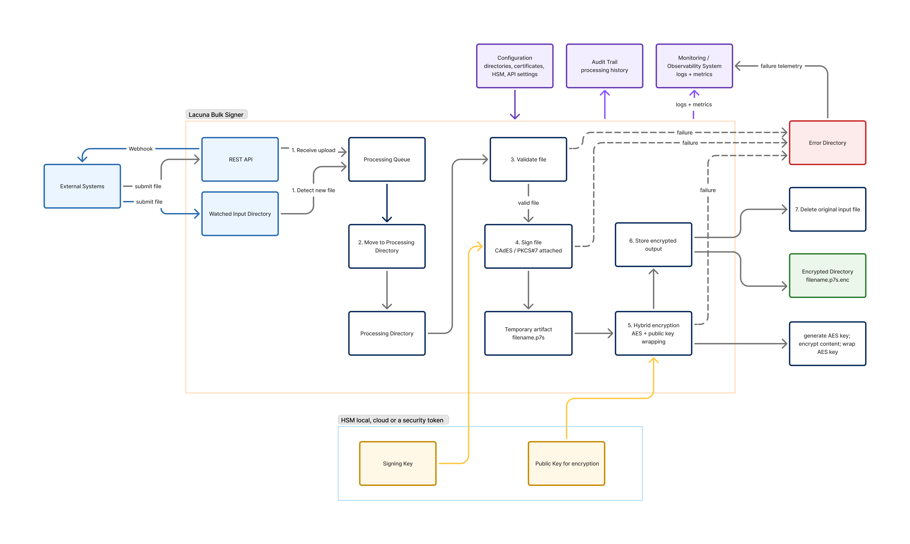

# Lacuna Bulk Signer

<!-- link to version in Portuguese -->
<div data-alt-locales="pt-br"></div>

**Bulk Signer** is an on-premises application designed to sign and process large volumes of files securely and automatically. It monitors configured folders for new files, processes them sequentially, applies digital signatures using certificates stored in a secure environment such as an HSM, and saves the signed output in the configured destination folder.

The application supports multiple digital signature formats, including **CAdES**, **XAdES**, and **PAdES**, allowing it to process different types of documents such as generic files, XML files, and PDF documents. After signing, Bulk Signer can also encrypt files using a public key, ensuring that only authorized recipients can access the final content.

Bulk Signer can run on **Windows, Linux, or Docker**, making it suitable for different infrastructure environments. It also provides a **web dashboard** where users can track file processing progress, view statistics, monitor successful and failed operations, and review the current processing status.

In addition to folder monitoring, the application exposes **REST APIs** that allow external systems to submit files for signing, check processing status, and retrieve signed results. Access to the dashboard and APIs is protected by **API key authentication**.

## Principal features

* Automatic folder monitoring for new files
* Digital signing with certificates stored in an HSM
* Support for CAdES, XAdES, and PAdES signatures
* Optional file encryption after signing
* REST APIs for external file submission
* Web dashboard for progress tracking and statistics
* Linux, Windows and Docker support
* Sequential background processing for predictable execution
* Verification of signed output before deleting original files
* Error tracking and processing history

Bulk Signer is ideal for organizations that need a reliable, secure, and auditable solution to automate high-volume digital signing processes.


## Architecture

The diagram below summarises how a file flows through the system, from submission (REST API or watched folder) through signing, optional hybrid encryption, and final storage in the encrypted output directory. The HSM (local, cloud, or security token) holds both the signing key and the recipient public key used for encryption.



Processing is sequential and idempotent at each step. Any failure short-circuits the pipeline, moves the file to the **Error Directory**, and emits failure telemetry to the observability system — the original input is only deleted after a verified output has been written.

## Default endpoints

The app listens on `http://localhost:8080` by default:

* `GET /` — service identification (anonymous)
* `GET /api/health` — liveness (anonymous)
* `GET /api/ready` — deep readiness check (anonymous)
* `POST /api/files` — upload a file for signing (multipart, `X-API-Key`)
* `GET /api/jobs`, `GET /api/jobs/{id}`, `GET /api/jobs/{id}/output`
* `POST /api/jobs/{id}/retry`, `POST /api/input/rescan`, `POST /api/cleanup/run`
* `GET /metrics` (API key)
* `/scalar/v1` — interactive OpenAPI UI (Development; Production behind `Swagger:EnabledInProduction`)
* `/` (dashboard) — login at `/login`

## Exit codes

```text
0  Success / graceful shutdown
1  Unexpected fatal error
2  Configuration error
3  Database initialization/migration error
4  Required folder creation/access error
5  Signing certificate initialization error
```

## See also

* [Configuration](configuration.md)
* [REST API](rest-api.md)
* [Dashboard](dashboard.md)
* [Setup on Docker](docker.md)
* [Setup as a Windows Service](windows-service.md)
* [Setup with Linux systemd](linux-systemd.md)
* [Troubleshooting](troubleshooting.md)
