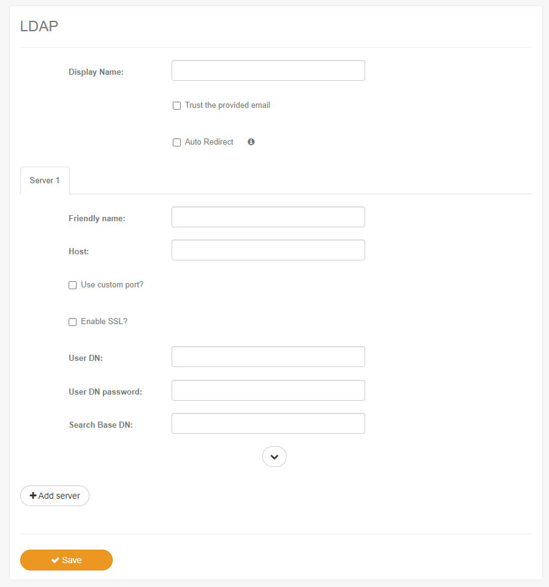
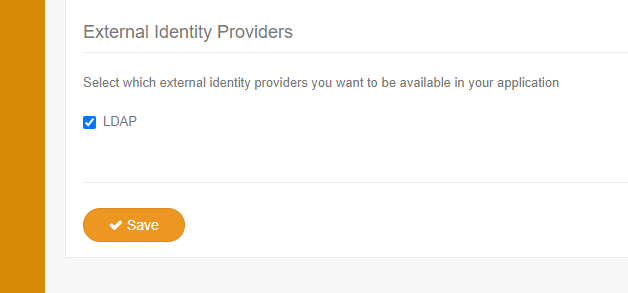

# LDAP Integration (Preview)

##  Application Login

To use LDAP for Application Login, you must configure it as an External Identity Provider by providing one or multiple LDAP servers information:

* Friendly Name: a name that identifies that particular server. If your users log in by providing the username in the format `name\user`, the friendly name should match the part 
behind the backslash.
* Host: the hostname or IP address of the server that will be used for LDAP connections.
* Use custom port: enables you to set a custom port for the LDAP connection to this server.
* Enable SSL: use this option if the LDAP connection should use SSL. If a port is not defined and this setting is checked, the application will use port `636`, otherwise `389` is used.
* User DN: the Distinguished Name (DN) of the account that will be used for querying users.
* User DN password: the password of the account that will be used for querying users.
* Search Base DN: the Distinguished Name (DN) of the container of users that will be queried.
* Search Filter (optional): a LDAP filter for matching the users. By default (if this setting is not provided), users will be queried by their User Principal Name (UPN) **or** SAM Account Name.
* Mobile Phone Attribute (optional): defines the LDAP attribute used to retrieve a user's phone number.

You may also configure this provider with the auto redirect option so users cannot user any other authentication method while logging in. If you choose this option, it is recommended to 
disable signup in your application settings and also disable profile editing in the subscription settings.

After the LDAP settings are configured, enable the provider in the application settings:

## User Configuration

In order for the login process to be completed successfully, the users must have the required information set in their accounts.
The following list defines the required information and which LDAP attributes are used by the application in order to obtain those informations.

* Name: the name of the user in the application will be determined by the LDAP `displayName` attribute. 
* Email: the email of the user. This information must be unique and will be determined by the LDAP `mail` attribute.
* Phone (optional): by default the application will query the user for an attribute named `Mobile` in order to retrieve the user's mobile phone number. 
The attribute name may be overriden by configuring the optional server setting `Mobile Phone Attribute`.