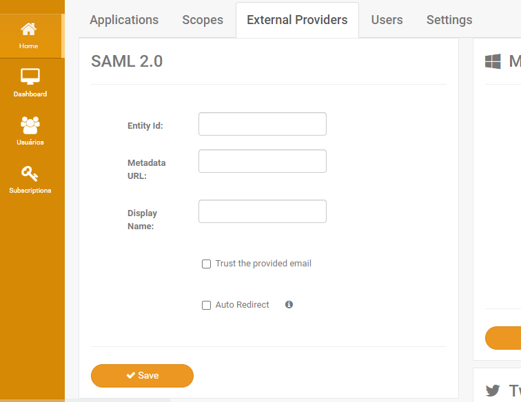
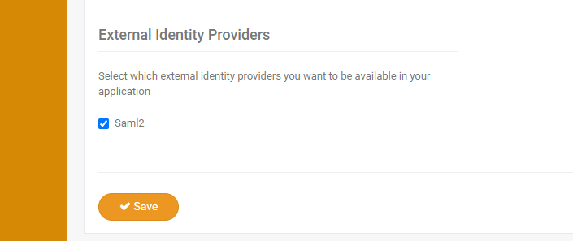

# SAML 2 Integration

##  Console Login

Console login with SAML 2 integration is configured in the app settings. You must set the fields in the "Saml2" section:

* **Enabled**: defines if integration is enabled for Console login.
* **EntityId**: the Entity ID of the Identity Provider you want to connect to.
* **MetadataUrl**: The URL to the metadata file for the Identity Provider you want to connect. For ADFS tipically it is 
`https://<domain>/federationmetadata/2007-06/federationmetadata.xml`.
* **DisplayName**: the name to display in the button that triggers the SAML 2 login.
* **ADCompatibilityEnabled**: defines if user permissions should be granted to the user based on the groups he is in. The group name determines the level
of access: `<subscription-namespace>-grantid-administrators` for administrators and `<subscription-namespace>-grantid-managers` for managers.
* **GroupClaimName** (default: `http://schemas.xmlsoap.org/claims/Group`): the name of the claim to use as groups if AD compatibility mode is enabled.

After the Saml2 settings are configured, access the URL in GrantID AuthServer: `https://<auth-server-url>/Saml2` to download GrantID Metadata file. Use this file to configure
a Relying Party Trust in the chosen Identity Provider.

##  Application Login

To use Saml2 for Application Login, you must configure it as an External Identity Provider by setting the EntityId and Metadata URL:

You may also configure this provider with the auto redirect option so the user nevers sees GrantID login page. If you choose this option, it is recommended to disable signup
in your application settings and also disable profile editing in the subscription settings.

After the Saml2 settings are configured, access the SAML 2 endpoint of your subscription url: `https://<subscription-url>/Saml2` to download GrantID Metadata file. 
Use this file to configure a Relying Party Trust in the chosen Identity Provider.

Finally, enable the provider in the application settings:

##  Claims Configuration

Regardlesss of your choice of login (Console or Application) you must configure the Claims Issuance Policy in the Relying Party Trust to send the following claims:

* Name: name of the user. The type must be `http://schemas.xmlsoap.org/ws/2005/05/identity/claims/name`.
* Email: email of the user. The type must be `http://schemas.xmlsoap.org/ws/2005/05/identity/claims/emailaddress`.
* NameID: user unique ID, it is recommended to be set as the email of the user. The type must be `http://schemas.xmlsoap.org/ws/2005/05/identity/claims/nameidentifier`.
* Phone (optional): mobile phone number of the user. The type must be `http://schemas.xmlsoap.org/ws/2005/05/identity/claims/mobilephone` or simply `phone`.
* Group (optional, used only for Console login): list of groups (each claim should have only one value) of the user (`Token-Groups - Unqualified names` in AD FS). 
The type is set by the GroupClaimName setting.