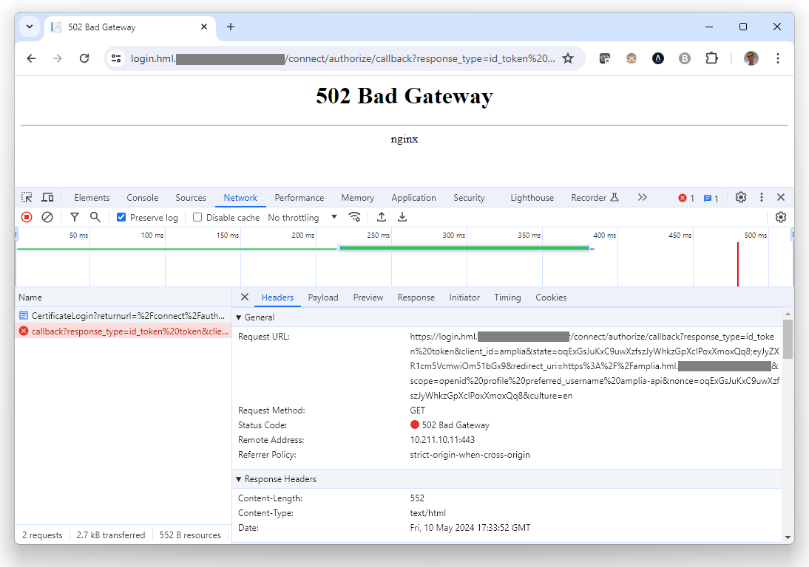
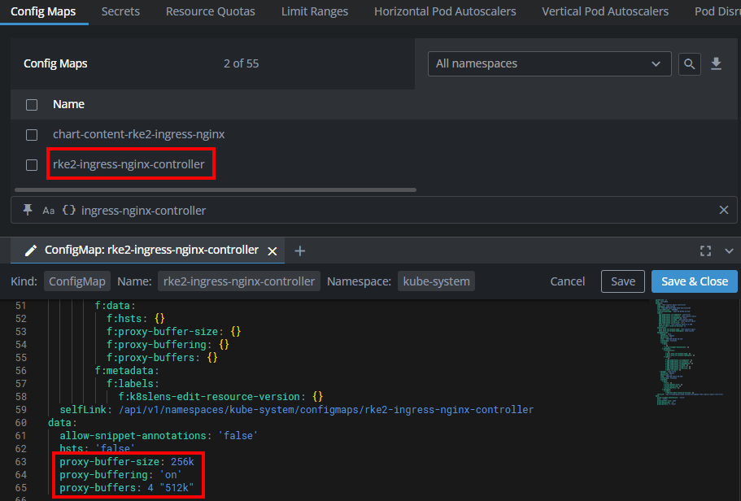

# Troubleshooting - GrantID

Here you can find information that may help you to diagnose problems on your [on-premises](index.md) instance of [GrantID](../index.md).

## Nginx returns *502 Bad Gatewway* when accessing */connect/authorize/callback* during authentication flow

On scenarios on which an nginx reverse proxy is used, a *502 Bad Gatewway* error may occur during the authentication flow, more specifically when
*/connect/authorize/callback* is called:

> [!NOTE]
> This issue can affect instances on AWS and also on Kubernetes when using an nginx-based ingress



To fix this, set the following settings on your nginx configuration file:

```nginx
proxy-buffer-size: 256k
proxy-buffering: 'on'
proxy-buffers: 4 "512k"
```

For instance:

```nginx
server {

    ...

    location / {
        proxy_pass         ...
        ...
        proxy-buffer-size: 256k
        proxy-buffering: 'on'
        proxy-buffers: 4 "512k"
    }
}
```

On Kubernetes, these are usually set on the ingress controller's config map:



## See also

* [GrantID Settings](settings.md)
* [Serilog Configuration](serilog.md)
