# Blob Storage Configuration

The **BlobStorage** configuration section defines how an application stores and retrieves files.

## File System

Stores files in the file system. Available settings:

* **Path**: the path to where the files will be stored.

Example (environment variables):

```bash
BlobStorage__Type=FileSystem
BlobStorage__Path=/var/files/myapp
```

Example (*.ini* or *.conf* file):

```ini
[BlobStorage]
Type=FileSystem
Path=/var/files/myapp
```

Example (JSON configuration):

```json
{
	...,
	"BlobStorage": {
		"Type": "FileSystem"
		"Path": "/var/files/myapp"
	},
	...
}
```

## Azure Storage Account

Stores files in an Azure Storage Account Container. Available settings:

* **ConnectionString**: the connection string for the Storage account.
* **ContainerName**: the name of the container where the files will be stored.

Example (environment variables):

```bash
BlobStorage__Type=Azure
BlobStorage__ConnectionString=DefaultEndpointsProtocol=https;AccountName=myaccountname;AccountKey=myaccountkey;EndpointSuffix=core.windows.net
BlobStorage__ContainerName=myapp-container
```

Example (*.ini* or *.conf* file):

```ini
[BlobStorage]
Type=Azure
ConnectionString="DefaultEndpointsProtocol=https;AccountName=myaccountname;AccountKey=myaccountkey;EndpointSuffix=core.windows.net"
ContainerName=myapp-container
```

Example (JSON configuration):

```json
{
	...
	"BlobStorage": {
		"Type": "Azure",
		"ConnectionString": "DefaultEndpointsProtocol=https;AccountName=myaccountname;AccountKey=myaccountkey;EndpointSuffix=core.windows.net",
		"ContainerName": "myapp-container"
	},
	...
}
```

## AWS S3 (Simple Storage Service)

Stores files in an S3 Bucket. Available settings:

* **Region**: the region of the bucket.
* **BucketName**: the name of the Bucket where the files will be stored.
* **AccessKey**: the access key ID of an IAM user that has access to the bucket. 
* **SecretKey**: the secret access key of an IAM user that has access to the bucket. 

Example (environment variables):

```bash
BlobStorage__Type=AwsS3
BlobStorage__Region=us-east-1
BlobStorage__BucketName=myappbucket
BlobStorage__AccessKey=MYACCESSKEYID
BlobStorage__SecretKey=MYSECRETACCESSKEY
```

Example (*.ini* or *.conf* file):

```ini
[BlobStorage]
Type=AwsS3
Region=us-east-1
BucketName=myappbucket
AccessKey=MYACCESSKEYID
SecretKey=MYSECRETACCESSKEY
```

Example (JSON configuration):

```json
{
	...
	"BlobStorage": {
		"Type": "AwsS3",
		"Region": "us-east-1",
		"BucketName": "myappbucket",
		"AccessKey": "MYACCESSKEYID",
		"SecretKey": "MYSECRETACCESSKEY"
	},
	...
}
```

### S3-compatible object storage

A self-hosted s3-compatible object storage service, also known as an "s3 clone", may also be used, for instance [minIO](https://min.io/). In this case, instead of the
*Region*, specify the **Endpoint**.

Example (environment variables):

```bash
BlobStorage__Type=AwsS3
BlobStorage__Endpoint=http://localhost:9000
BlobStorage__BucketName=myappbucket
BlobStorage__AccessKey=MYACCESSKEYID
BlobStorage__SecretKey=MYSECRETACCESSKEY
```

Example (*.ini* or *.conf* file):

```ini
[BlobStorage]
Type=AwsS3
Endpoint=http://localhost:9000
BucketName=myappbucket
AccessKey=MYACCESSKEYID
SecretKey=MYSECRETACCESSKEY
```

Example (JSON configuration):

```json
{
	...
	"BlobStorage": {
		"Type": "AwsS3",
		"Endpoint": "http://localhost:9000",
		"BucketName": "myappbucket",
		"AccessKey": "MYACCESSKEYID",
		"SecretKey": "MYSECRETACCESSKEY"
	},
	...
}
```

By default, path-style addressing is used when an S3-compatible storage is configured, instead of the default virtual-hosted–style addressing used when a standard
AWS S3 bucket is configured. This can be changed with the **ForcePathStyle** setting (`true` or `false`). For more information on S3 addressing, see
[Virtual hosting of buckets](https://docs.aws.amazon.com/AmazonS3/latest/userguide/VirtualHosting.html).

## Google Cloud Storage

Stores files in a Google Cloud Storage bucket. You'll need a service account with a Storage Object Admin role. Available settings:

* **BucketName**: the name of the bucket where the files will be stored.
* **ProjectId**: the Google Cloud Project ID.
* **PrivateKeyId**: The ID of the service account private key.
* **PrivateKey**: The service account private key.
* **ClientEmail**: The service account email.

Example (environment variables):

```bash
BlobStorage__Type=Gcp
BlobStorage__BucketName=myappbucket
BlobStorage__ProjecId=my-app-project-id
BlobStorage__PrivateKeyId=MYPRIVATEKEYID
BlobStorage__PrivateKey=MYPRIVATEKEY
BlobStorage__ClientEmail=myserviceaccountemail@my-app-project-id.iam.gserviceaccount.com
```

Example (*.ini* or *.conf* file):

```ini
[BlobStorage]
Type=Gcp
BucketName=myappbucket
ProjecId=my-app-project-id
PrivateKeyId=MYPRIVATEKEYID
PrivateKey=MYPRIVATEKEY
ClientEmail=myserviceaccountemail@my-app-project-id.iam.gserviceaccount.com
```

Example (JSON configuration):

```json
{
	...
	"BlobStorage": {
		"Type": "Gcp",
		"BucketName": "myappbucket",
		"ProjecId": "my-app-project-id",
		"PrivateKeyId": "MYPRIVATEKEYID",
		"PrivateKey": "MYPRIVATEKEY",
		"ClientEmail": "myserviceaccountemail@my-app-project-id.iam.gserviceaccount.com"
	},
	...
}
```

### Obtaining the Google Cloud Storage settings

First we'll need a Google Cloud Storage bucket to store the files. A new bucket can be created using the **Create** button on the Google Cloud Storage console:

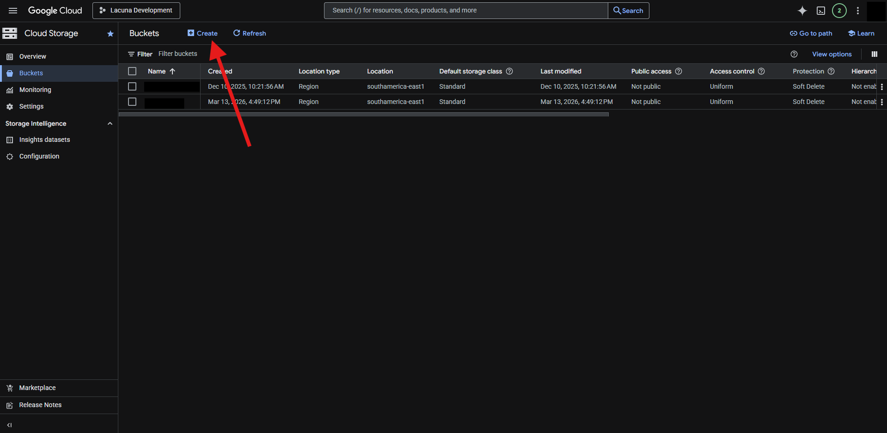

Pick a name for the new bucket and click on continue:

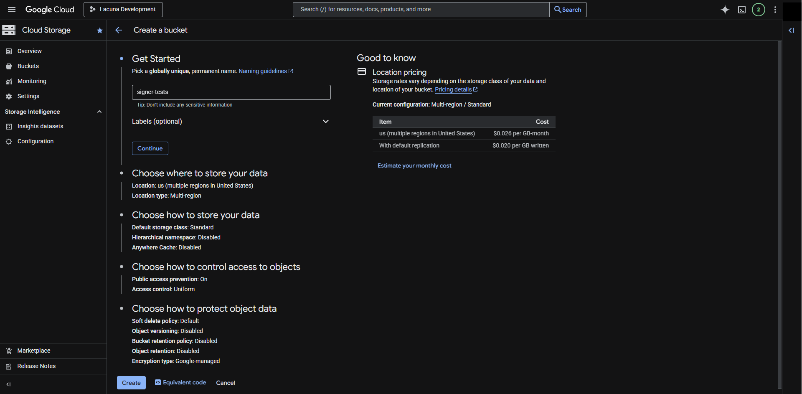

Choose the new bucket region:

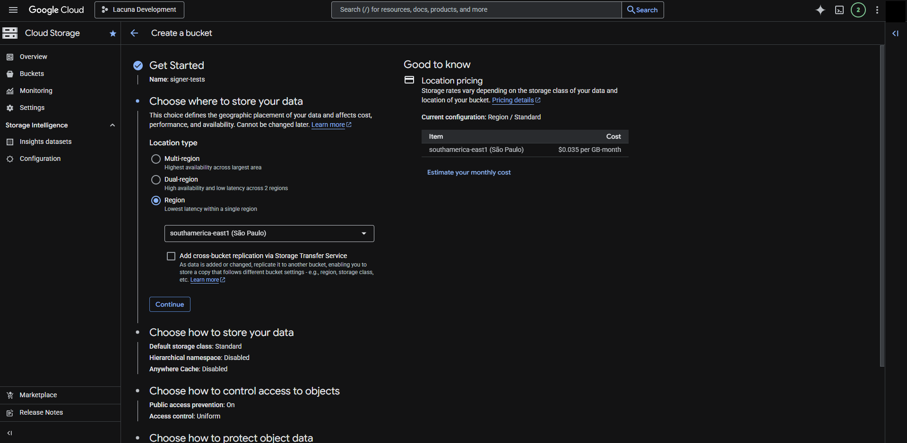

Make sure to enforce public access prevention and uniform access control for the new bucket:

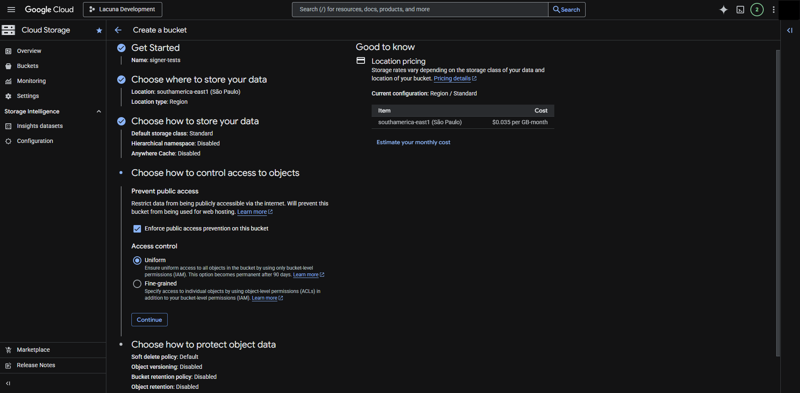

Choose the object retention policy and create the bucket:

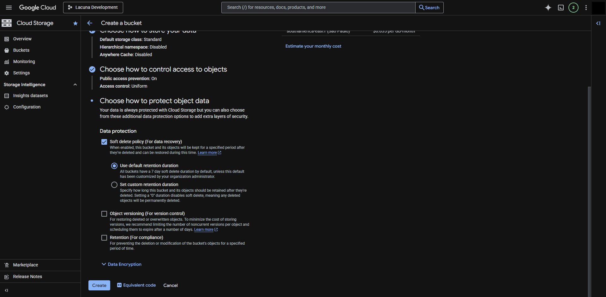

A dialog might appear to confirm that public access will be prevented. Click on confirm to continue:

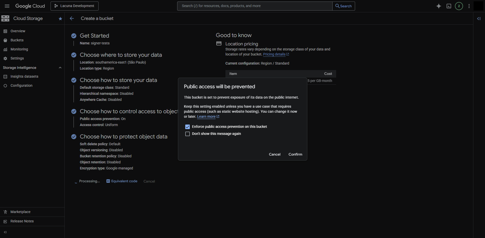

Next we need to create a Google Cloud service account to access the bucket. This can be done using the **Create service account** button on the *Service Accounts* page under *IAM & Admin*:

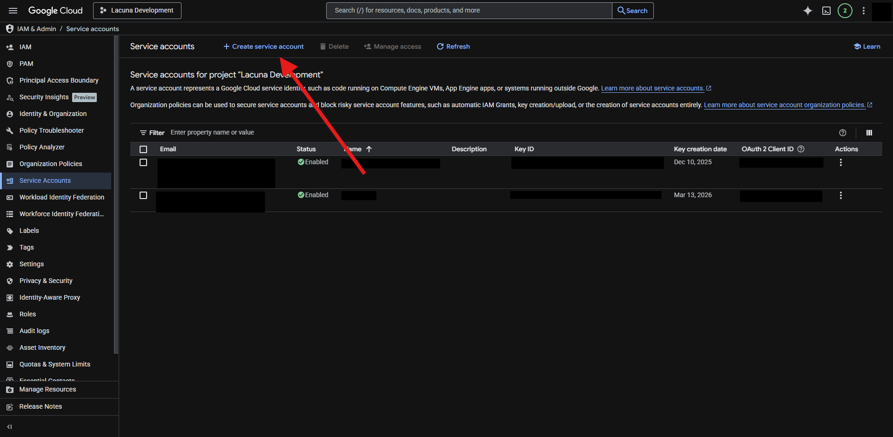

We'll also need a name for the new service account. Choose it and click on **Create and continue**:

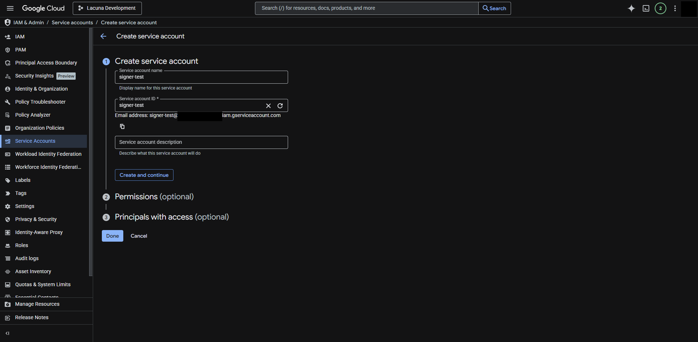

Ensure the new service account is given the Storage Object Admin role:

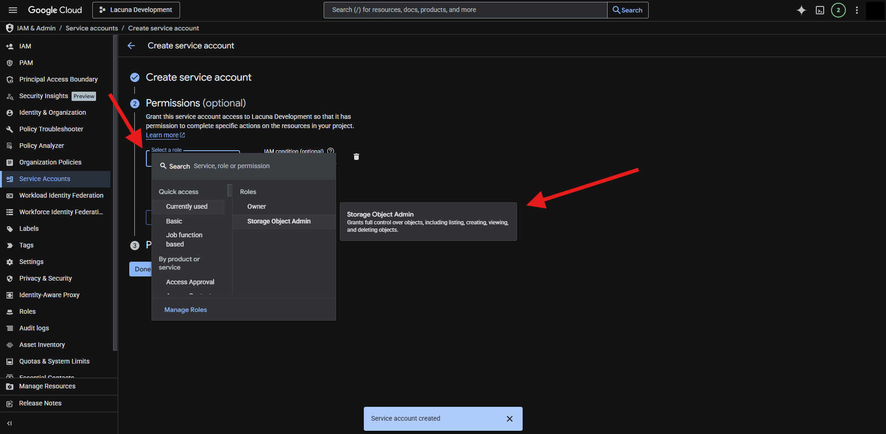

Grant access to principals if needed and click on done to finish the new service account creation process:

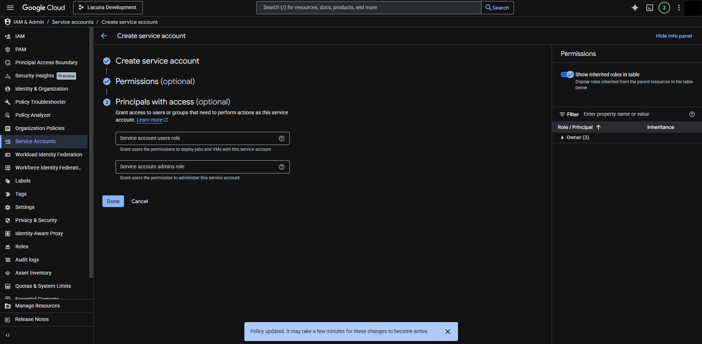

Now that the service account is created we need a key to authenticate it. Click on new service account to open its details page:

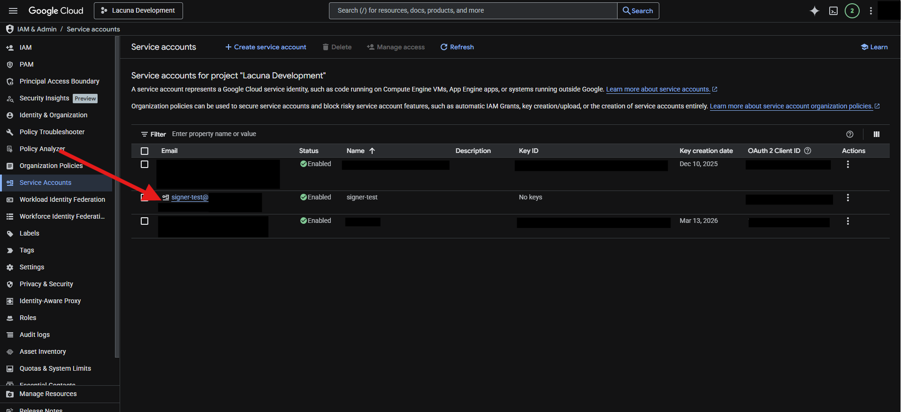

Inside the service account details, go to the keys section:

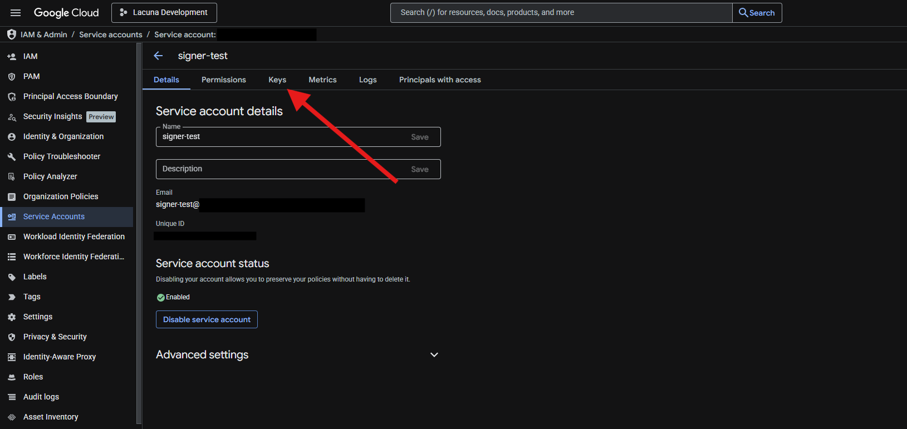

Under the **Add key** option, choose **Create new key**:

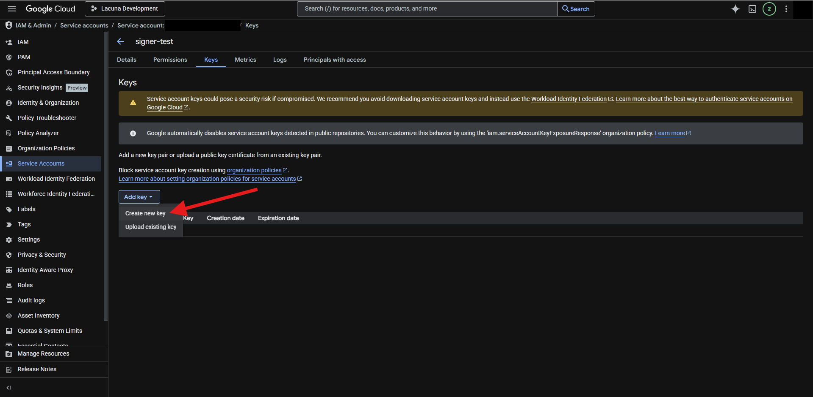

Choose the JSON format and click on the **Create** button:

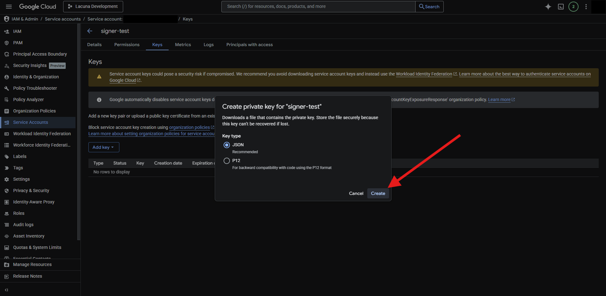

A JSON file will be downloaded containing the private key and other information related to the service account:

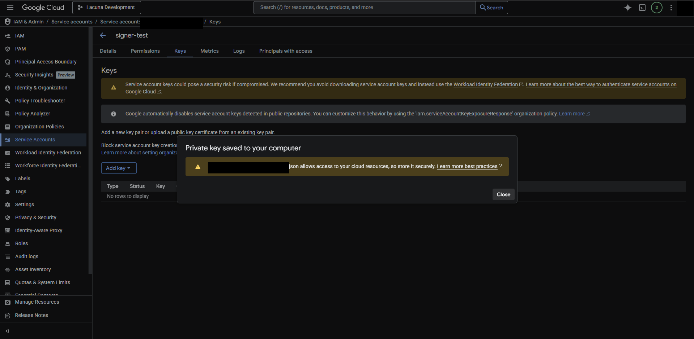

Inside the JSON file you'll be able to obtain the `project_id`, `private_key_id`, `private_key` and `client_email` fields to configure the Blob Storage service.

> [!IMPORTANT]
> The information inside this JSON file allows access to the GCP resources and must not be compromised! Make sure to store or dispose of it securely.
