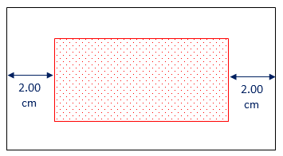
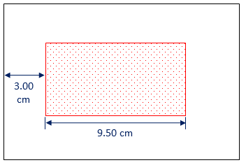
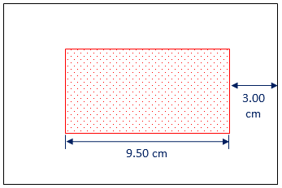
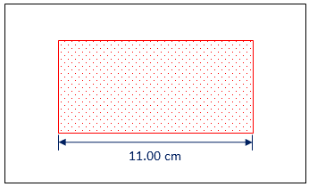

## Container

A container has the following parameters `Top`, `Bottom`, `Left`, `Right`, `Width` and `Height` as shown in the figure below.

The container, marked in red, has margins related to the parent element.

To instantiate a container, you must not set all parameters. The sets of specific parameters result in different behaviors. The container's horizontal dimensions explanation is as follows (vertical dimensions are analog to horizontal dimensions, as shown at the end of this page).

### Fluid

Setting `Left` and `Right` parameters, the container will keep the given margin dimensions. The `Width` will adjust itself to fill all the remaining horizontal space, as shown in the figure below.

### Left ancored

Setting `Left` and `Width` parameters, the container will keep the given left margin and width. The right margin will adjust itself to the reaming horizontal space, as shown in the figure below.

### Right ancored

Setting `Right` and `Width` parameters, the container will keep the given right margin and width. The left margin will adjust itself to the remaining horizontal space, as shown in the figure below.

### Centered

Setting only the `Width` parameter, the container will keep the given width. And it will be horizontally centered, as shown in the figure below.

## Vertical dimensions

The vertical dimensions are analog to the horizontal dimensions shown above. If you substitute `Left` and `Right` by `Top` and `Bottom`, and `Width` by `Height`, you get the analog behavior.