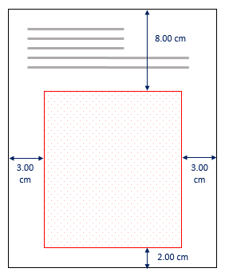
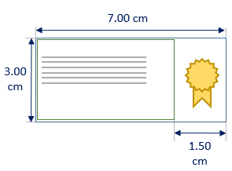
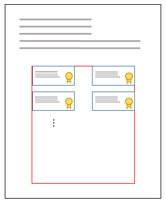

# Samples

## Automatic positioning sample

This sample creates a customized automatic positioning applied in the document's last page.

The model below shows the measures used on the container that delimits the region where the visual representation will be inserted and automatically ordered.



The following code exemplifies how to set the container's parameters.

```php
// Visual representation positioning container.
$container = array(
    'left' => 3.00,
    'right' => 3.00,
    'bottom' => 2.00,
    'top' => 8.00
);
```

For more information on how to set Containers, read the article [Defining a container](containers.md)

Each inserted signature has a visual representation. The model below shows its rectangle, text, and image parameters.



The external signature's rectangle will be 3cm x 7cm. It will have a badge as a background image that will be right-aligned to the rectangle. The text's container will have a right margin of 1.50cm so to avoid the text overlapping the image. The following code shows how to set these parameters. 

```php
// Visual representation rectangle
$signature = array(
    'height' => 3.0,
    'width' => 7.0
);

// Text container
$textContainer = array(
    'left' => 0,
    'right' => 1.5,
    'bottom' => 0,
    'top' => 0
);

// Background image
$image = array(
    'resource' => array(
        // To be inserted image bytes
        'content' => getPdfStampContent()
    ),
    // Right-align image inside the visual 
    // representation rectangle. Valid values are
    // 'right', 'center' and 'left'.
    'horizontalAlign' => 'right',
    // Vertically centralize the image inside the
    // representation rectangle. Valid values are 
    // 'top', 'center', 'bottom'.
    'verticalAlign' => 'center',
);
```

The image below shows the expected result of the automatically inserted visual representation after the completion of the signatures.



## Complete automatic positioning sample

```php
$signer = new PadesSigner();
$signer->setPkcs12($cert_path);
$signer->setCertPassword("password");
$signer->setPdfToSignFromContentRaw($pdfBytes);
$signer->signaturePolicy = StandardSignaturePolicies::PADES_BASIC_WITH_LTV;

// Set a file reference for the stamp file.  Note that the
// file can be referenced later by "fref://{alias}" at the
// "url" field on the visual representation.
$signer->addFileReference('stamp', getPdfStampPath());

// Create a visual representation.
$visual = array(
    'position' => array(
        'pageNumber' => -1,
        // Set the measurement unit of the parameters as
        // centimeters (default measurement unit). Valid 
        // values are 'centimeters' and 'pdfPoints'. 
        'measurementUnits' => 'centimeters',
        // Set automatic positioning.
        'auto' => array(
            // Set the visual representation positioning
            // container.
            'container' => array(
                'left' => 3.00,
                'right' => 3.00,
                'bottom' => 2.00,
                'top' => 8.00
            ),
            // Set the visual representation rectangle.
            'signatureRectangleSize' => array(
                'height' => 3.0,
                'width' => 7.0,
            ),
            // Set the distance between lines of visual
            // representations.
            'rowSpacing' => 1.0,
            // Horizontally insert representations from
            // left to right (default behavior). Valid
            // values are 'leftToRight' and 'rightToLeft'.
            'horizontalDirection' => "leftToRight",
            // Vertically insert representations from top
            // to bottom (default behavior). Valid values
            // are 'leftToRight' and 'rightToLeft'.
            'verticalDirection' => "topDown",
        )
    ),
    'text' => array(    // Visual representation text.
        // Set text to be rendered. For a full list of the
        // supported tags, see:
        // https://github.com/LacunaSoftware/RestPkiSamples/blob/master/PadesTags.md
        'text' => 'Signed by {{name}} ({{national_id}})',
        // Set text's font size.
        'fontSize' => 13.0,
        // Specify that the signing time should also be 
        // rendered.
        'includeSigningTime' => true,
        // Set container's text as right-aligned. Valid
        // values are 'right' and 'left'.
        'horizontalAlign' => 'right',
        // Optional. Set the container within the signature
        // rectangle on which to place the text. By
        // default, the text can occupy the entire 
        // rectangle (how much of the rectangle the text
        // will actually fill depends on the length and 
        // font size).
        'container' => array(
            'left' => 0,
            'top' => 0,
            'right' => 1.5,
            'bottom' => 0, 
        ),
    ),
    'image' => array(    // Visual representation image.
        'resource' => array(
            // Reference to the image.
            'url' => 'fref://stamp',
        ),
        // Right-align image inside the visual 
        // representation rectangle. Valid values are
        // 'right', 'center' and 'left'.
        'horizontalAlign' => 'right',
        // Vertically centralize the image inside the
        // representation rectangle. Valid values are 
        // 'top', 'center', 'bottom'.
        'verticalAlign' => 'center',
    )
);

// Set signature visual representation.
$signer->setVisualRepresentation($visual);

// Generate the name of the signed PDF file with visual 
// representations.
$signedPdf = generateFileId('pdf');
$signer->setOutputFile($signedPdf);
// Sign document and insert visual representations.
$signer->sign();
```

The above code results in the following signed PDF file.

