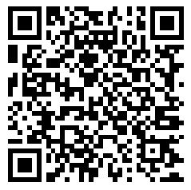
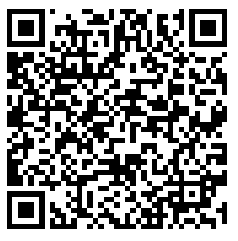

# Test certificates

If you need test certificates to use in a development or staging environment, you can
use one of the certificates in our test PKI.

> [!WARNING]
> The Lacuna Test PKI should never be trusted in a production environment!

<br />
<center>
**[Download test certificates](https://docs.lacunasoftware.com/en-us/content/test-certs.zip)**
</center>
<br />

All files are PKCS #12 certificates with password **1234**. The following certificates are included:

* Alan Mathison Turing
    * Email: testturing@lacunasoftware.com
    * ICP-Brasil mock certificate with CPF 56072386105
* Ferdinand Georg Frobenius
    * Email: testfrobenius@lacunasoftware.com
    * ICP-Brasil mock certificate with CPF 87378011126
* Pierre de Fermat
    * Email: test@lacunasoftware.com
    * ICP-Brasil mock certificate with CPF 47363361886
* Wayne Enterprises, Inc 
	* Email: test@wayneenterprises.com
    * ICP-Brasil mock certificate with CNPJ 34785515000166	
	* Legal representative: Bruce Wayne mock certificate with CPF 47891178631

> [!TIP]
> The Lacuna Test PKI is not trusted by default on our [sample projects](https://github.com/LacunaSoftware/PkiSuiteSamples). See
> sections below for instructions on how to configure your application to accept test certificates.

If you need a certificate with a particular information, [issue a test certificate](https://demos.lacunasoftware.com/en/demos/generate-certificate) yourself.

Always remember to **remove the trust in the Lacuna Test PKI security context when you're moving to a production environment**. Better yet, use some sort of conditional compilation so that the test PKI is only trusted when running in debug mode.

## Configuring Rest PKI

The Lacuna Test PKI security context ID is:

```
Lacuna Test PKI security context ID (for development purposes only!!!):
803517ad-3bbc-4169-b085-60053a8f6dbf
```

Where you'll use it depends on the programming language you're using and on the operation you're
performing. For instance, if you are performing a PAdES (PDF) signature on PHP, edit the file `pades-signature.php`:

```php
// Trust Lacuna Test PKI (for development purposes only!!!)
$signatureStarter->setSecurityContext("803517ad-3bbc-4169-b085-60053a8f6dbf");
```
    
Or if you're using Java, edit the file `PadesSignatureController.java`:

```java
// Trust Lacuna Test PKI (for development purposes only!!!)
signatureStarter.setSecurityContext(new SecurityContext("803517ad-3bbc-4169-b085-60053a8f6dbf"));
```
Whatever operation or language you're using, it should be fairly clear from the code comments on the sample project where to put the security context ID.

From then on, the certificates in our test PKI will be trusted.

## Cloud certificates

If you need cloud certificates to use in a development or staging environment, you can use one of the bellow.

    Cliend Id: 20658903000171
    Client Secret: ocBigveadOkidgavVulnumKet3
    CPF: 02610247010

| VaultID | BirdID |
|:-------:|:------:|
| |  |
