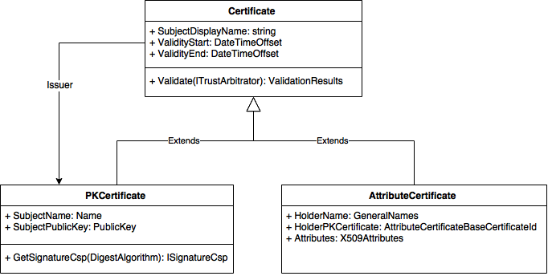

# Attribute Certificates

An attribute certificate is a structure similar to a public key certificate, 
with the difference that the attribute certificate does not contain a key. An 
attribute certificate can contain attributes that specify group membership, 
roles, security clearances or other authorization information associated with 
the certificate holder.

The PKI SDK is capable of decoding and validating attribute certificates through 
the class @Lacuna.Pki.AttributeCertificate, as well as issuing attribute 
certificates, with the class @Lacuna.Pki.AttributeCertificateGenerator.

## Class hierarchy

Because an attribute certificate is similar to a public key certificate, classes 
that represent such structures
in the SDK are related, having a common ancestor:



> [!NOTE]
> The diagram above is incomplete, showing just some of the properties and methods of each class

Note that some properties present in the @Lacuna.Pki.PKCertificate class are 
actually from the class @Lacuna.Pki.Certificate, common ancestor with the class @Lacuna.Pki.AttributeCertificate. Therefore, many of the operations
that are possible with public key certificates work the same way for attribute 
certificates, especially the property @Lacuna.Pki.Certificate.Issuer and the method @Lacuna.Pki.Certificate.Validate(Lacuna.Pki.ITrustArbitrator).

The holder information, however, is not in the ancestral class, but in the child 
classes. That's because, in the case of public key certificates, the holder 
(*subject*) is a @Lacuna.Pki.Name, whereas in attribute certificates the holder 
can be a @Lacuna.Pki.GeneralNames or or even a public key certificate. These two 
values possible are accessible by properties @Lacuna.Pki.AttributeCertificate.HolderName and
@Lacuna.Pki.AttributeCertificate.HolderPKCertificate. The property @Lacuna.Pki.Certificate.SubjectDisplayName it is a
mere visual aid to treat public key and attribute certificates as a common 
entity, but this is just one aspect in which they differ.

## Decoding and validating attribute certificates

Because of the common hierarchy with the class @Lacuna.Pki.PKCertificate, the 
decryption and validation operations for attribute certificates are very similar 
to the same operations with public key certificates:

```cs
byte[] acContent = ...;
AttributeCertificate ac = AttributeCertificate.Decode(acContent);
ValidationResults vr = ac.Validate(TrustArbitrators.Windows);
if (!vr.IsValid) {
	// ...
}
```
## Decoding attributes

An additional difficulty in handling attribute certificates is to decode the attributes contained in the certificate,
whose coding is often proprietary. The class @Lacuna.Pki.Asn1.Asn1Util provides methods for encoding and
decode ASN.1 objects, which is the encoding generally used for attributes.

To use the encoding and decoding methods, it is necessary to make classes that represent the structures that
if you want to encode and decode and denote with attributes the ASN.1 syntax of the structures, as below:

```cs
// MembershipIdAttribute ::= SEQUENCE {
//     memberId INTEGER,
//     memberNickname UTF8String
// }

[Asn1Sequence]
public class MembershipIdAttribute {

    [Asn1SequenceElement(0, Asn1PrimitiveTypes.Integer)]
    public int MemberId { get; set; }

    [Asn1SequenceElement(1, Asn1PrimitiveTypes.UTF8String)]
    public string MemberNickname { get; set; }
}

public class Program {

    public static void Main(string[] args) {

        MembershipIdAttribute memberAttribute = new MembershipIdAttribute() {
            MemberId = 12345,
            MemberNickname = "Mr. Bison"
        };

        // Encode in DER
        byte[] encodedAttribute = Asn1Util.DerEncode(memberAttribute);

        // Decode from DER/BER
        MembershipIdAttribute decodedAttribute = Asn1Util.DecodeAs<MembershipIdAttribute>(encodedAttribute);

    }
}
```
Once the classes represent the attributes and are decorated with the ASN.1 syntax indications, it is possible to obtain the attributes as follows:

```cs
byte[] acContent = ...;

// We decode the certificate
AttributeCertificate ac = AttributeCertificate.Decode(acContent);

// We look for an attribute by its OID
X509Attribute attributeObj = ac.Attributes["1.2.3.4"];

// There can be multiple values for the same OID, let's say that in this case we are only interested in the first value
byte[] encodedAttribute = attributeObj.EncodedValues[0];

// We decode the attribute
MembershipIdAttribute memberAttribute = Asn1Util.DecodeAs<MembershipIdAttribute>(encodedAttribute);
```

The method @Lacuna.Pki.X509Attributes.GetAndDecodeValueAs``1(System.String,System.Boolean) allows you to search for an attribute and decode its first value directly:

```cs
byte[] acContent = ...;

// We decode the certificate
AttributeCertificate ac = AttributeCertificate.Decode(acContent);

// We search and decode the first value of an attribute by its OID
MembershipIdAttribute memberAttribute = ac.Attributes.GetAndDecodeValueAs<MembershipIdAttribute>("1.2.3.4");
```

## See too

* @Lacuna.Pki.Certificate
* @Lacuna.Pki.AttributeCertificate
* @Lacuna.Pki.AttributeCertificateGenerator
* @Lacuna.Pki.Asn1.Asn1Util