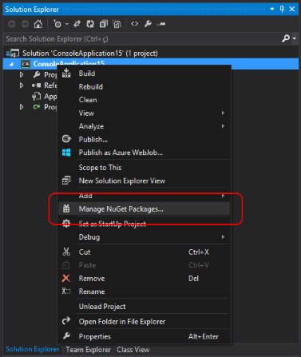
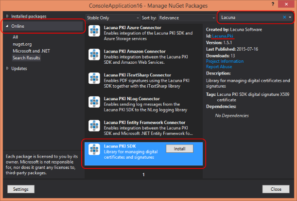

# Adding the nuget package

The SDK is distributed through the Nuget Package Manager. To add the SDK package to your project, open Nuget Package Manager (right-click on your project and click **Manage Nuget Packages...**).

Then follow the steps below:

0. Click on the item **Online** in the left column
0. Type **Lacuna** in the search field at the top right
0. SDK-related packages will appear. Click on the package **Lacuna PKI SDK**
0. Check Package Id, which should match **Lacuna.Pki**
0. Then click on **Install**

Other packages are optional and enable integration with providers such as Microsoft Azure and Amazon Web Services, as well as integration with libraries such as Entity Framework, NLog and iTextSharp. To learn more about optional packages, see [Optionals nuget packages](../optional-packages/index.md).

The next step is to configure the license to use SDK (see topic [Licensing](licensing.md)).