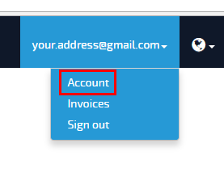
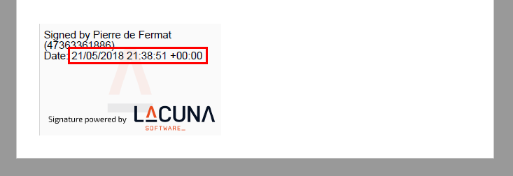
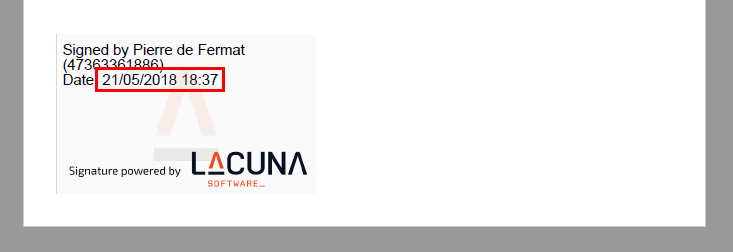

# Configure Region and Date - Rest PKI

You can change the date format and time zone used to compose dates on PDF signatures done with [Rest PKI](index.md).

To alter this configuration, follow the steps below:

1. Sign in to [https://pki.rest/]
1. On the top menu, click your email and **Account**
   
1. On the next page, use the controls on the area **Region and Date** to configure the date appearance:
   

The following configurations are available:

* Culture
* Time Zone
* Date Format

For instance, the following configuration results in the date show below:

* Culture: **Portuguese (Brazil)**
* Time Zone: **UTC**
* Date Format: **Complete with time zone**

Another possible configuration would be:

* Culture: **Portuguese (Brazil)**
* Time Zone: **(UTC-03:00) Brasilia**
* Date Format: **Short date and time**

## Date formats

The supported date formats are:

Formato                      | Culture = **English (United States)**      | Culture = **Portuguese (Brazil)**
---------------------------- | ------------------------------------------ | -------------------------------------
**Complete with time zone**  | 5/21/2018 7:48:51 PM -03:00                | 21/05/2018 19:48:51 -03:00
**Long date and time**       | Monday, May 21, 2018 7:48:51 PM            | segunda-feira, 21 de maio de 2018 19:48:51
**Short date and time**      | 5/21/2018 7:48 PM                          | 21/05/2018 19:48
**Long date and short time** | Monday, May 21, 2018 7:48 PM               | segunda-feira, 21 de maio de 2018 19:48    
**Short date and long time** | 5/21/2018 7:48:51 PM                       | 21/05/2018 19:48:51                        
