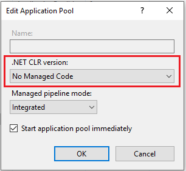

# Signer - Setup on Windows Server

To install an on-premises instance of Signer on Windows Server, first download binaries of the desired version. The latest version available is provided in the link below: 

<br />
<center>
**[Signer binaries package](https://cdn.lacunasoftware.com/signer/signer-1.49.0.zip)**
</center>
<br />

## Prerequisites

* Windows Server 2012 or newer (any edition)
* SQL Server 2014 or newer (recommended edition Standard or better)
* PKI SDK license (in Base64 format)
* Web PKI license (Base64/binary format)

## Database Requirements

* Database with collation `Latin1_General_100_CI_AI` or `Latin1_General_CI_AI`.
* Credentials corresponding to a user with `db_owner` role.

If you need help preparing the database, [click here](../prepare-database.md).

<a name="install-aspnet-core" />

## Installation

1. Install IIS
1. Install .NET Core Hosting Runtime https://aka.ms/dotnetcore-3-1-windowshosting
1. Create folder for IIS site. Example: `C:\inetpub\Signer`
1. Create folder for logs. Example: `C:\Logs`
1. Create site on IIS
1. In the corresponding Application pool:
   * Select Basic Settings and set the .NET CLR version to `No managed code`

     
   * Select Advanced Settings and set load user profile to `True`

     

1. Extract the files in the binaries package to the site folder.

> [!WARNING]
> The .NET Core Hosting Runtime should be installed after IIS, otherwise when running the website you may receive the error `500.19 (0x8007000d)`. 
> If this is your case, run the "Repair" option of the Hosting Runtime installer.

## Configuration

On the installation folder, move the file **appsettings.iis.json** from the folder **config-templates** to the root folder of the site. Then, edit the file
to configure your instance.

This file is organized in sections whose children nodes represent setting names. For instance: for the General section, to
configure the SupportEmailAddress, add/edit a Section with name `General` and add/edit the child with name `SupportEmailAddress`:

```json
...
"General": {
	"SupportEmailAddress": "support@email.com"
}
...
```

The required settings are presented below.

[!include[Database config](../../../includes/spa-config/database-config.md)]

### Logging

Under section **Serilog**, configure the application logging:

```json
...
"Serilog": {
	"MinimumLevel": {
		"Default": "Warning",
	},
	"WriteTo": [
		{
			"Name": "File",
			"Args": {
				"path": "C:\\Logs\\Signer.log",
				"outputTemplate": "{Timestamp:yyyy-MM-dd HH:mm:ss.fff zzz} [{Level:u3}] [{SourceContext}] {Message:lj}{NewLine}{Exception}",
			}
		}
	]
}
...
```

Change the **path** setting to the log file path.

> [!NOTE]
> Remember to grant full access to the application user on the log folder

[!include[OIDC config](../../../includes/spa-config/oidc-config.md)]

[!include[PKI config](../../../includes/spa-config/pki-config.md)]

### General Configuration

[!include[General config](../includes/general-config.md)]

### Bindings Configuration

* **UseReverseProxy**: set as `true` if the instance will be executed behind a reverse proxy or load balancer. It can be omitted otherwise.

[!include[Email config](../../../includes/spa-config/email-config.md)]

## Additional Configuration

Additional settings can be found at the [Signer Settings page](../settings.md).

## Starting up application

1. Start IIS site
1. Access the site URL

## Updating application

Before updating your instance, it is recommended to check the [Changelog](../../changelog.md) to see what has changed from your 
current version to the latest one available.

If any of the versions included in the update have database model changes ("Updates database model: yes") then you
should procceed carefully as the instance will attempt to update the database upon startup.

In this scenario, it is recommended to choose one of the following options:

* Reduce the number of instances to 1 (if you have multiple servers).
* Allow only one instance to update the database. This is done by adding/editing the following settings to all but one instance:

```json
"General": {
	"ProcessBackgroundJobs": "false",
	"AutoUpdateDatabase": "false"
}
```

### Update procedure

1. Stop the site in IIS Manager.
1. Create a backup of database and site folder.
1. Download and extract the contents of the new binaries package to the site folder, overwriting all files.
1. Make any necessary changes to the file `appsettings.iis.json`.
1. Start the site in IIS Manager.

> [!NOTE]
> The `appsettings.iis.json` file with your instance settings will be preserved, because in the package there is no file with that name.

## See also

* [Settings](../settings.md)
* [Access Control](../access-control.md)
* [Customization](../customization.md)