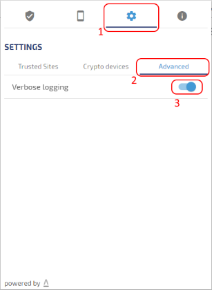

# Logs - Web PKI

The [Web PKI](index.md) is able to write logs on both browser component and native app.

## Enable browser console logs

In order to write verbose logging to the Web page console on the browser and to the native app, click the web-extension button and then select
`Settings > Advanced > Verbose logging`



## Native app logs

### Windows

On Windows, the log file is placed on:
```
%LOCALAPPDATA%\Lacuna Software\WebPKIForChrome.log
```

Note: `%LOCALAPPDATA%` is a shortcut for the current user app data directotry.

### Mac

On Mac, the log file is placed on:
```
~/.lacuna-webpki/WebPKIForChrome.log
```

Note: `~` is a terminal shortcut for the current user home directory.

>[Note]

### Linux

On Linux, the log file is placed on:
```
~/.lacuna-webpki/WebPKIForChrome.log
```

Note: `~` is a terminal shortcut for the current user home directory.