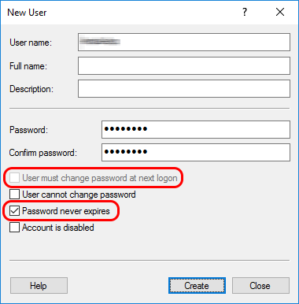

# Amplia - Configuração para usar um usuário local

Se você pretende usar o usuário atual ou a máquina local [Configuração de Key Stores](../key-stores/index.md), é altamente recomendado que você configure o Amplia para executar com
um conta de usuário local, ao contrário do padrão *application pool identify*.

Como o *app pool identify* não é uma conta de usuário completa, pode ser difícil executar determinadas  operações que podem ser necessárias ao usar os armazenamentos de chaves do sistema
operacional:

* Executar o programa com a *application pool identify*
* Adicionar a *application pool identify* para um grupo de usuários local

Para configurar o Amplia para executar como um usuário local:

1. Crie uma conta de usuário local
    1. Abra a ferramenta *Computer Management*
    1. Abaixo *System Tools*, clique no item ao lado *Local Users and Groups*, clique com o botão direito do mouse em *Users* e selecione **New User...**
    1. Digite um nome de usuário (ex.: `AmpliaApp`) e uma senha
    1. Não selecione a caixa **User must chenge password at next logon**
    1. Selecione a caixa **Password never expires**
    
        
    
    1. Clique em **Create**
1. Configure a *application pool*
    1. Abra o *Internet Information Services (IIS) Manager
    1. Expanda o item do servidor local, então clique em *Application Pools*
    1. Clique no *application pool* correspondente ao site do Amplia
    1. No menu direito, clique em *Advanced Settings*
    1. No item ***Identify***, clique no botão com **"..."**
    <!-- TODO: add image -->
    1. Clique em ***Custom account***, após clique em ***Set***
    <!-- TODO: add image -->
    1. Digite o nome de usuário e senha digitada anteriormente
    <!-- TODO: add image -->
    1. Clique em *OK*

<a name="grant-admin" />
## Adicionando o usuário do aplicativo ao grupo de Administradores

Para usar o armazenamento de chaves da máquina do sistema operacional, o usuário do aplicativo deve ser adicionado ao grupo Administradores local.

> [!WARNING]
> A menos que você pretenda usar o armazenamento de chaves da máquina local, você **NÃO DEVE** realizar este procedimento!

1. Abra a ferramenta *Computer Management* tool
1. Abaixo *System Tools*, clique no item ao lado *Local Users and Groups*, então clique em *Users*
1. Encontre o usuário do aplicativo (nome de usuário escolhido no procedimento descrito acima) e clique duas vezes nele
1. Selecione a aba *Member Of*
1. Clique em ***Add...***
1. Abaixo *From this location*:, verifique se a máquina local está selecionada (ela sempre será selecionada, a menos que o servidor faça parte de um domínio e, nesse caso, você deverá alterar a localização do domínio para a máquina local)
1. No campo de texto, digite ***Administrators*** e clique em ***Check Names***
1. Clique em *OK*

## Veja também

* [Instalando Amplia no Windows Server](install.md)
* [Configuração de Key Stores](../key-stores/index.md)
* [Resolução de problemas](troubleshoot/index.md)
