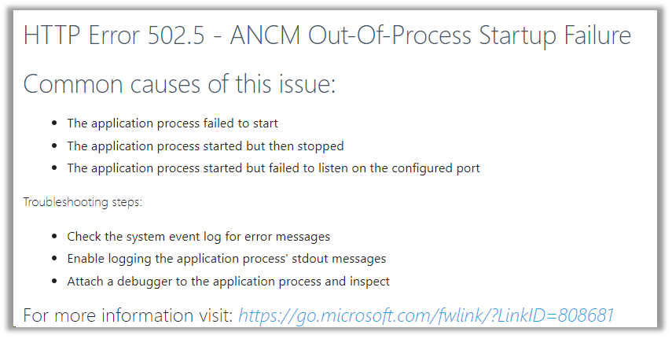

# HTTP Error 502.5 - ANCM Out-Of-Process Startup Failure (Windows Server)

Ao instalar ou atualizar o site, pode aparecer o erro *HTTP Error 502.5 - ANCM Out-Of-Process Startup Failure*:



A principal causa para esse problema é o .NET Core Runtime 2.2 não estar instalado ([baixe aqui](https://dotnet.microsoft.com/download/thank-you/dotnet-runtime-2.2.5-windows-hosting-bundle-installer)).

Para verificar que o .NET Core Runtime 2.2 está instalado, execute o comando abaixo em um command prompt ou no Powershell:

```sh
dotnet --info
```

Procure a seção *.NET Core runtimes installed* na saída. Deve haver pelo menos um item mencionando *AspNetCore* com versão 2.2.x:

```
...

.NET Core runtimes installed:
  Microsoft.AspNetCore.All 2.2.5 [C:\Program Files\dotnet\shared\Microsoft.AspNetCore.All]
  Microsoft.AspNetCore.App 2.2.5 [C:\Program Files\dotnet\shared\Microsoft.AspNetCore.App]
  Microsoft.NETCore.App 2.2.5 [C:\Program Files\dotnet\shared\Microsoft.NETCore.App]

...
```

Embora essa seja a principal causa, existem diversos fatores que podem acarretar esse erro. Para diagnosticar o problema,
veja [Diagnosticando problemas na inicialização](startup-errors.md).
