# Configurar Integração com o Signer

Esta página descreve o processo de configuração do Digiploma com o Signer necessária para emitir o diploma e realizar as assinaturas.

A integração consiste em configurações feitas na aplicação do Digiploma e do Signer nas devidas organizações. É necessário criar uma organização em cada aplicação para ser realizada a integração.

## Criação de Organização
Para criar uma organização, vá até a página da **Administração**, disponível no menu do usuário. 


Selecione **Organizações**.


### Digiploma
Clique em **Adicionar**

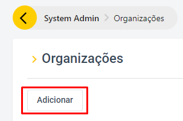

Agora, basta preencher as informações necessárias, selecionar o tipo da organização e clicar em **Criar**. O apelido é opcional.

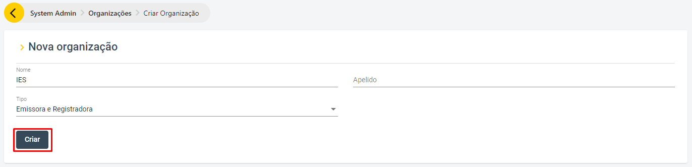

Tipos de organização:
- **Emissora e Registradora**: será possível realizar emissão e registro;
- **Emissora**: será possível realizar apenas emissão;
- **Registradora**: será possível realizar apenas registro.

### Signer

- Caso não exista nenhuma organização, clique em **Nova organização**

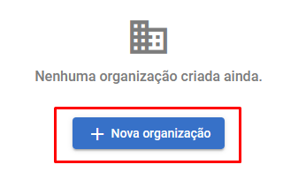

- Caso já exista alguma organização, clique no ícone **+**:

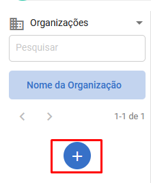

Agora, basta preencher as informações necessárias e clicar em **Salvar**. O CNPJ é opcional.

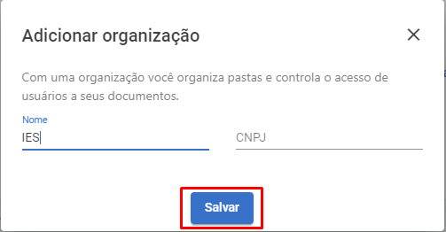

## Configuração no Digiploma

Para configurar a integração no Digiploma, é necessário criar uma chave de API no Signer.

### Signer
Para gerar a **chave de API**, crie uma aplicação selecionado a organização criada anteriormente: 


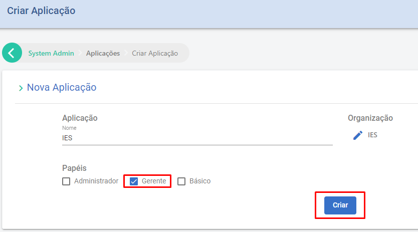

Em seguida gere a chave na opção **Chaves**:

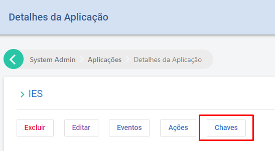


Copie a **chave de API** gerada (esse valor não pode ser recuperado posteriormente), onde será utilizada no Digiploma.

### Digiploma

Na tela inicial do Digiploma com a organização já selecionada, selecione **Configurações**.

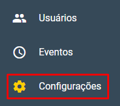

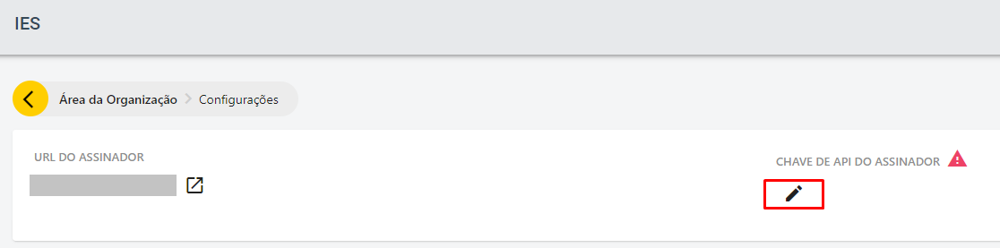

Agora, basta colar a **chave de API** copiada do Signer.

## Configuração no Signer

Para configurar a integração no Signer, é necessário criar uma chave de API no Digiploma.

### Digiploma

Para gerar a **chave de API**, crie uma aplicação selecionado a organização criada anteriormente: 

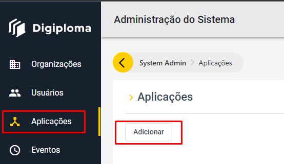

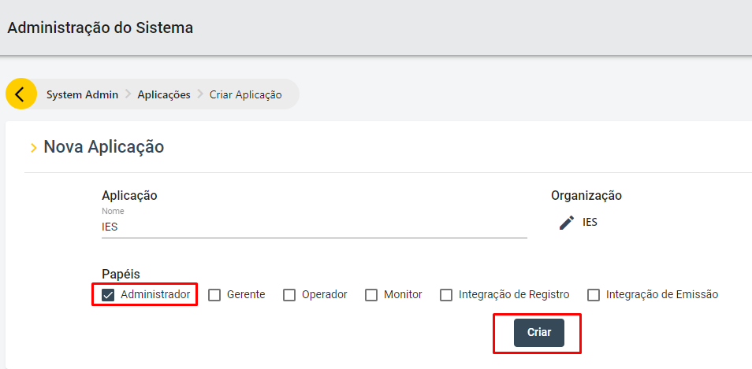

Copie a **chave de API** gerada (esse valor não pode ser recuperado posteriormente), onde será utilizada no Signer.

### Signer

Vá até a página de **Administração**, selecione **Organização**, selecione a organização criada anteriormente e **habilite os webhooks**.

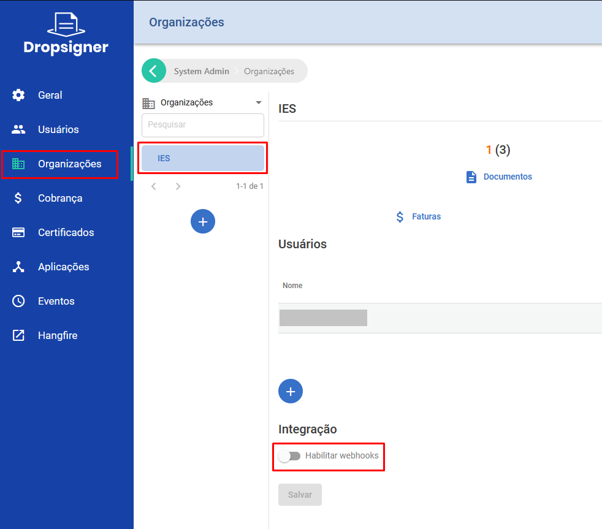

1. O campo **URL** deve ser preenchido com o endereço de sua instância do Digiploma seguido do caminho padrão de webhooks conforme o exemplo abaixo:

```
https://seu-digiploma.com.br/api/degrees/webhook
```

2. No campo **Tipo de autenticação** deve ser selecionado o tipo **X-Api-Key**.
3. No campo **Token de Autenticação** deve ser preenchido a **chave de API** copiada do Digiploma.

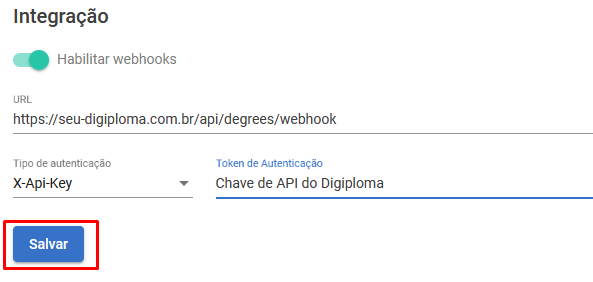

