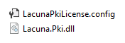
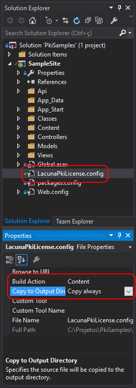

# Licenciamento

Para habilitar o uso do Lacuna PKI SDK é necessário carregar a licença na inicialização da aplicação. A licença pode ser utilizada nos formatos

* Arquivo LacunaPKILicense.config
* String Base64

Se você ainda não possui uma licença, entre em contato através do site pki.lacunasoftware.com para obter uma licença de trial gratuitamente.

Existem 3 maneiras de se carregar a licença. A maneira mais recomendada depende se sua aplicação é uma aplicação web ou desktop:

* Para aplicações **web**, o método mais recomendado é colocar o [arquivo LacunaPKILicense.config no diretório da DLL](#side-loaded-file)
* Para aplicações **desktop**, o método mais recomendado é setar a licença [Programaticamente](#programmatically)

<a name="side-loaded-file" />
## Arquivo LacunaPKILicense.config no diretório da DLL

O SDK busca automaticamente o arquivo .config da licença junto à sua DLL (Lacuna.Pki.dll). Portanto, basta que o arquivo `LacunaPKILicense.config` seja copiado durante a compilação para o mesmo local da DLL.



Uma forma prática de fazer isso é incluir o arquivo `LacunaPKILicense.config` no projeto do seu site ou aplicação e especificar o **Build Action** do arquivo como **Content** e setar opção **Copy to Output Directory** para **Copy Always**.



Essa forma é a mais recomendada para aplicações web.

## Arquivo .config

Outra opção é incluir no arquivo `Web.config` ou `App.config` do seu site ou aplicação uma tag com o caminho para o arquivo .config da licença ou ainda uma tag com a licença em Base64, conforme exemplificado abaixo:

```xml
<appSettings>
  <!-- LacunaPKILicense.config file path -->
  <add key="LacunaPKI.LicensePath" value="[LacunaPKILicense.config file path]"/>

  <!-- or -->

  <!-- Base64 License -->
  <add key="LacunaPKI.BinaryLicense" value="[Base64 license]"/>
</appSettings>
```

<a name="programmatically" />
## Programaticamente

A licença pode ser carregada programaticamente fazendo uma chamada ao método @Lacuna.Pki.PkiConfig.LoadLicense(System.Byte[]) passando o valor decodificado da licença em Base64, preferencialmente no código de inicialização do seu site ou aplicação:

```csharp
// Licença em Base64
byte[] binLicense = Convert.FromBase64String("[given Base64 License]");

// Carregando Licença
PkiConfig.LoadLicense(binLicense);

// Uso habilitado
```

**Esta forma é a mais recomendada para aplicações desktop**, pois a licença fica embutida no código fonte da aplicação,	dificultando seu vazamento para terceiros.

Também é possível utilizar o método @Lacuna.Pki.PkiConfig.LoadLicense(System.String) para passar o caminho para o arquivo .config da licença. Entretanto, esse método **não é recomendado para aplicações desktop** pois não tem a vantagem de "esconder" a licença.

```csharp
// Caminho para o arquivo LacunaPKILicense.config
string licensePath = "...";

// Carregando licença
PkiConfig.LoadLicense(licensePath);

// Uso habilitado
```

## Próximos passos

Tendo adicionado o pacote Lacuna PKI SDK ao seu projeto e configurado a licença de uso do mesmo, veja como utilizar o SDK acessando os próximos tópicos como [Certificados](../certificates/index.md) e [Assinaturas](../signatures/index.md).

## Veja também

* Classe @Lacuna.Pki.PkiConfig
