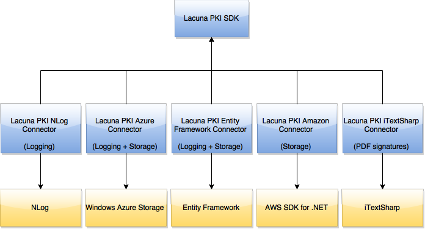

# Pacotes nuget opcionais

O PKI SDK é distribuído via Nuget Package Manager. Além do pacote principal,
[Lacuna.Pki](https://www.nuget.org/packages/Lacuna.Pki/), existem alguns pacotes opcionais que habilitam integrações
com provedores e outras bibliotecas.

As setas no diagrama acima representam dependências. O pacote **Lacuna.Pki** não possui dependências e cada pacote
opcional depende dele e de um outro pacote, com o qual ele habilita integração.

## Integração para armazenamento

Algumas operações requerem um "storage externo", um local para armazenar e recuperar dados. Alguns exemplos de
operações que requerem um storage externo são:

* Compressão e descompressão de assinaturas CAdES (para mais informações veja [Compressão de assinaturas](../signatures/cades/compression.md)).
* Criação e validação de assinaturas CAdES com referências de validação porém sem valores de validação (por exemplo, políticas CAdES-C, CAdES-X Type 1 e ICP-Brasil AD-RV).

Para realizar essa operações, é necessário passar para o SDK um objeto que implemente a interface
<xref:Lacuna.Pki.Stores.ISimpleStore>. Já existe no pacote principal uma implementação da interface, a classe
@Lacuna.Pki.Stores.FileSystemSimpleStore, que salva e recupera os arquivos no sistema de arquivos local. Entretanto,
para sistemas em larga escala, o armazenamento em disco pode não ser suficiente no que se refere à confiabilidade.
Os seguintes pacotes opcionais oferecem outras possibilidade de armazenamento:

* [Azure Connector](azure-connector.md) (armazenamento no Azure Blob Storage)
* [Amazon Connector](amazon-connector.md) (armazenamento no Amazon S3)
* [Entity Framework Connector](ef-connector) (armazenamento em banco de dados)

## Integração para log

Os seguintes pacotes oferecem a possibilidade de logar mensagens internas do SDK para diagnóstico:

* [NLog Connector](nlog-connector.md) (enviar logs para a biblioteca NLog)
* [Entity Framework Connector](ef-connector.md) (enviar logs para o banco de dados)
* [Azure Connector](azure-connector.md) (enviar logs para o Azure Table Storage)

O pacote recomendado para log é o [NLog Connector](nlog-connector.md), pois através do **NLog** é possível enviar logs
para diferentes locais, inclusive para o Azure e para o banco de dados, aproveitando os benefícios de performance dessa
biblioteca específica para tal propósito.

## Integração para armazenamento de nonces

Para realizar autenticação com certificados digitais, o SDK requer um storage externo para armazenar *nonces*
criptográficos. O pacote [Entity Framework Connector](ef-connector.md) oferece uma forma de armazenar tais *nonces* no
banco de dados utilizando o Microsoft Entity Framework.
