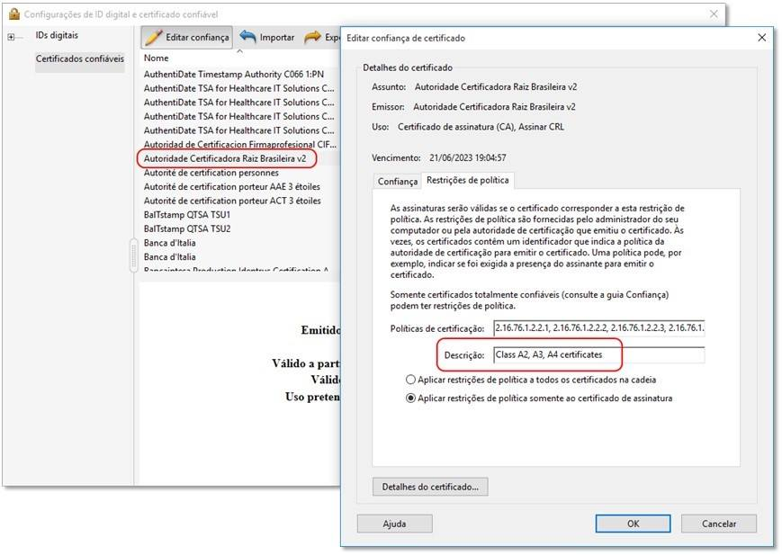

# Validação do Adobe Reader

## Resumo

O *Adobe Reader*, em configuração padrão, não validará assinaturas nos casos:
* Assinante com certificate A1 da cadeia V2 da ICP-Brasil
* Assinantes com certificado da cadeia V5 da ICP-Brasil

Ações para validar:
1. [Ativar confiança do Adobe nas raízes do Windows](https://docs.lacunasoftware.com/en-us/content/configuring-windows-roots-on-adobe-reader/)
1. Reiniciar o Adobe

> [!NOTE]
> Vale destacar que qualquer ação individual para contornar esta validação terá efeito apenas local, na conta do usuário.

## Detalhes

O *Adobe Reader* é instalado com a configuração padrão de confiar apenas em sua própria lista de certificados raízes
confiáveis. Por esse motivo, assinaturas feitas com alguns certificados podem ser interpretadas como não confiáveis em
*Adobe Readers* com a configuração padrão, por exemplo certificados da cadeia V5 da ICP-Brasil e certificados que não atendam regras de políticas registradas na lista do *Adobe reader*.

<a name="icp-brasil-v2" />
### ICP-Brasil AC Raiz V2

O certificado da AC Raiz da ICP-Brasil V2 passou a fazer parte das raízes confiáveis da Adobe (AATL).

Porém, a afirmação de que “qualquer documento assinado no formato PDF e aberto no *Acrobat Reader* poderá ser validado automaticamente”, conforme esperado pela comunidade de usuários de arquivos PDF com assinatura digital ICP-Br, não é 100% correta.
Por padrão, a raiz brasileira foi incluída na AATL com uma configuração de restrição de políticas que aceita somente o uso de certificados A2, A3 e A4. 
Ou seja, uma assinatura realizada com certificados do tipo A1, mesmo que válida segundo os critérios estabelecidos pela ICP-Br, será exibida como inválida pelo *Adobe Reader*.

Mesmo para quem já havia configurado a raiz brasileira como confiável no *Adobe Reader* ou para quem configurou o *Adobe Reader* para confiar nas cadeias do Windows (tendo a AC Raiz ICP-Brasil presente), terá os documentos assinados com certificados A1 exibidos como inválidos, pois a validação com a cadeia de confiança da Adobe (AATL) sobrepõe qualquer configuração realizada anteriormente.

No caso de uma nova Autoridade Certificadora ser homologada pelo ITI, existe a possibilidade do software invalidar todas as assinaturas feitas por certificados emitidos pela nova AC caso a política de certificação não esteja na lista de restrições de políticas previamente criada. O problema só seria corrigido após uma nova atualização da cadeia de confiança da Adobe.

Vale destacar que qualquer medida individual para contornar esta validação terá efeito apenas local, na conta do usuário.

Geralmente orientamos os usuários a configurarem seus leitores para aceitar também a lista de certificados raízes do
Windows. O link contém um passo-a-passo de como fazer essa configuração: [Ativar confiança do Adobe nas raízes do Windows](https://docs.lacunasoftware.com/en-us/content/configuring-windows-roots-on-adobe-reader/)

<a name="icp-brasil-v5" />
### ICP-Brasil AC Raiz V5

Como abordado no [tópico anterior](#icp-brasil-v2), apenas o certificado AC Raíz V2, com restrições, foi adicionado à lista de confiança da Adobe.
O certificado AC Raíz V5 da ICP-Brasil, por padrão, não é confiado pelo Adobe nem pelos sistema operacional, portanto, inicialmente, as assinaturas realizadas com certificados da cadeia V5 não serão validados com sucesso.

Devido ao fato do certificado da AC Raiz V5 ser distibuído oficialmente por nenhum repositório de confiança padrão, para validação dos certificados sob ela, deve-se incluir manualmente esta raiz como confiável em seu sistema ou rede. Antes, veja o alerta abaixo:

> [!CAUTION]
> Incluir **manualmente** certificados raízes em repositórios de confiança de sistemas é uma operação **crítica de segurança** e **desaconselhada** pela Lacuna Software.
> Caso seja o desejado, solicite o auxílio do profissional de infraestrutura e segurança responsável sobre esta ação.

Vale destacar que qualquer medida individual para contornar esta validação terá efeito apenas local, na conta do usuário.