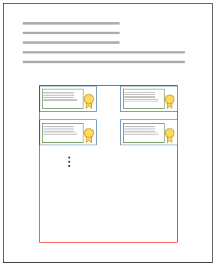
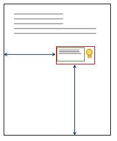
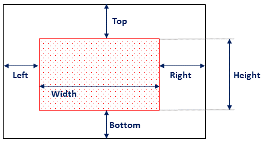
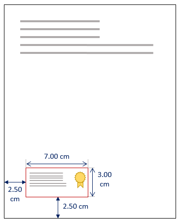
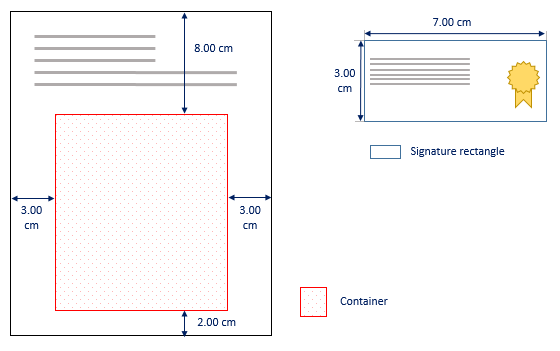
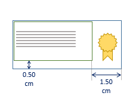

# Representação Visual

A representação visual na assinatura de PDF é a inclusão de um texto ou imagem contendo informações sobre a assinatura
que está interna ao documento. Dependendo do software de visualização do PDF, esta representação pode fazer uma ligação
com os dados e propriedades da assinatura e do signatário.

**Cada representação visual é sempre relativa a apenas uma assinatura no PDF e cada assinatura  pode ter até uma representação visual.**

As informações da representação visual a serem incluídas na assinatura são controladas pela classe
@Lacuna.Pki.Pades.PadesVisualRepresentation2. Nas seções abaixo exploraremos as opções, parâmetros e customizações na
definição de uma representação visual para assinaturas em PDF.

## Elementos da Representação Visual

A classe de representação visual @Lacuna.Pki.Pades.PadesVisualRepresentation2 possui 3 elementos que podem ser definidos:
@Lacuna.Pki.Pades.PadesVisualRepresentation2.Position, @Lacuna.Pki.Pades.PadesVisualRepresentation2.Text e
@Lacuna.Pki.Pades.PadesVisualRepresentation2.Image. A lista abaixo introduz os elementos da representação visual.
Para mais informações verifique o guia da API de cada classe.

* Posição

  A posição do retângulo da representação visual da assinatura é customizável através das classes
  @Lacuna.Pki.Pades.PadesVisualAutoPositioning e @Lacuna.Pki.Pades.PadesVisualManualPositioning.

  * Posicionamento Automático

    O posicionamento automático é indicado para casos em que pode-se definir uma região (container) em uma página do PDF
	que irá receber a representação das assinaturas. Este modo irá organizar as assinaturas em série dentro da região
	especificada. A figura abaixo exemplifica o comportamento do posicionamento automático. O retângulo vermelho representa
	o container definido no qual as representações visuais serão posicionadas automaticamente em série.

    

  * Posicionamento Manual

    O posicionamento manual é indicado para os casos em que cada representação das assinaturas serão inseridas em posições
    arbitrárias, por exemplo a posição e a página serem informados pelo usuário.

    

* Texto

  As informações textuais a serem inseridas na representação visual da assinatura são customizáveis através da classe
  @Lacuna.Pki.Pades.PadesVisualText.

* Imagem

  É possível incluir uma imagem de fundo na representação visual da assinatura, podendo também customizar sua opacidade
  e seu alinhamento dentro do retângulo da representação visual. Estas opções são definidas através da classe
  @Lacuna.Pki.Pades.PadesVisualImage.

## Posicionamento Manual

No posicionamento manual, define-se a página na qual a representação da assinatura será inserida e a posição e tamanho
do retângulo de assinatura em relação à página.

A página é especificada pela propriedade @Lacuna.Pki.Pades.PadesVisualPositioning.PageNumber. Números negativos são
contados a partir do final do documento (-1 significa última página, -2 penúltima, etc). Pode-se usar o valor especial
0 (zero), que especifica que a representação da assinatura deve ser colocada em uma nova página em branco adicionada
ao final do documento.

A posição do retângulo de assinatura em relação à página é especificada pela propriedade
@Lacuna.Pki.Pades.PadesVisualManualPositioning.SignatureRectangle. Um retângulo pode ter os parâmetros `Top`, `Bottom`,
`Left`, `Right`, `Width` e `Height` conforme mostrado na figura abaixo.



Por exemplo, para especificar que a representação visual deve ser inserida na última página do documento, tendo tamanho
7cm de largura e 3cm de altura, ficando a 2.5cm das margens esquerda e inferior, conforme a imagem abaixo, escreveríamos
o seguinte código:



```cs
var signer = new PadesSigner();
...
var signatureVisualRep = new PadesVisualRepresentation2() {
    Position = new PadesVisualManualPositioning() {
        PageNumber = -1,                                    // Define inserção na última página do documento
        SignatureRectangle = new PadesVisualRectangle() {
            Width = 7,                                      // Largura = 7cm
            Height = 3,                                     // Altura = 3cm
            Left = 2.50,                                    // Distância da margem esquerda = 2.50cm
            Bottom = 2.50                                   // Distância da margem inferior = 2.50cm
        }
    },
    Text = ...,
    Image = ...
};
signer.SetVisualRepresentation(visual);
 ```

Para mais informações sobre como definir a posição da representação da assinatura, veja o artigo
[Definindo um container](containers.md).

## Posicionamento Automático

No posicionamento automático, assim como no manual, é preciso especificar a página na qual a representação visual será
inserida. Entretanto, ao invés de se definir o posicionamento da representação visual em relação à página, define-se um
container que irá receber as representações das sucessivas assinaturas realizadas no documento e o tamanho de cada
retângulo de assinatura dentro do container.

O container de assinaturas é definido pela propriedade @Lacuna.Pki.Pades.PadesVisualAutoPositioning.Container. De
maneira similar à especificação do retângulo de assinatura no posicionamento manual, o container pode ter os parâmetros
`Top`, `Bottom`, `Left`, `Right`, `Width` e `Height`. Já o tamanho de cada retângulo de assintura (altura e largura) é
definido pela propriedade @Lacuna.Pki.Pades.PadesVisualAutoPositioning.SignatureRectangleSize.

A propriedade @Lacuna.Pki.Pades.PadesVisualAutoPositioning.RowSpacing define o espaçamento entre as "linhas" das
representações visuais. Os retângulos de assinaturas das representações visuais são inseridos da esquerda para direita e
quando não há mais espaço, são inseridas em uma nova linha respeitando o `RowSpacing` passado.

Por exemplo, para especificar que as representações visuais devem ser inseridas sucessivamente na última página do
documento dentro de um container espaçado 2.5cm das bordas esquerda, direita e inferior e 10cm da borda superior, sendo
que cada retângulo de assinatura deve ter 7cm de largura por 3cm de altura, conforme ilustrado na imagem abaixo,
escreveríamos o seguinte código:



```cs
var signer = new PadesSigner();
...
var signatureVisualRep = new PadesVisualAutoPositioning() {
    Position = new PadesVisualAutoPositioning() {
        PageNumber = -1,                             // Define inserção na última página do documento
        Container = new PadesVisualRectangle() {
            Left = 3.00,                             // Distância da margem esquerda = 3.00cm
            Right = 3.00,                            // Distância da margem direita = 3.00cm
            Bottom = 2.00,                           // Distância da margem inferior = 2.00cm
            Top = 8.00                               // Distância da margem superior = 8.00cm
        },
        SignatureRectangleSize = new PadesSize(7, 3), // Tamanho de cada retângulo de assinatura (largura x altura),
        RowSpacing = 1                               // 1.00cm de espaçamento entre linhas
    },
    Text = ...,
    Image = ...
};
signer.SetVisualRepresentation(visual);
```

> [!NOTE]
> O container que definimos acima tem altura e largura variáveis. Essa é uma das muitas possibilidades de especificação
> do container de assinaturas. Para mais informações, veja o artigo [Definindo um container](containers.md).

As assinaturas realizadas com o código acima terão o resultado esperado conforme a imagem abaixo:


## Posicionamento de texto e imagem

* Texto

  Interno ao retângulo da representação visual da assinatura, o SDK permite a customização do alinhamento, posição e
  conteúdo do texto a ser inserido. A posicionamento do texto pode ser controlado através da definição de um
  @Lacuna.Pki.Pades.PadesVisualText.Container. Se nenhum container for definido, o texto preencherá todo o retângulo
  de assinatura.

  Como exemplo, definiremos um posicionamento do texto relativo ao retângulo de assinatura conforme a figura abaixo.

  

  ```cs
  var text = new PadesVisualText() {                          // Texto da representação visual
      SignerName = signingCert.SubjectDisplayName,            // Inclui o nome do signatário
      IncludeSigningTime = true,                              // Inclui a data da assinatura
      Container = new PadesVisualRectangle() {                // Define container do texto
          Left = 0,
          Top = 0,
          Right = 1.5,
          Bottom = 0.5
      }
  };
  ```

  Verifique as customizações de texto possíveis nas propriedades no guia da API @Lacuna.Pki.Pades.PadesVisualText.

* Imagem

  Também é possível definir uma imagem de fundo para o retângulo de assinatura e customizar sua opacidade e alinhamento.
  Verifique as customizações de texto possíveis nas propriedades no guia da API @Lacuna.Pki.Pades.PadesVisualImage.

## Veja também
* @Lacuna.Pki.Pades.PadesVisualRepresentation2
* @Lacuna.Pki.Pades.PadesVisualText
* @Lacuna.Pki.Pades.PadesVisualImage
* @Lacuna.Pki.Pades.PadesVisualAutoPositioning
* @Lacuna.Pki.Pades.PadesVisualManualPositioning
