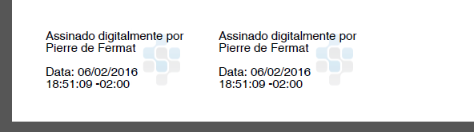

# Exemplos completos

## Exemplo completo com posicionamento automático padrão

O PKI SDK oferece dois templates para o posicionamento automático das represenrações visuais: **Rodapé** e **Nova Página**.

O método @Lacuna.Pki.Pades.PadesVisualAutoPositioning.GetFootnote(System.Int32,System.Int32) retorna um posicionamento que
organiza automaticamente as assinaturas no rodapé da página.

O método @Lacuna.Pki.Pades.PadesVisualAutoPositioning.GetNewPage retorna um posicionamento que insere uma nova página em
branco ao final do documento e organiza automaticamente as assinaturas em grid nesta página adicionada.

O exemplo de código abaixo demonstra uma assinatura básica com representação visual com posicionamento automático padrão
rodapé.

```cs
var signer = new PadesSigner();
signer.SetSigningCertificate(cert);
signer.SetPdfToSign(pdfBytes);
signer.SetPolicy(PadesPolicySpec.GetBasic(TrustArbitrators.Windows));

// Criando objeto de representação visual
var visual = new PadesVisualRepresentation2() {
    Position = PadesVisualAutoPositioning.GetFootnote(),       // Define posicionamento automático no rodapé da última página

    Text = new PadesVisualText() {                             // Texto da representação visual
        SignerName = cert.Certificate.SubjectDisplayName,                   // Inclui o nome do signatário
        IncludeSigningTime = true                              // Inclui a data da assinatura
    },

    Image = new PadesVisualImage() {                           // Imagem de fundo na representação visual
        Content = getPdfStampContent(),                        // Bytes da imagem a ser inserida
        HorizontalAlign = PadesHorizontalAlign.Right           // Define imagem alinhada à direita no retângulo da representação visual
    }
};
signer.SetVisualRepresentation(visual);                        // Define representação visual na assinatura
signer.ComputeSignature();

byte[] signedPdf = signer.GetPadesSignature();                 // Retorna os bytes do PDF assinado com
                                                               // representação visual
```

O processo acima deve produzir um PDF assinado contendo uma representação visual no rodapé da última página do documento,
com nome do signatário, data da assinatura e uma imagem de marca d'água conforme a figura a seguir.



## Exemplo completo com posicionamento automático customizado

Criaremos um posicionamento automático customizado que será aplicado na última página do documento.

O container de inclusão, região na qual as representações visuais das assinaturas serão organizadas automaticamente,
será definido seguindo o modelo representado na imagem abaixo.


O código abaixo exemplifica como definir estes parâmetros em um container.

```cs
var container = new PadesVisualRectangle() {
    Left = 3.00,
    Right = 3.00,
    Bottom = 2.00,
    Top = 8.00
};
```

Para mais informações de como definir um Container, veja o artigo [Definindo um container](containers.md)

Cada assinatura incluída terá sua representação visual seguindo os parâmetros do retângulo de assinatura, texto e imagem
seguindo o modelo representado pela imagem abaixo.


O retângulo externo da assinatura tera 3cm x 7cm. Será incluído um brasão de imagem de fundo alinhada à direita no
retângulo de assinatura. O container do texto terá uma margem direita de 1.50cm em relação ao retângulo externo,
impedindo, para este exemplo, que o texto fique por cima da imagem. O código abaixo demonstra como definir estes parâmetros.

```cs
// Definindo retângulo de assinatura
var signatureRectangleSize = new PadesSize(7, 3);

// Definindo o container do Texto
var textContainer = new PadesVisualRectangle() {
    Left = 0,
    Right = 1.5,
    Bottom = 0,
    Top = 0
};

// Definindo imagem de fundo
var image = new PadesVisualImage() {
    Content = getPdfStampContent(),                    // Bytes da imagem a ser inserida
    HorizontalAlign = PadesHorizontalAlign.Right       // Define imagem alinhada à direita no retângulo da representação visual
};
```

À medida que as assinaturas forem sendo realizadas, o resultado esperado para as representações visuais incluídas
automaticamente é o apresentado na imagem abaixo.


### Código de exemplo completo

```cs
var signer = new PadesSigner();
signer.SetSigningCertificate(cert);
signer.SetPdfToSign(pdfBytes);
signer.SetPolicy(PadesPolicySpec.GetBasic(TrustArbitrators.Windows));

// Criando objeto de representação visual
var visual = new PadesVisualRepresentation2() {
    // Define container para posicionamento automático das representações visuais
    Position = new PadesVisualAutoPositioning() {               
        MeasurementUnits = PadesMeasurementUnits.Centimeters,   // Unidade de medida == Cm
        PageNumber = -1,                                        // Container será aplicado na última página do documento
        SignatureRectangleSize = new PadesSize(7, 3),           // Define dimensões do retângulo de assinatura
        Container = new PadesVisualRectangle() {                // Define dimensões do container para posicionamento automático
            Left = 3.0,
            Right = 3.0,
            Bottom = 2.0,
            Top = 8.0
        },
        RowSpacing = 1.5                                        // Espaçamento entre as fileiras verticais de representações visuais
    },

    Text = new PadesVisualText() {                              // Texto da representação visual
        SignerName = cert.Certificate.SubjectDisplayName,       // Inclui o nome do signatário
        IncludeSigningTime = true,                              // Inclui a data da assinatura
        Container = new PadesVisualRectangle() {                // Define container do texto
            Left = 0,
            Top = 0,
            Right = 1.5,
            Bottom = 0
        }
    },

    Image = new PadesVisualImage() {                            // Imagem de fundo na representação visual
        Content = getPdfStampContent(),                         // Bytes da imagem a ser inserida
        HorizontalAlign = PadesHorizontalAlign.Right            // Define imagem alinhada à direita no retângulo da representação visual
    }
};
signer.SetVisualRepresentation(visual);                         // Define representação visual na assinatura
signer.ComputeSignature();

byte[] signedPdf = signer.GetPadesSignature();                  // Retorna os bytes do PDF assinado com
                                                                // representação visual
```

A execução do exemplo acima produz o seguinte resultado na assinatura de um PDF:


