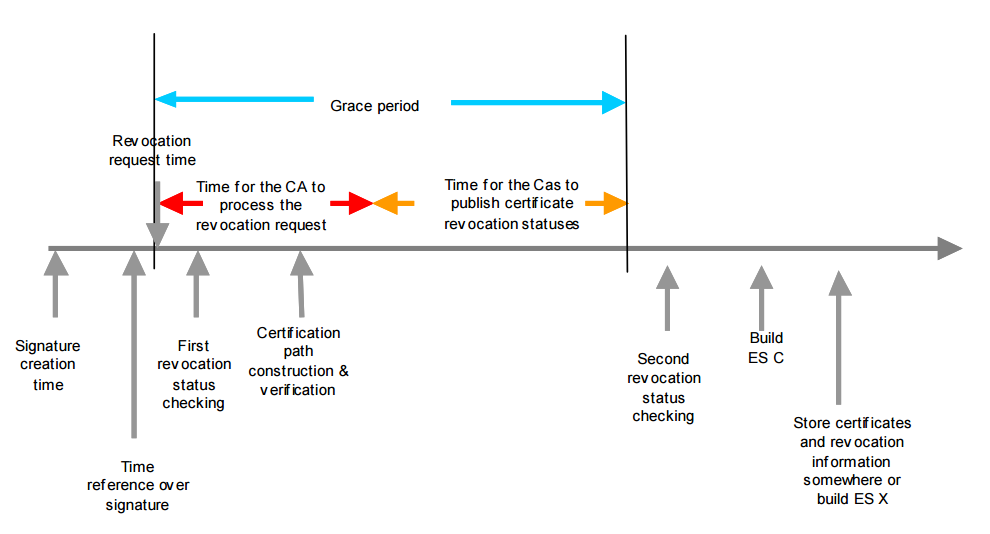

# Políticas com grace period

Nos processos de validação existe um atraso inevitável entre a requisição de um estado de revogação e a distribuição de
um reporte desta revogação correspondente. Para garantir maior confiabilidade na validação de assinaturas é indicado o
uso de um **grace period**.

## Grace period

Grace period é o período de tempo previsto para que a informação de revogação de um certificado se propague pelo
processo interno da certificadora e chegue até sua publicação pelas partes confiáveis.

Na visão do verificador, é o menor intervalo de tempo que deve aguardar para requisitar o estado de revogação de um
certificado de modo que o emissor responsável tenha realizado esta publicação confiável.

Na validação de uma assinatura com data confiável, mecanismo que resiste a validade da assinatura mesmo após revogação
ou expiração do certificado do signatário, o verificador, antes de assertar sobre a validade deste certificado, deve
garantir que exista o grace period entre a referência de data da assinatura e a data dos dados da revogação utilizados.
Esta referência de data da assinatura poder ser um carimbo de tempo (TST) de assinatura ou uma marca de tempo
(time-mark) de uma autoridade confiável.

A informação do valor temporal do grace period, bem como a exigência ou não de que os valores de revogação a serem
utilizados tenham sido emitidos após o término deste grace period, são de responsabilidade da Autoridade Certificadora
e devem estar presentes na Declaração de Práticas de Certificação (DPC).



## Assinando com grace period

Só é possivel criar assinaturas em que a política possui grace period utilizando a estretégia de finalização assíncrona
de assinatura. Para mais informações veja o artigo [Finalização assíncrona de assinaturas](../cades/finisher.md).

Para incluir um valor de tempo fixo para o grace period na política utilize o método
@Lacuna.Pki.Cades.CadesPolicySpec.SetGracePeriod(System.TimeSpan) como no exemplo abaixo.

```cs
// Carregando uma política de assinatura
CadesPolicySpec policy = ...

// Definindo grace period fixo de 2 horas
policy.SetGracePeriod(TimeSpan.FromHours(2));
```

Também é possivel utilizar um @Lacuna.Pki.IGracePeriodCatalog, um catálogo de grace period que retorna o valor
temporal baseado em informações do certificado do signatário como Issuer ou CertificatePolicies e definí-lo na política
através da propriedade @Lacuna.Pki.Cades.CadesPolicySpec.GracePeriodCatalog.

```cs
// Implementação de um catálogo de grace period
IGracePeriodCatalog catalog = ...

policy.GracePeriodCatalog = catalog;
```

## Veja também

* [Finalização assíncrona de assinaturas](../cades/finisher.md)
* @Lacuna.Pki.Cades.BrazilCadesPolicySpec
