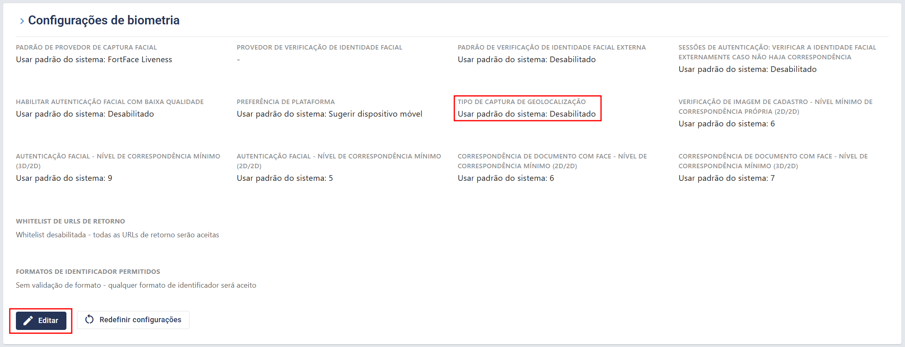
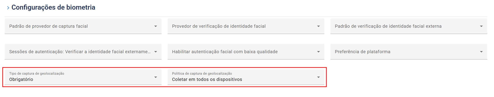
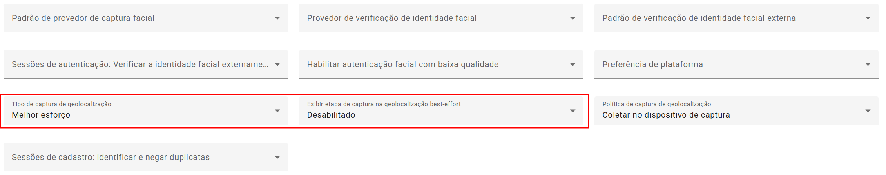

# Configuração de geolocalização (Geolocation) - Rest PKI Core

Durante uma sessão de biometria, o Rest PKI Core pode capturar a localização geográfica do dispositivo do usuário (latitude e longitude). O recurso vem **desligado por padrão**, essa é uma característica do software e pode ser ligado pelo painel, passando a valer para todas as sessões da sua aplicação. Em instâncias próprias (on-premises), o mesmo padrão também pode ser definido diretamente no `appsettings`, na seção `Bio`.

Existem três configurações:

- **Tipo de captura de geolocalização** — define se a localização é capturada e se ela é obrigatória:
    - **Desabilitado** (padrão): a localização não é capturada.
    - **Opcional**: o sistema tenta capturar a localização, mas a sessão continua normalmente caso o usuário não dê permissão ou a captura falhe.
    - **Obrigatório**: a sessão só prossegue se a localização for capturada com sucesso.
    - **Melhor esforço**: o sistema tenta capturar a localização sem nunca interromper a sessão, reenviando automaticamente falhas transitórias (por padrão, até 3 tentativas). Se todas as tentativas falharem, a sessão continua normalmente sem a localização.
- **Política de captura de geolocalização** — define em quais aparelhos a localização é coletada (importante nos fluxos com QR code, em que a biometria é feita no celular):
    - **Coletar no dispositivo de captura** (padrão): coleta apenas no aparelho que faz a biometria (ex.: o celular).
    - **Coletar em todos os dispositivos**: coleta tanto no computador que iniciou a sessão quanto no celular que fez a biometria.
- **Exibir etapa de captura na geolocalização best-effort** — só aparece quando o **Tipo de captura de geolocalização** está definido como **Melhor esforço**:
    - **Ligado** (padrão): o usuário vê uma etapa pedindo a permissão de localização, porém sem os botões de cancelar ou pular.
    - **Desligado**: a captura acontece sem nenhuma etapa própria do Rest PKI Core. Mesmo assim, o navegador do usuário pode exibir seu próprio pedido de permissão de localização, caso ele ainda não tenha decidido sobre ela.

## Como configurar pelo painel

1. Autentique-se no painel de controle da sua instância.
1. No menu lateral, clique em **Configurações**.
1. Localize a seção **"Configurações de biometria"** e clique em **Editar**.

1. No campo **Tipo de captura de geolocalização**, escolha **Opcional**, **Obrigatório** ou **Melhor esforço** para ligar o recurso.
1. Se desejar, ajuste a **Política de captura de geolocalização** (esse campo só aparece quando a captura está ligada).

1. Se escolheu **Melhor esforço**, ajuste também a opção **Exibir etapa de captura na geolocalização best-effort** para **desabilitado**, caso não queira mostrar a etapa de permissão ao usuário.

1. Clique em **Salvar** para aplicar as configurações.

> [!TIP]
> Integrando via API? Você pode definir a geolocalização por sessão, sobrescrevendo o padrão configurado aqui — veja [Parâmetros de geolocalização](../index.md#geolocation).