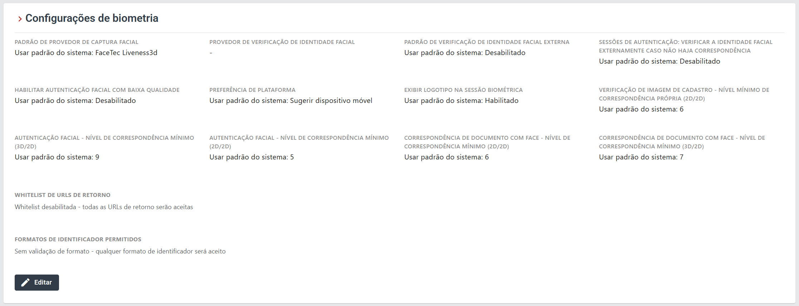
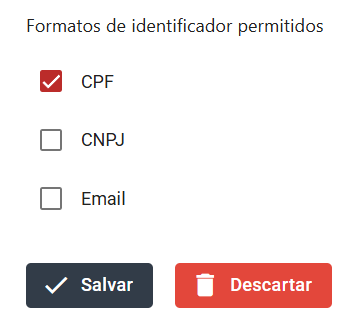

# Configuração para os formatos de identificador (SubjectIdentifier) - Rest PKI Core

O `SubjectIdentifier` é um campo que vincula a sessão de biometria a uma pessoa específica que está utilizando o seu sistema.

Por padrão, o sistema aceita qualquer formato de identificador. Se quiser restringir quais formatos são permitidos nas sessões da sua aplicação, siga os passos abaixo:

1. Autentique-se no painel de controle da sua instância.
2. No menu lateral, clique em **Configurações**.
3. Localize a seção **"Configurações de biometria"**.

4. Clique em Editar e selecione os formatos que deseja permitir: CPF, CNPJ e/ou E-mail.

6. Clique em salvar para aplicar as configurações.