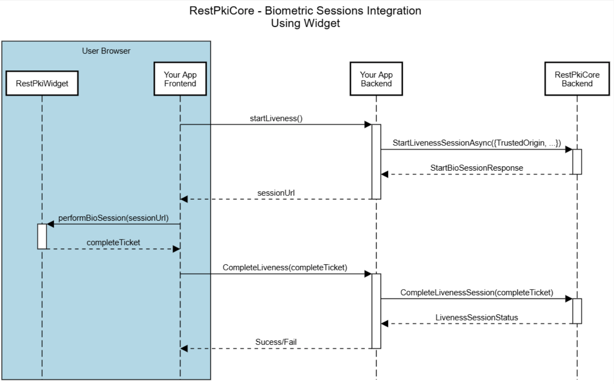

# Sessões de biometria - Rest PKI Core

**Sessões de biometria** são uma funcionalidade do [Rest PKI Core](../../index.md) que permitem que seus usuários realizem operações biométricas, tais como prova de vida (Liveness), cadastro, autenticação e identificação facial, além de capturas de documentos de identidade.

## Fluxos de FrontEnd

O [Rest PKI Core](../../index.md) já fornece uma tela de captura biométrica, que poderá ser utilizada na sua aplicação por meio de um redirecionamento ou através da utilização do nosso Widget.

### Fluxo de Redirecionamento (ReturnUrl)

Neste modelo, sua aplicação "perde o foco". O usuário é enviado para uma URL do RestPkiCore para capturar a face.
Para uitilizá-lo, você deve passar o parâmetro **`ReturnUrl`** na criação da sessão.

- **Quando usar:** Se você quer uma implementação mais simples, e não existe problema em redirecionar o usuário para completar o fluxo.
- **Vantagens:** Implementação mais simples, não há necessidade de configurações avançadas como CSP (Content Security Policies).
- **O que acontece após o fim:** O usuário é redirecionado para a URL que você informou no `ReturnUrl`, trazendo na _Query String_ o `completeTicket` (necessário para você consultar o resultado depois).


#### Diagrama


##### 1. Preparação (Backend) 
Tudo começa quando o seu usuário clica para iniciar a biometria no seu site.

- `startLiveness()`: O seu Frontend avisa o seu Backend que uma sessão precisa ser iniciada.

- `StartLivenessSessionAsync`: O Backend da sua aplicação faz uma requisição para a API do RestPkiCore. 

- `sessionUrl`: O RestPkiCore retorna uma URL única da sessão. Seu backend repassa essa URL para o seu frontend.

##### 2. Ação do Usuário (Frontend + RedirectUrl)
Agora é o momento em que a câmera é aberta e o usuário interage.

- `redirect to sessionUrl`: O seu Frontend redireciona para a página de sessão de biometria, a página assume o controle abre a câmera, orienta o usuário e captura a face/documento.

- `RedirectUrl + completeTicket`: Assim que o usuário termina, a janela fecha a câmera e carrega a janela com o `redirectUrl + ticket` através de query params. 

##### 3. Validação e Resultado (Backend)
Agora o seu sistema precisa conferir se o usuário passou no teste.

- `CompleteLiveness(completeTicket)`: O seu Frontend envia o Ticket para o seu próprio Backend.

- `CompleteLivenessSession(completeTicket)`: O seu Backend envia esse ticket para o RestPkiCore.

- `LivenessSessionStatus`: O RestPkiCore responde ao seu Backend com o veredito (Sucesso, Falha e os dados capturados).

- `Success/Fail`: Finalmente, o seu Backend responde ao seu Frontend confirmando se a operação foi aprovada, permitindo que o usuário siga no seu fluxo (ex: liberar um pagamento ou login).


### Fluxo Incorporado (Widget/TrustedOrigin)

Neste modelo, o usuário permanece durante todo o tempo dentro da página da sua aplicação, pois a tela de captura é renderizada dentro do seu próprio site através da utilização do nosso Widget.
Para utilizá-lo, você deve passar o parâmetro **`TrustedOrigin`** na criação da sessão.

> [!NOTE]
> O `TrustedOrigin` deve ser a URL base do seu site (ex: `https://meusite.com`). Isso funciona como uma proteção do ambiente JavaScript, garantindo que o widget só funcione no seu domínio.

- **Quando usar:** Se você quer manter o usuário dentro do seu ambiente para uma experiência mais fluida.
- **Vantagens:** O fluxo é integrado, não é necessário redirecionar o usuário nem processar parâmetros de retorno (_Query String_).
- **O que acontece após o fim:** O usuário permanece na tela da sua aplicação, o resultado da sessão (`completeTicket`) vem na própria chamada do componente.

#### Diagrama 


##### 1. Preparação (Backend) 
Tudo começa quando o seu usuário clica para iniciar a biometria no seu site.
- `startLiveness()`: O seu Frontend avisa o seu Backend que uma sessão precisa ser iniciada.
- `StartLivenessSessionAsync`: O Backend da sua aplicação faz uma requisição para a API do RestPkiCore. 
- `sessionUrl`: O RestPkiCore retorna uma URL única da sessão. Seu backend repassa essa URL para o seu frontend.

##### 2. Ação do Usuário (Frontend + Widget)
Agora é o momento em que a câmera é aberta e o usuário interage.

- `performBioSession(sessionUrl)`: O seu Frontend "alimenta" o Widget do RestPkiCore com a URL recebida. O Widget assume o controle, abre a câmera, orienta o usuário e captura a face/documento.

- `completeTicket`: Assim que o usuário termina, o Widget fecha a câmera e devolve para o seu Frontend um "Ticket". 

##### 3. Validação e Resultado (Backend)
Agora o seu sistema precisa conferir se o usuário passou no teste.

- `CompleteLiveness(completeTicket)`: O seu Frontend envia o Ticket para o seu próprio Backend.

- `CompleteLivenessSession(completeTicket)`: O seu Backend envia esse ticket para o RestPkiCore.

- `LivenessSessionStatus`: O RestPkiCore responde ao seu Backend com o veredito (Sucesso, Falha e os dados capturados).

- `Success/Fail`: Finalmente, o seu Backend responde ao seu Frontend confirmando se a operação foi aprovada, permitindo que o usuário siga no seu fluxo (ex: liberar um pagamento ou login).


#### Instalação e Configuração do Widget

Para integrar a captura biométrica ao seu frontend, você pode utilizar o Rest PKI Widget. Existem duas formas de adicioná-lo ao seu projeto: via **CDN** (direto no HTML) ou via **NPM** (para projetos que utilizam frameworks como React, Angular ou Vue).

##### 1. Via CDN

Esta é a forma mais rápida de começar. Basta adicionar a tag  `script` no `head` do seu arquivo HTML.

```html
<!DOCTYPE html>
<head>
    <script 
        type="text/javascript" 
        src="https://cdn.lacunasoftware.com/libs/restpki/lacuna-restpki-widget-1.3.1.min.js"
        integrity="sha256-PziIkD0H3D/3KAcwE/u7u8MTbd6k62IlI9mmqzkc9r0="
        crossorigin="anonymous">
    </script>
</head>
</html>
```

##### 2. Via NPM


Se você utiliza frameworks como React, Angular ou Vue, instale o pacote via terminal para garantir o controle de versões e tipagens, pode ser [encontrada no respositorio](https://www.npmjs.com/package/lacuna-restpki-widget):

```shell
npm i lacuna-restpki-widget
```

Você pode verificar no arquivo `package.json` se a dependencia foi instalada

```json
{
    ...
    "dependencies": {
        "lacuna-restpki-widget": "x.y.z",
    },
    ...
}
```

Após a instalação, você pode importar o widget no seu componente ou arquivo JavaScript:

```js
import { RestPkiWidget } from 'lacuna-restpki-widget';
```

---

## Configuração do Backend

Para começar, você precisará dos seguintes parâmetros:

* **Endpoint**: endereço da instância do Rest PKI Core a ser utilizada
* **Chave de API**: chave de autenticação com a API

Se estiver utilizando o Rest PKI Core como um serviço (SaaS), solicite seus parâmetros ao nosso [suporte ao desenvolvedor](mailto:suporte@lacunasoftware.com).

Caso esteja utilizando uma [instância própria](../on-premises/index.md), o *endpoint* é o próprio endereço do painel de controle do Rest PKI, por exemplo
`https://assinatura.suaempresa.com.br/`. Crie você mesmo uma chave de API seguindo os passos abaixo:

1. Autentique-se no painel de controle da sua instância
2. No menu lateral, clique em **Aplicações**, em seguida em **Adicionar**
3. Preencha um **nome** para a aplicação
4. Marque o papel `Operador` (este papel é suficiente para realizar as operações de integração mais comuns, como criar sessões de assinatura)
5. Clique em **Criar**
6. Na página de detalhes da aplicação, clique em **Chaves**, em seguida em **Adicionar**
7. Preencha uma descrição qualquer para a chave e escolha uma expiração (recomenda-se escolher **Nunca expira**) e clique em **Criar**
8. **Tome nota da chave de API exibida** pois não será possível recuperá-la mais tarde


### Chamando a API

Embora o Rest PKI Core ofereça APIs REST que podem ser facilmente chamadas, elas normalmente não são utilizadas diretamente. Ao invés disso, oferecemos bibliotecas para consumir os serviços do Rest PKI Core (*client libs*) em diversas linguagens de programação e diversos projetos de exemplos que demonstram o uso dessas bibliotecas, de modo que os programadores não precisem se preocupar com os detalhes envolvidos no consumo de APIs e possam codificar diretamente em sua linguagem preferida.


Utilização das bibliotecas (ClientLibs):
* [C#/.NET](client-libs/dotnet.md)

Se você precisar de um exemplo em uma linguagem que não foi listada, por favor entre em contato conosco em [suporte@lacunasoftware.com](mailto:suporte@lacunasoftware.com) ou EQN 102/103, Ed. Avenida 102, 2º Andar - Asa Norte, Brasília-DF, Brasil. Telefone: +55 61 3030-5700.

## Parametros das sessões de biometria

Ao iniciar uma sessão, você deve configurar os parâmetros que definem como o usuário irá interagir com o sistema e quais regras de segurança serão aplicadas.

### Parâmetros gerais
- **TrustedOrigin:** Parâmetro obrigatório para o fluxo Incorporado. Deve ser a URL do domínio onde o widget será carregado (ex: https://meu-site.com.br). Isso impede que sua sessão seja roubada e executada em sites maliciosos.

- **ReturnUrl:** Parâmetro obrigatório para o Fluxo de Redirecionamento. É a URL para onde o usuário será enviado após concluir a biometria. O resultado (ticket) será anexado a esta URL via Query String.
- **PlatformPreference:** Define a preferência de plataforma e configuração do QRCode.
    - **NoPreference**: O sistema permite realizar a sessão tanto pelo computador quanto por um dispositivo móvel, sem exibir nenhum QR Code.
    - **PreferMobile**: O sistema permite iniciar a sessão pelo computador, mas recomenda que seja realizado por meio de um dispositivo móvel exibindo um QR code para realizar a sessão.
    - **RequireMobile**: Bloqueia o uso em desktops, exigindo um dispositivo móvel exibindo um QR code para realizar a sessão.

### Identificador dos usuários (`SubjectIdentifier`)
O `SubjectIdentifier` é um campo que vincula a sessão de biometria a uma pessoa específica que está utilizando o seu sistema.

Para as sessões de cadastro biométrico e autenticação biométrica, o `SubjectIdentifier` é o identificador único relacionado à aquela pessoa que você deseja cadastrar ou autenticar no sistema de biometria.
        
Para as sessões anônimas, como Liveness e captura de documentos, esse identificador é indexado e poderá ser utilizado para encontrar o histórico de sessões com aquele identificador.

> [!tip]
> Recomendamos a utilização de identificadores únicos e constantes, como CPF (apenas números), CNPJ, E-mail ou o UUID do seu sistema.

Caso queira aceitar apenas alguns tipos de identificadores específicos, você pode [configurar os formatos de identificador permitidos para sua Subscription](configs/subject-identifier-formats.md).

### Parâmetros das sessões com captura facial
- **FaceCaptureProvider:** Define qual tecnologia de captura será utilizada na sessão de biometria.
    - Atualmente o único provedor utilizado pelo sistema é o `FaceTecLiveness3d` 

<a name="geolocation" />

### Parâmetros de geolocalização

O Rest PKI Core pode capturar a localização geográfica do dispositivo do usuário durante a sessão de biometria. O recurso está **desabilitado por padrão** e pode ser habilitado por sessão ou globalmente na configuração da subscription.

> [!TIP]
> Prefere configurar o padrão pelo painel? Veja [Configuração de geolocalização](configs/geolocation.md).

- **`GeolocationCaptureType`**: Define o comportamento da captura.
    - **`Disabled`** (padrão): Geolocalização não é coletada.
    - **`Optional`**: O sistema tenta capturar a geolocalização, mas a sessão prossegue normalmente caso o usuário negue permissão ou a captura falhe.
    - **`Required`**: A geolocalização é obrigatória. A sessão é interrompida se a captura não for concluída com sucesso.
    - **`BestEffort`**: O sistema tenta capturar a geolocalização sem nunca interromper a sessão. Falhas transitórias (ex.: timeout) são tentadas novamente automaticamente, por padrão até 3 vezes; falhas permanentes (ex.: permissão negada) não são reenviadas. Se todas as tentativas falharem, a sessão prossegue normalmente sem a localização.

- **`GeolocationCapturePolicy`**: Define em quais dispositivos a geolocalização é coletada (relevante para sessões com QR code).
    - **`CollectOnCaptureDevice`** (padrão): A geolocalização é capturada apenas no dispositivo que realiza a biometria (ex: o celular, nos fluxos com QR code).
    - **`CollectOnAllDevices`**: A geolocalização é capturada em todos os dispositivos envolvidos na sessão — tanto no desktop que iniciou quanto no celular que realizou a captura.

> [!NOTE]
> Quando `GeolocationCaptureType` é `BestEffort`, por padrão o usuário vê uma etapa pedindo a permissão de localização, porém sem os botões de cancelar ou pular — já que essa captura nunca pode interromper a sessão. Esse comportamento pode ser desativado pelo painel, removendo essa etapa própria do Rest PKI Core — veja [Configuração de geolocalização](configs/geolocation.md). Mesmo assim, o navegador pode exibir seu próprio pedido de permissão caso o usuário ainda não tenha decidido sobre ela (ver nota abaixo).

> [!NOTE]
> A exibição (ou não) do pedido de permissão, e por quanto tempo o navegador lembra da permissão concedida, são definidos por cada navegador e fogem ao controle do Rest PKI Core. Em alguns navegadores, conceder a permissão de forma temporária (ex.: "Permitir desta vez" no Chrome) pode manter a localização disponível durante a sessão do navegador, mesmo quando a captura é opcional. Para detalhes sobre cada comportamento, consulte a documentação do respectivo navegador.

## Tipos de sessão

* [Prova de vida (`Liveness`)](liveness.md)
* [Cadastro biométrico (`Enrollment`)](enrollment.md)
* [Autenticação facial (`Authentication`)](authentication.md)
* [Identificação facial (`Identification`)](identification.md)
* [Captura de documento (`IdentificationDocumentCapture`)](id-capture.md)

## Veja também

* [Repositório de exemplos(GitHub)](https://github.com/LacunaSoftware/RestBioSamples)
* [Exemplo de backend (.NET)](https://github.com/LacunaSoftware/RestBioSamples/tree/main/backend/dotnet)
* [Exemplo de backend (Java)](https://github.com/LacunaSoftware/RestBioSamples/tree/main/backend/java)
* [Exemplo de frontend (Angular)](https://github.com/LacunaSoftware/RestBioSamples/tree/main/frontend/angular)
* [Exemplo de frontend (JS/HTML)](https://github.com/LacunaSoftware/RestBioSamples/tree/main/frontend/generic)
