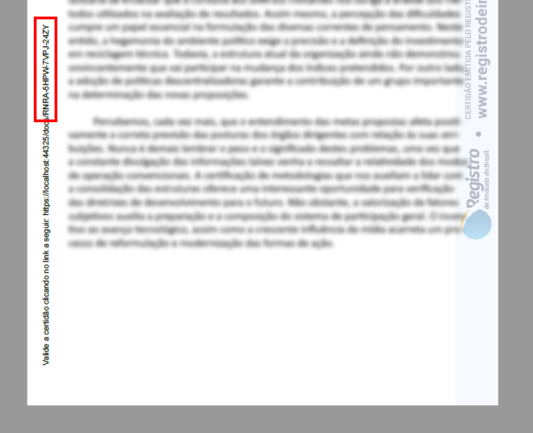
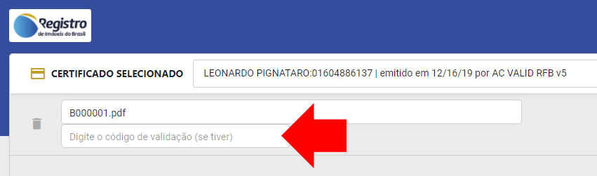
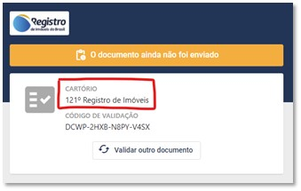

<!-- This article is intentionally excluded from the TOC -->
<!-- There are no plans to translate this article, therefore code snippets are in-file (instead of being stored elsewhere and referenced, to allow reuse) -->

# Requisitos adicionais de integração - RIB

A integração com o **Assinador Web** do **Registro de Imóveis do Brasil - RIB** possui alguns requisitos adicionais não mencionados no restante dessa documentação.

## Metadados obrigatórios

Ao criar [sessões de assinatura](signature-sessions/index.md), é necessário fornecer os seguintes [metadados](signature-sessions/document-metadata.md) obrigatórios:

* `cartorio`: Nome do cartório emitente (esse valor é exibido na página de validação do documento)
* `cns`: CNS (Código Nacional de Serventia) do cartório emitente

O CNS pode ser informado em qualquer uma das formas abaixo:

* `1234` (apenas dígitos)
* `001234` (com zeros à esquerda)
* `00.123-4` (formatação completa)

Em .NET:

```cs
var response = await restPkiService.CreateSignatureSessionAsync(new CreateSignatureSessionRequest() {
	...
}, documentMetadata: new NameValueCollection {
	["cartorio"] = "XXº Oficial de Registro de Imóveis do Município - UF",
	["cns"] = "123456",
});
```

Em PHP:

```PHP
$request = new CreateSignatureSessionRequest();
...
$request->documentMetadata = [
	"cartorio" => "XXº Oficial de Registro de Imóveis do Município - UF",
	"cns" => "123456"
];
```

Em Java:

```java
CreateSignatureSessionRequest request = new CreateSignatureSessionRequest();
...
List<String> firstElement = new ArrayList<>();
firstElement.add("XXº Oficial de Registro de Imóveis do Município - UF");
request.putDocumentMetadataItem("cartorio", firstElement);

List<String> secondElement = new ArrayList<>();
secondElement.add("123456");
request.putDocumentMetadataItem("cns", secondElement);
```

Caso esteja chamando a API diretamente:

```plaintext
POST {endpoint}/api/signature-sessions
{
	...,
	"documentMetadata": {
		"cartorio": ["XXº Oficial de Registro de Imóveis do Município - UF"],
		"cns": ["123456"]
	}
}
```

Além dos metadados mencionados acima, todo documento no Assinador Web tem também o metadado `validade`, no formato `aaaa-mm-dd`, por exemplo *2021-04-01*
(1º de abril de 2021). Esse metadado é automaticamente atribuído aos documentos contando 30 dias a partir da data de assinatura e **não pode ser especificado**
na criação da sessão.

## Alocação de chaves de validação de documento

A chave de validação do documento, às vezes chamada de "hash" no contexto dos processos do RIB, é o código alfanumérico que consta na margem do
documento e que permite que este seja consultado posteriormente:



No momento da assinatura do documento, o usuário tem a opção de informar a chave de validação que aquele documento deve ter, ao invés de o sistema
gerar uma nova chave aleatória:



Deve ser possível aos registros de imóveis, através das centrais de serviços, alocar chaves de validação para uso posterior. Para isso, a sua central
deve chamar a API de alocação de chaves de documentos. Nessa chamada, é necessário passar os mesmos metadados obrigatórios descritos acima:

Em .NET:

```cs
// Alocar uma chave
var documentKey = await restPkiService.AllocateDocumentKeyAsync(new NameValueCollection {
	["cartorio"] = "XXº Oficial de Registro de Imóveis do Município - UF",
	["cns"] = "123456",
});

// Alocar N chaves
var documentKeys = await restPkiService.AllocateDocumentKeysAsync(10, new NameValueCollection {
	["cartorio"] = "XXº Oficial de Registro de Imóveis do Município - UF",
	["cns"] = "123456",
});
```

Caso esteja chamando a API diretamente:

```plaintext
// Alocar uma chave
POST {endpoint}/api/document-keys
{
	"provisionalMetadata": {
		"cartorio": ["XXº Oficial de Registro de Imóveis do Município - UF"],
		"cns": ["123456"]
	}
}

// Alocar N chaves
POST {endpoint}/api/document-keys/batch
{
	"count": 10,
	"provisionalMetadata": {
		"cartorio": ["XXº Oficial de Registro de Imóveis do Município - UF"],
		"cns": ["123456"]
	}
}
```

> [!NOTE]
> Instruções para Java e PHP serão documentadas em breve

O parâmetro `provisionalMetadata` na alocação de chaves serve para informar qual é o cartório responsável por submeter o documento correspondente
a uma determinada chave, permitindo ao sistema exibir essa informação caso a chave seja usada na consulta de documentos:


