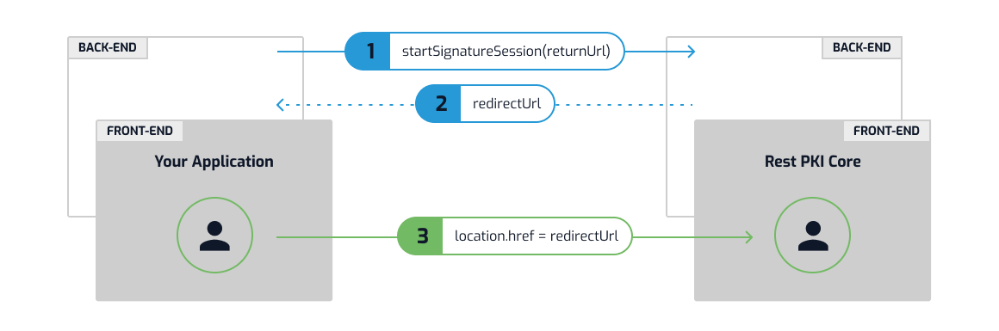
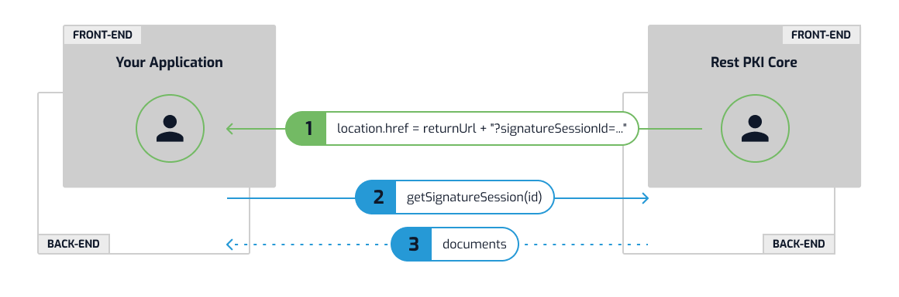

# Sessões de assinatura - Rest PKI Core

> [!NOTE]
> Por ora, esse artigo só cobre integração com .NET ou direta por API. Em breve estará disponível integração usando PHP (Jan/2021) e Java (Fev/2021)

**Sessões de assinatura** são uma funcionalidade do [Rest PKI Core](../../index.md) que permitem que seus usuários assinem documentos digitalmente sem que você
precise implementar uma página de assinatura digital na sua aplicação.

Para criar uma sessão de assinatura, sua aplicação especifica um `returnUrl` e recebe de volta um `redirectUrl`. Sua aplicação então redireciona o usuário para o
`redirectUrl`, local onde ele irá realizar as assinaturas digitais:



Uma vez que o processo seja finalizado, o usuário será redirecionado de volta à sua aplicação no endereço `returnUrl` especificado durante a criação da sessão. Um
*query parameter* será adicionado à URL contendo o ID da sessão de assinatura (`?signatureSessionId=...`). Usando esse ID, a sua aplicação chama o Rest PKI Core para
obter os documentos assinados pelo usuário:



## Criando a sessão de assinatura

> [!TIP]
> Desse ponto em diante estaremos descrevendo chamadas ao Rest PKI Core. Para conseguir acompanhar, certifique-se de que já fez os [Primeiros passos](get-started.md).

Em .NET, chame `IRestPkiService.CreateSignatureSessionAsync()` e use o `RedirectUrl` retornado para redirecionar o usuário:

[!include[Create session in dotnet](../../../../../../includes/rest-pki/core/signature-sessions/create-dotnet.md)]

Em PHP, chame `RestPkiServiceInterface.createSignatureSession()` e use o campo `$redirectUrl` retornado para redirecionar o usuário:

[!include[Create session in php](../../../../../../includes/rest-pki/core/signature-sessions/create-php.md)]

Disponibilizamos um código completo de [exemplo de criação de sessão de assinatura em PHP](https://github.com/LacunaSoftware/PkiSuiteSamples/blob/master/php/plain/public/signature-session-rest-core/index.php).

Em Java, chame `RestPkiService.CreateSignatureSession()` e use o `RedirectUrl` retornado para redirecionar o usuário:

[!include[Create session in java](../../../../../../includes/rest-pki/core/signature-sessions/create-java.md)]

Caso esteja chamando a API diretamente:

[!include[Create session API](../../../../../../includes/rest-pki/core/signature-sessions/create-api.md)]

Vamos analisar o `returnUrl` utilizado nos exemplos acima:

```plaintext
http://localhost:8080/SessionCallback
^^^^^^^^^^^^^^^^^^^^^ ^^^^^^^^^^^^^^^
Endereço da sua app   Rota para o tratamento de retorno
```

Ao adaptar os exemplos para a sua aplicação, você precisa alterar a primeira porção para o endereço da sua própria aplicação e também a rota para o tratamento do
retorno na sua aplicação (veja a seção abaixo).

## Implementando o tratamento de retorno

O `returnUrl` é o endereço para no qual o Rest PKI Core enviará o seu usuário de volta para a sua aplicação uma vez que o processo de assinatura seja concluído.

> [!NOTE]
> Até aqui, estamos usando `/SessionCallback` como URL relativa do tratamento de retorno, porém sinta-se à vontade para usar a URL relativa mais adequada à sua
> aplicação

Em .NET, a implementação do tratamento de retorno seria algo como:

[!include[Callback in dotnet](../../../../../../includes/rest-pki/core/signature-sessions/callback-dotnet.md)]

Em PHP, a implementação do tratamento de retorno seria algo como:

[!include[Callback in PHP](../../../../../../includes/rest-pki/core/signature-sessions/callback-php.md)]

Em Java, a implementação do tratamento de retorno seria algo como:

[!include[Callback in java](../../../../../../includes/rest-pki/core/signature-sessions/callback-java.md)]

Note que verificamos o estado (`Status`) da sessão e enviamos o usuário para um local padrão caso o estado não seja `Completed`.

> [!NOTE]
> Quando um usuário é redirecionado de volta à sua aplicação, a sessão terá um de dois possíveis estados: `Completed` ou `UserCancelled`, esse último ocorrendo quando a
> sessão é cancelada pelo usuário. Seu código deve sempre checar esse estado, pois é perfeitamente normal um usuário ser direcionado ao endereço de tratamento de
> retorno porque cancelou a sessão.

Em .NET, a view de Razor seria algo como:

[!include[Callback in dotnet - view](../../../../../../includes/rest-pki/core/signature-sessions/callback-dotnet-view.md)]

Em PHP, o lado do cliente seria algo como:

[!include[Callback in PHP - view](../../../../../../includes/rest-pki/core/signature-sessions/callback-php-view.md)]

Disponibilizamos um código completo de [exemplo de tratamento de retorno em PHP](https://github.com/LacunaSoftware/PkiSuiteSamples/blob/master/php/plain/public/signature-session-rest-core/complete.php).

Em Java, a view de Spring seria algo como:

[!include[Callback in java - view](../../../../../../includes/rest-pki/core/signature-sessions/callback-java-view.md)]

Disponibilizamos um código completo de [exemplo de tratamento de retorno em Java](https://github.com/LacunaSoftware/PkiSuiteSamples/blob/master/java/springmvc/src/main/java/com/lacunasoftware/pkisuite/controller/SignatureSessionRestCoreController.java).
## Desabilitando downloads

Caso tenha a impressão de que alguns de seus usuários, ao invés de concluirem a sessão e retornarem à sua aplicação, simplesmente fazem o download dos arquivos
assinados e fecham a aba do navegador, de modo que a sua aplicação não chega a tomar conhecimento dos documentos, você pode desabilitar a função de download dos
arquivos assinados durante a sessão de assinatura especificando `DisableDownloads = true` ao criar a sessão.

Em .NET:

[!include[Disable downloads in dotnet](../../../../../../includes/rest-pki/core/signature-sessions/disable-downloads-dotnet.md)]

Em PHP:

[!include[Disable downloads in PHP](../../../../../../includes/rest-pki/core/signature-sessions/disable-downloads-php.md)]

Em Java:

[!include[Disable downloads in java](../../../../../../includes/rest-pki/core/signature-sessions/disable-downloads-java.md)]

Integração direta por API:

[!include[Disable downloads API](../../../../../../includes/rest-pki/core/signature-sessions/disable-downloads-api.md)]

Nesse caso, os usuários só conseguirão baixar os arquivos assinados na sua aplicação e, portanto, ficarão menos inclinados a interromper o processo prematuramente
fechando a aba do navegador.

> [!NOTE]
> Outra forma de lidar com esse problema é optar pelo **Fluxo com webhook** (veja seção abaixo)

<a name="webhook-flow" />

## Fluxo com webhook

No fluxo padrão descrito acima, a sua aplicação toma conhecimento dos documentos assinados quando o usuário é redirecionado de volta com a *query parameter*
`signatureSessionId` adicionada à URL.

Uma alternativa a esse fluxo é tomar conhecimento dos documentos assinados através de [notificação de evento por webhook](../webhooks.md). Nesse caso, pode-se
abrir a página de assinatura em uma nova aba, a qual é fechada ao final do processo, dispensando a implementação do "tratamento de retorno" (é necessário, entretanto,
implementar o recebimento de notificação de evento).

Esse fluxo tem a vantagem de não depender do retorno do usuário à sua aplicacão para tratar os documentos que são assinados. Além disso, esse fluxo facilita
o uso de [processamento em background](background-processing.md), recurso que melhora significativamente a experiência do usuário.

Para abrir a página de assinatura em outra aba, é preciso utilizar um *anchor* (elemento `<a>`) com `target="_blank"`:

[!include[Webhook flow link](../../../../../../includes/rest-pki/core/signature-sessions/webhook-flow-link.md)]

> [!NOTE]
> Outra opção é abrir a aba com uma chamada ao `window.open()` em Javascript

Além disso, é preciso omitir o parâmetro `returnUrl` ao criar a sessão.

Em .NET:

[!include[Create session with webhook in dotnet](../../../../../../includes/rest-pki/core/signature-sessions/webhook-flow-dotnet.md)]

Em PHP:

[!include[Create session with webhook in PHP](../../../../../../includes/rest-pki/core/signature-sessions/webhook-flow-php.md)]

Disponibilizamos um código completo de [exemplo do início do fluxo com webhook em PHP](https://github.com/LacunaSoftware/PkiSuiteSamples/blob/master/php/plain/public/signature-session-rest-core/using-webhook.php).

Em Java:

[!include[Create session with webhook in java](../../../../../../includes/rest-pki/core/signature-sessions/webhook-flow-java.md)]

Disponibilizamos um código completo de [exemplo do início do fluxo com webhook em Java](https://github.com/LacunaSoftware/PkiSuiteSamples/blob/master/java/springmvc/src/main/java/com/lacunasoftware/pkisuite/controller/SignatureSessionRestCoreController.java).

Integração direta por API:

[!include[Create session with webhook API](../../../../../../includes/rest-pki/core/signature-sessions/webhook-flow-api.md)]

Dessa forma, a aba será fechada pelo Rest PKI Core ao final do processo.

## Melhorando a experiência do usuário

Você pode optar por alguns dos recursos abaixo para melhorar a experiência do usuário durante suas sessões de assinatura:

* [Validação de arquivos](file-validation.md)
* [Processamento em background](background-processing.md)
