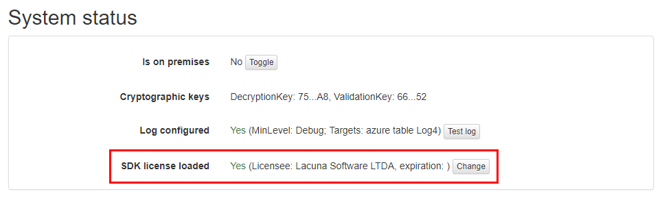

# Change license - Rest PKI

In order to run an [*on premises*](index.md) instance of [Rest PKI](../index.md), you need a license for the
Lacuna PKI SDK, which is configured during the setup procedure.

If you need to change the license afterwards, follow the steps below:

1. Sign in as administrator on your instance of Rest PKI (if you have lost the password, see the article [Recover administrator password](admin-recover.md))
1. On the top menu, click on **Administration** &gt; **System status**
1. On the item **SDK license loaded**, click on the button **Change**
1. Locate on the file **LacunaPkiLicense.txt** the binary license, under the section "Binary license content (Base64-encoded)"
   ```
   Binary license content (Base64-encoded)
   ---------------------------------------
   
   AxAA..............iw==
   ^^^^^^^^^^^^^^^^^^^^^^
   ```
1. Copy and paste the entire line, and then click on **Configure license**


