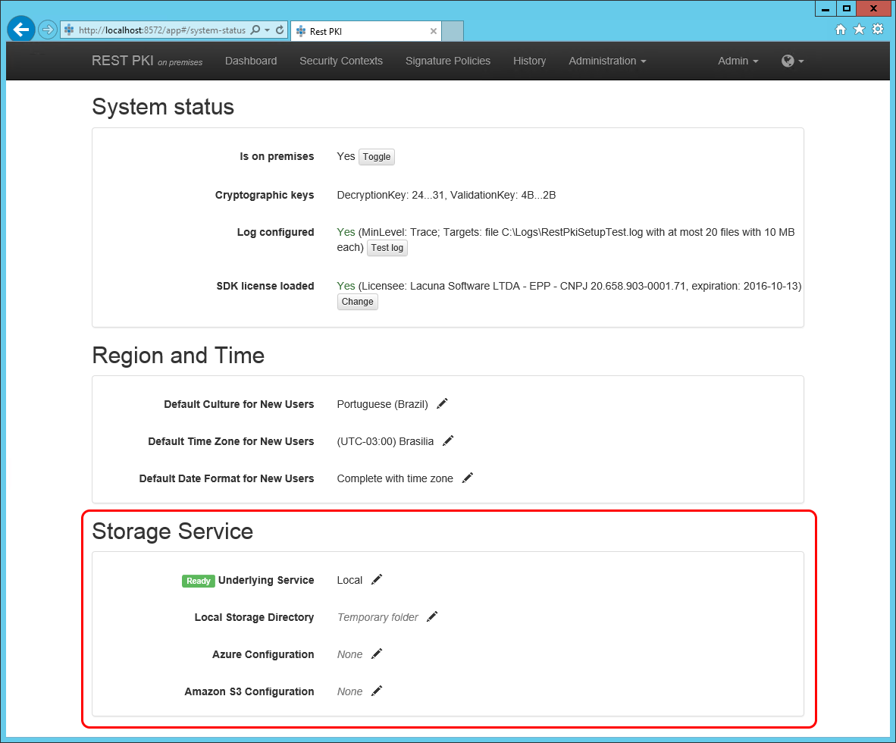

# Configuração de Storage - Rest PKI

Para manter o banco de dados organizado, o [Rest PKI](../index.md) armazena arquivos fora do banco de dados. Os arquivos
podem ser armazenados em *serviços* diferentes:

* Local (sistema de arquivos)
* [Azure Storage](https://azure.microsoft.com/en-us/services/storage/)
* [Amazon S3](https://aws.amazon.com/s3)

Por padrão, a sua instância [*on premises*](index.md) vem configurada para armazenar arquivos na pasta temporária
do servidor web. Entretanto, pode ser necessário alterar essa configuração, especialmente caso você queira executar
o Rest PKI em múltiplos servidores. Nesse caso, é necessário que as várias instâncias compartilhem o mesmo banco de
dados *e o mesmo storage*.

A configuração de storage é feita pela interface web do sistema:

1. Autentique-se com um usuário administrador
1. Vá em **Administração** &gt; **Status do Sistema**

Em seguida, configure a seção **Serviço de Armazenamento** conforme uma das seções abaixo.

## Local

 1. Em **Serviço Base**, escolha **Local**
 1. Em **Diretório do Armazenamento Local**, preencha o caminho da pasta onde o Rest PKI deve armazenar os arquivos

 > [!NOTE]
> Em uma instalação multi-servidores, essa pasta deve ser compartilhada entre os servidores web

## Azure Storage

 1. Em **Serviço Base**, escolha **Azure Blob Storage**
 1. Em **Configuração do Azure**, preencha da seguinte maneira: `<account name>;<account key>;<nome do container>`
    * Exemplo: `patorumstorage;MYSECRETKEY;restpkifiles`

## Amazon S3

1. Em **Serviço Base**, escolha **Amazon S3**
 1. Em **Configuração do Amazon S3**, preencha da seguinte maneira: `<access key>;<secret key>;<nome do bucket>`
    * Exemplo: `MYACCESSKEY;MYSECRETKEY;restpkifiles`
