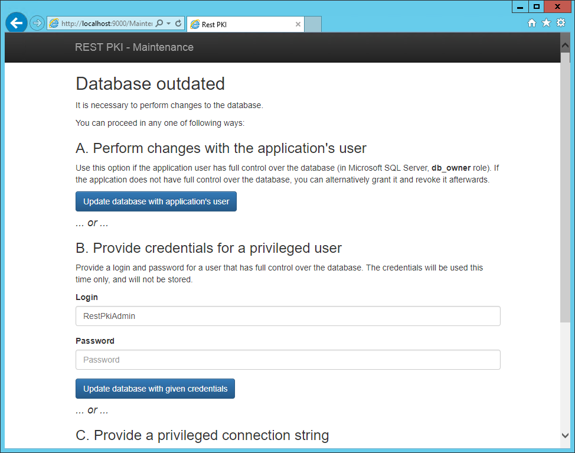

# Atualização do banco de dados - Rest PKI

As atualizações do banco de dados em instâncias [*on premises*](index.md) do [Rest PKI](../index.md) podem
ser feitas **automaticamente** ou **manualmente**. A configuração mais adequada depende sobretudo da escolha feita
durante a instalação sistema no que se refere às permissões do sistema sobre o banco de dados:

1. Sistema ser "dono" (*owner*) do banco de dados
1. Sistema ter apenas permissões de leitura e escrita no banco de dados

Caso se tenha optado pela opção **1** (sistema ***owner* do banco**), ambas configurações de atualização do banco
podem ser utilizadas, sendo recomendada a configuração de atualizações **automáticas**. Caso se tenha optado pela
opção **2** (sistema com permissões de **leitura e escrita apenas** no banco de dados), o sistema deve ser
configurado para efetuar atualizações no do banco de dados **manualmente**.

Quando o sistema está configurado para realizar atualizações automáticas do banco de dados, este é atualizado
na primeira execução de uma nova versão do sistema, não sendo necessário qualquer procedimento adicional.

Já no caso de atualizações manuais do banco de dados, o sistema verifica na primeira execução de uma nova versão se é
necessário atualizar o banco de dados e, nesse caso, o sistema fica inoperante até que o procedimento seja realizado manualmente
(veja [seção abaixo](#manual-update)).

## Configuração do modo de atualização

A configuração do modo de atualização -- manual ou automática -- é feita no arquivo `AppSettings.config`, no item `AutoUpdateDatabase`.

Para utilizar atualizações **automáticas** do banco de dados (configuração recomendada para quanto o sistema é ***owner* do banco**):

```xml
<add key="AutoUpdateDatabase" value="True" />
```

Para utilizar atualizações **manuais** do banco de dados (configuração recomendada para quando o sistema tem permissões de **leitura e escrita apenas** sobre o banco de dados):

```xml
<add key="AutoUpdateDatabase" value="False" />
```

> [!NOTE]
> Caso a configuração seja omitida, assume-se atualização **manual** (que não é o ideal quando o sistema é *owner* do banco de dados).

<a name="manual-update" />
## Atualização manual do banco de dados

Caso ao atualizar o Rest PKI apareça a mensagem "HTTP Error 503.0 - The server is currently undergoing maintenance. Please try again later.", isso significa que é preciso atualizar o banco de dados manualmente.

> [!NOTE]
> Para saber com antecedência se uma atualização demandará atualização do banco de dados, observe no [Histórico de versões](../changelog.md) se alguma das
> versões entre a versão que encontra-se instalada e a que você está instalando está marcada como demandando atualização do banco de dados. Para saber como
> verificar a versão instalada do sistema, veja [este artigo](check-version.md).

Nesse caso, acesse a URL `/Maintenance` relativa ao endereço do site (por exemplo, `http://localhost:9000/Maintenance`) e siga as instruções na tela.

> [!NOTE]
> Para acessar essa URL é preciso estar acessando o site localmente ou via HTTPS. Caso precise acessar essa URL remotamente via HTTP, veja a seção 2.4.5 do [Manual de instalação em Windows Server](https://files.lacunasoftware.com/restpki/restpki-admin-guide-pt.pdf)



Nesse passo, o sistema irá atualizar as tabelas no banco de dados. Utilize uma das opções exibidas na tela para efetuar as alterações, de acordo com a opção de permissões da aplicação sobre o banco de dados escolhida durante a instalação:

* Caso o sistema seja *owner* do banco de dados, prossiga com a opção **A** (*Perform changes with the application’s user*)
* Caso o sistema tenha apenas permissões de leitura e escrita no banco de dados, prossiga com a opção **B** (*Provide
  credentials for a privileged user*). Forneça então "RestPkiAdmin" como usuário privilegiado (ou o nome de usuário escolhido
  durante a instalação como usuário administrador do banco de dados) e a senha deste

Após seguir as instruções, a tela inicial com a mensagem "REST PKI on premises" será exibida e o procedimento de atualização estará concluído.

## Veja também

* [Resolução de problemas de instalação em Windows Server](windows-setup/troubleshoot/index.md)
