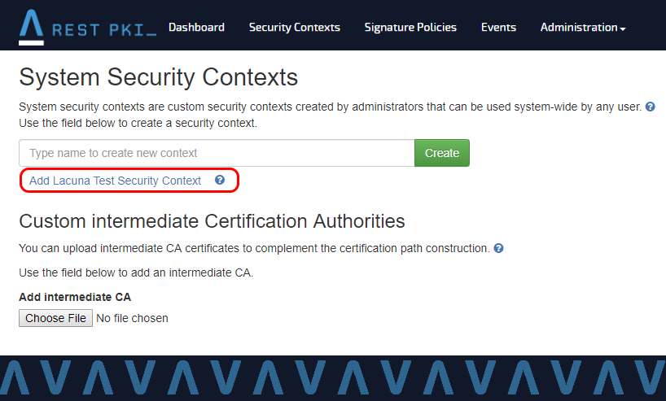

# Habilitando o contexto de segurança de testes da Lacuna

Para utilizar os certificados da nossa cadeia de testes, é **preciso habilitar o contexto de segurança da Lacuna de testes**.

Para isso:
1. Autentique-se com uma conta de administrador na instância do Rest PKI em questão
1. Vá em **Administração > Contextos de Segurança de Sistema**
1. Clique em **Criar Contexto de Segurança da Lacuna de Testes**

