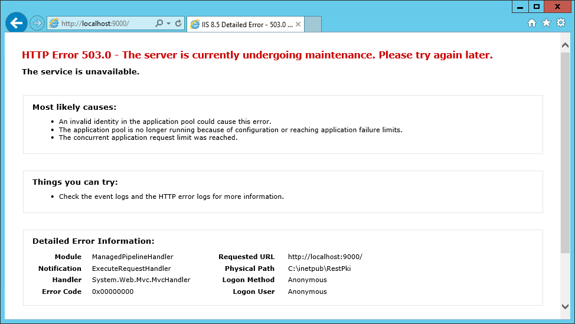

# Atualização do Rest PKI em Windows Server

Para atualizar a sua instância do [Rest PKI](../../index.md), siga as instruções dessa página.

> [!TIP]
> Antes de começar, verifique a [configuração de atualizações do banco de dados](../database-update.md) do sistema.

1. Crie um backup do banco de dados e da pasta do site
1. Apague todos os arquivos da pasta do site **EXCETO OS ARQUIVOS** `AppSettings.config` e `Connections.config`
1. Extraia o conteúdo do novo pacote do Rest PKI ([restpki-1.26.3.zip](https://cdn.lacunasoftware.com/restpki/restpki-1.26.3.zip)) para a pasta do site
1. Acesse o site

> [!NOTE]
> Como o pacote não contém arquivos chamados AppSettings.config e Connections.config, os seus arquivos com esses nomes contendo as configurações do sistema serão preservados durante a operação.

Caso seja exibida a tela inicial com o título "REST PKI on premises", o processo estará concluído.

<a name="db-update" />
Caso o sistema esteja configurado para realizar atualizações manuais ao modelo do banco de dados, poderá ser necessário um procedimento adicional para atualizar o banco de dados.

> [!NOTE]
> Para saber com antecedência se uma atualização demandará atualização do banco de dados, observe no [Histórico de versões](../../changelog.md) se alguma das
> versões entre a versão que encontra-se instalada e a que você está instalando está marcada como demandando atualização do banco de dados. Para saber como
> verificar a versão instalada do sistema, veja [este artigo](../check-version.md).

Nesse caso, será exibida a mensagem "HTTP Error 503.0 - The server is currently undergoing maintenance. Please try again later." ao acessar o sistema, conforme abaixo:

Realize então a [atualização manual do banco de dados](../database-update.md#manual-update).

## Veja também

* [Resolução de problemas](troubleshoot/index.md)
