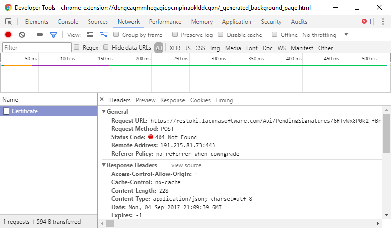

# Erro "Could not get pending signature"

Ao tentar implementar uma página com [assinatura web remota](../../pki-guide/web-signatures/remote.md) utilizando o
[Rest PKI](../index.md) em conjunto com o [Web PKI](../../web-pki/index.md), pode ocorrer um erro no navegador do
usuário final com a seguinte mensagem:

> Could not get pending signature

Nos exemplos de assinatura remota que utilizam a função `signWithRestPki` do Web PKI ocorre uma comunicação direta
entre o Web PKI e o Rest PKI para trafegar os dados da assinatura. Esse erro indica que essa comunicação não está
funcionando corretamente. Esse problema é comum quando se está utilizando uma instância própria do Rest PKI (*on
premises*), mas pode ocorrer também utilizando o Rest PKI em nuvem (em https://pki.rest/).

O primeiro passo para diagnosticar o problema é verificar se a máquina do usuário em questão tem acesso à
instância do Rest PKI sendo utilizada. Abra um navegador na máquina do usuário e acesse:

* Rest PKI em nuvem: https://restpki.lacunasoftware.com/Api/System/Info
* Rest PKI *on premises*: https://restpki.suaempresa.com.br/Api/System/Info (substitua de acordo com a URL da sua instância)

> [!NOTE]
> Embora a URL padrão para acessar as APIs do Rest PKI seja `https://pki.rest/`, no Web PKI utiliza-se por padrão a URL alternativa
> `https://restpki.lacunasoftware.com/` que, por ser mais convencional, tem uma chance menor de ser eventualmente bloqueada por
> firewalls das redes dos usuários finais.

O resultado esperado é um XML similar ao seguinte:

```xml
<SystemInfo xmlns:i="http://www.w3.org/2001/XMLSchema-instance" xmlns="http://schemas.datacontract.org/2004/07/Lacuna.RestPki.Api.System">
	<ProductName>Lacuna Rest PKI</ProductName>
	<ProductVersion>1.13.1</ProductVersion>
</SystemInfo>
```

Caso a chamada falhe, o erro informado deve ajudar no diagnóstico do problema.

* Para Rest PKI em nuvem, a chamada provavelmente foi bloqueada pelo firewall da rede do usuário. Solicite ao responsável pela rede
  em questão a liberação do domínio `restpki.lacunasoftware.com` em protocolo HTTPS.
* Para Rest PKI *on premises*, os principais motivos de falha são:
  * A sua instância do Rest PKI não está disponível publicamente
  * A sua instância do Rest PKI está disponível publicamente, porém está sendo bloqueada por um firewall no ambiente do usuário final. Nesse caso, para evitar
    possíveis bloqueios, assegure-se que a URL do seu Rest PKI:
    * Seja por hostname, não por IP (ex: `http://201.184.43.191/`)
    * Seja via HTTPS com certificado de SSL válido
    * Seja em porta padrão (443 ou, caso não esteja em HTTPS, porta 80)

Caso a chamada seja bem-sucedida, retornando um XML similar ao mostrado acima, realize na máquina onde está sendo observado o erro
o procedimento descrito na seção abaixo.

<a name="debug-chrome" />
## Diagnóstico da extensão no Chrome

> [!NOTE]
> Caso o problema só ocorra em outros navegadores que não o Chrome, veja instruções no final do artigo

1. Clique com o botão direito no ícone do Web PKI (chip amarelo) no canto superior direito do navegador e clique na opção **Manage extensions**
1. Marque a caixa **Developer mode** no topo da lista de extensões
1. Localize o Web PKI na lista de extensões e clique no link **background page**
1. Na janela que se abrirá, clique na aba **Network**
1. Repita o procedimento de assinatura no navegador
1. Ficará registrado na aba Network a chamada de rede ao Rest PKI que falhou. Clique na chamada.

Após esse procedimento, você visualizará uma tela similar à seguinte:



Os detalhes do erro da chamada de rede ao Rest PKI devem indicar a causa do problema:

* Caso você esteja usando uma instância própria do Rest PKI ...

  * ... e a chamada tenha sido para o **domínio `restpki.lacunasoftware.com` ao invés do domínio da sua instância do Rest PKI**: o endereço do
    Rest PKI não está configurado corretamente no código Javascript da página. Veja a solução no artigo
    [Especificando a URL do Rest PKI](../../web-pki/customizing-restpki-url.md).

  * ... e a chamada tenha sido para o domínio correto da sua instância do Rest PKI ...

    * ... e tenha falhado com **status code 404**: o endereço do Rest PKI pode não estar configurado corretamente no seu código de backend. Verifique
      a inicialização da classe `RestPkiClient` (o nome da classe pode ser ligeiramente diferente dependendo da linguagem de programação).

    * ... e tenha falhado com **outro status code**: tente diagnosticar o problema observando o código de erro e a mensagem. **NOTA:** certificados de
      SSL inválidos causam falha silenciosa na comunicação entre o Web PKI e o Rest PKI. É fundamental que o certificado de SSL sendo utilizado esteja
      dentro do período de validade e tenha sido emitido por uma Autoridade Certificadora confiada por padrão pelos sistemas operacionais.

* Caso você esteja usando a instância padrão do Rest PKI em `https://pki.rest/`: verifique o código de erro. Provavelmente o acesso ao Rest PKI está sendo
  bloqueado pelo firewall da rede do usuário em questão. Se for o caso, entre em contato com o responsável pela rede em questão.

<a name="debug-firefox" />
## Diagnóstico da extensão no Firefox

Para diagnosticar falhas na comunicação do Web PKI com o Rest PKI no Firefox, siga os passos abaixo:

1. Abra o menu do Firefox (ícone no canto superior direito)
1. Clique em **Add-ons**
1. Clique na engrenagem no topo da página, depois em **Debug Add-ons**
1. Marque a caixa **Enable add-on debugging**
1. Localize o Web PKI na lista de extensões e clique no link **Debug**
1. No pop-up que aparecerá, clique em **Allow**
1. Na janela que se abrirá, clique na aba **Network**
1. Repita o processo de assinatura no navegador
1. Ficará registrado na aba Network a chamada de rede ao Rest PKI que falhou. Clique na chamada.

> [!NOTE]
> No Firefox, ficam misturadas na aba *Network* da janela de debug da extensão as chamadas feitas pela página e feitas pela extensão. Para ajudar, a chamada
> que o Web PKI faz para o Rest PKI pode ser identificada pela rota, chamada **Certificate**
