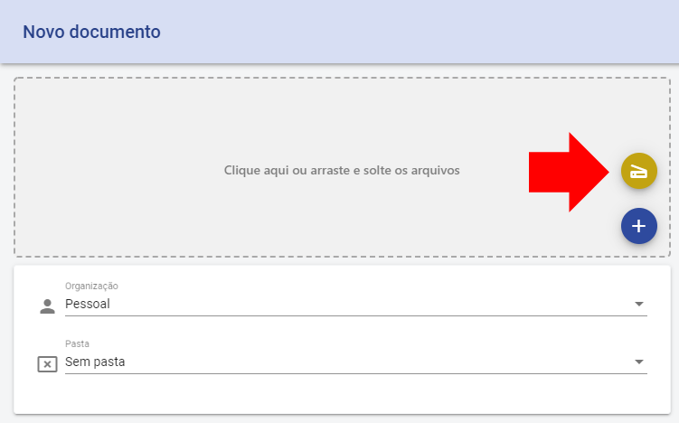
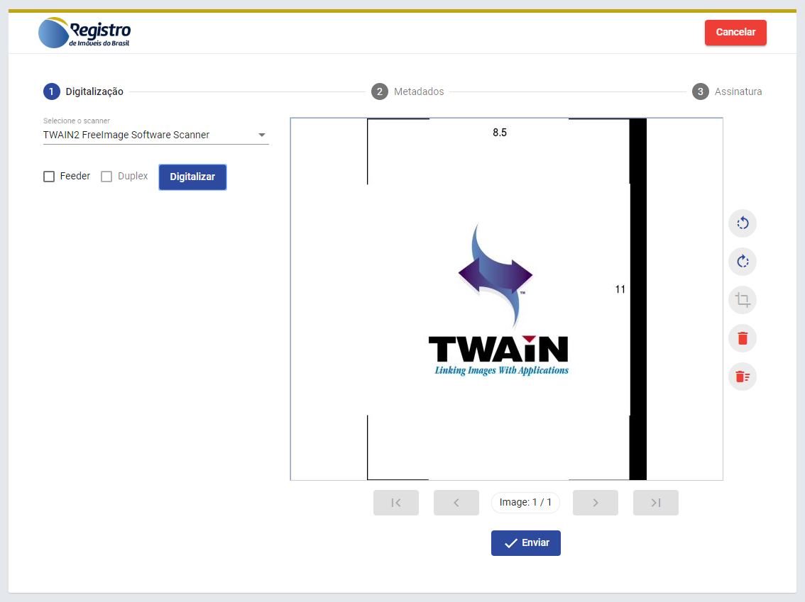
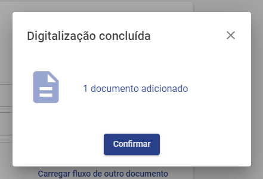
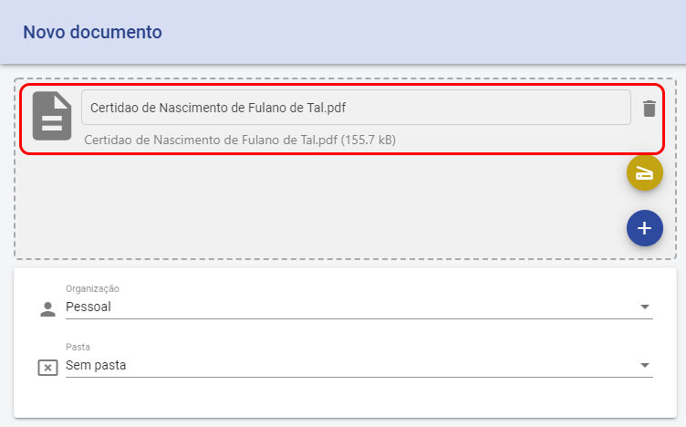
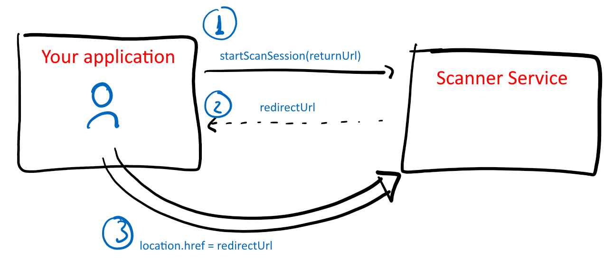
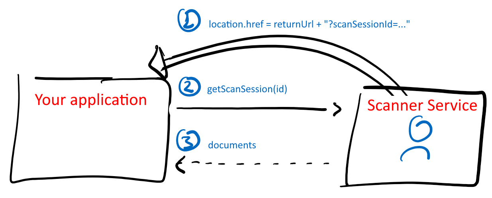

# Guia de Integração - Scanner Service

O [Lacuna Scanner Service](../index.md) lhe permite adicionar uma página de digitalização à sua aplicação web existente de maneira rápida e fácil porque
a digitalização em si ocorre em uma página do serviço, e não da sua aplicação, liberando esta de lidar com as complexidades envolvidas na
comunicação com scanners e no preenchimento dos metadados obrigatórios previstos no [Decreto Nº 10.278/2020](http://www.planalto.gov.br/ccivil_03/_Ato2019-2022/2020/Decreto/D10278.htm).

## Exemplo

Por exemplo, suponha que na sua aplicação exista um formulário que aceita *upload* de arquivos e você queira adicionar um botão para digitalização:

Ao clicar no botão, o usuário é redirecionado para a página de digitalização:

> [!NOTE]
> A página de digitalização pode ser personalizada com a logomarca e cores da sua aplicação de modo a oferecer ao usuário uma experiência
> homogênea (a imagem acima é um exemplo de personalização).

Ao concluir o processo de digitalização, o usuário é redirecionado de volta à sua aplicação:

A sua aplicação então faz uma chamada à API do serviço para obter o documento digitalizado:

<a name="overview" />
## Visão geral

O procedimento se inicia com a sua aplicação criando uma **sessão de digitalização**, passando o **returnUrl** &ndash; a URL à qual o usuário deve ser
levado de volta ao final do processo. A sua aplicação recebe de volta o **redirectUrl** &ndash; a URL à qual o usuário deve ser levado para iniciar o
processo de digitalização:

Ao final do processo de digitalização, o usuário é levado de volta à sua aplicação (na URL **returnUrl**). É adicionado à URL um argumento chamado **scanSessionId**.
Com esse argumento, a sua aplicação faz uma chamada à API do serviço para obter o(s) documento(s) digitalizado(s):

## Parâmetros de comunicação

Você precisará dos seguintes parâmetros:

* **Endpoint**: endereço do Scanner Service, ex: `https://scn.lacunasoftware.com/`
* **API Key**: chave de acesso à API

Solicite ao nosso [suporte ao desenvolvedor](mailto:suporte@lacunasoftware.com) seus parâmetros.

## Linguagens de programação

Escolha uma linguagem de programação para instruções específicas:

* [.NET](dotnet.md)
* Para outras linguagens: [Integração por REST API](other.md)
