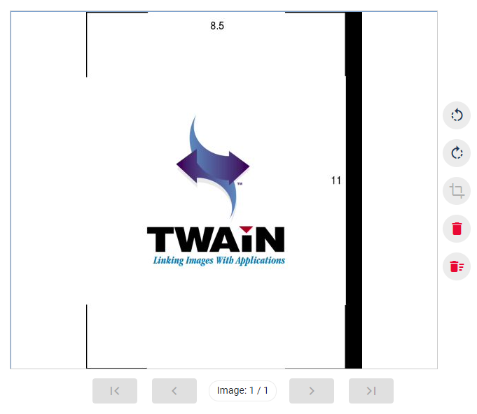

# Simulador de dispositivo de digitalização

Caso você queira testar o [Scanner Service](index.md) porém não tenha um scanner, você pode utilizar um simulador de dispositivo de digitalização executando
o instalador abaixo:

[**twainds.win64.installer.2.1.3.msi**](https://cdn.lacunasoftware.com/scanner/tools/twainds.win64.installer.2.1.3.msi)

Após a instalação, passará a constar um scanner chamado *TWAIN2 FreeImage Software Scanner* nas sua lista de scanners. Ao disparar a digitalização com esse
scanner, é sempre digitalizada uma mesma página de exemplo:

