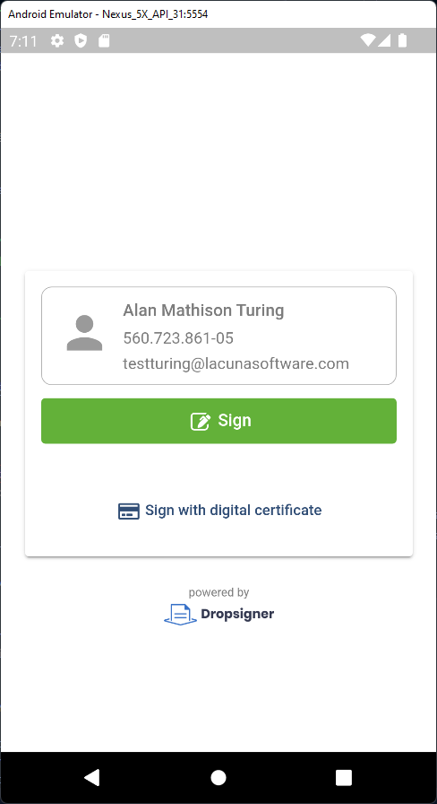

# Integração com Assinatura embutida

## Introdução

A integração com Assinatura embutida permite assinar/aprovar documentos submetidos no Signer dentro de qualquer aplicação por meio do componente `LacunaSignerWidget`.

> [!NOTE]
> O Signer deve ser configurado com uma licença do Web PKI que tenha o domínio no qual o componente será carregado.

## Instalação

Primeiro, inclua na sua página o arquivo [lacuna-signer-widget.js](https://cdn.lacunasoftware.com/libs/signer/lacuna-signer-widget-0.8.0.min.js) mais recente:

```html
<script type="text/javascript" src="https://cdn.lacunasoftware.com/libs/signer/lacuna-signer-widget-0.8.0.min.js"
    integrity="sha256-kS96fv3kyz1iJOP3crrI/2dvBzAgEHu4dZF9ecS/f0I="
    crossorigin="anonymous"></script>
```

Em seguida, instancie a classe `LacunaSignerWidget`:

```javascript
var widget = new LacunaSignerWidget();
```

Chame então o método `on()` passando o tipo de evento que quer escutar e uma função de callback que será chamada quando o usuário assinar/aprovar o documento:

```javascript
//assinatura
widget.on(widget.events.documentSigned, function (e) {
	// ...
	//alert('Documento ' + e.id + ' assinado');
});
```

```javascript
//aprovação
widget.on(widget.events.documentApproved, function (e) {
	// ...
	//alert('Documento ' + e.id + ' aprovado');
});
```

Se preferir use o método `listen()` para escutar todos eventos com apenas um callback:

```javascript
widget.listen(function (e) {
	if (e.type === widget.events.documentSigned) {
		// ...
		//alert('Documento ' + e.id + ' assinado');
	} else if (e.type === widget.events.documentApproved) {
		// ...
		//alert('Documento ' + e.id + ' aprovado');
	}
});
```

> [!NOTE]
> Sempre verifique no backend se o documento foi de fato concluído, dado que os callbacks podem ser acionados por outros arquivos javascript.

Por fim, carregue o iFrame utilizando o método `render()`, que recebe duas entradas obrigatórias:

* `embedUrl`: a URL para ação que deseja ser realizada. Corresponde ao parâmetro embedUrl retornado pela [API Action URL](https://www.dropsigner.com/swagger/index.html#operations-Documents-post_api_documents__id__action_url)
* `elementId`: id do elemento no qual será exibido o componente de assinatura.

E duas entradas opcionais:

* `page`: numero da página na qual o documento será aberto em sua inicialização (para abrir a última página de qualquer documento, não importando o tamanho dele, atribui-se o número `'-1'`).
* `scale`: a porcentagem que definirá em qual escala o documento será aberto. Pode ser definido através de um simples string `'100'` ou através do `widget.scaleOptions.S100`

```javascript
widget.render(embedUrl, 'embed-container', page, scale);
```

Caso prefira, pode ser fornecido o elemento DOM diretamente:

```javascript
widget.renderElement(embedUrl, document.getElementById('embed-container'), page, scale);
```

## Exemplo online

<iframe width="100%" height="600" src="https://jsfiddle.net/LacunaSoftware/hgutm4fL/embedded/" allowfullscreen="allowfullscreen" frameborder="0"></iframe>

Para executar o exemplo, clique na aba **Result**. Se você ainda não tem o Web PKI instalado, será preciso seguir as intruções para instalá-lo. 
Ao usar este componente em sua própria aplicação, o usuário será redirecionado para a página de instalação e voltará à aplicação automaticamente ao final do processo.


## Exemplo online de assinatura em nuvem

Para este exemplo é utilizado o certificado de teste do BirdID (CPF 026.102.470-10, veja abaixo as instruções para pareamento).

<iframe width="100%" height="600" src="https://jsfiddle.net/LacunaSoftware/12zLfhgr/embedded/" allowfullscreen="allowfullscreen" frameborder="0"></iframe>

Para executar o exemplo, clique na aba **Result**. Para usar o usuário de teste do ambiente de homologação do BirdID use o QR code abaixo no aplicativo:


## Configurações adicionais

Na instanciação da classe `LacunaSignerWidget` você pode passar um objeto com uma ou mais das configurações listadas abaixo:

Atributo                 | Tipo         |  Descrição  
-----------------------  | ------------ | ----------
`enableNotifications`    | boolean      | Notificações não são enviadas após a conclusão da assinatura/aprovação embutida. Defina como `true` para enviá-las. Pode ser definido após a instanciação com método `setEnableNotifications`.
`disableDocumentPreview` | boolean      | Se `true`, esconde a pré-visualização do documento. Nesse caso, será exibido apenas o botão de assinatura e dados do assinante/aprovador. Pode ser definido após a instanciação com método `setDisableDocumentPreview`.
`enableRefusal`          | boolean      | Se `true`, exibirá a opção para recusar uma assinatura. Pode ser definido após a instanciação com método `setEnableRefusal`.
`culture` | string | Define o idioma utilizado, as opções disponíveis são `"pt"`(português), `"en"`(inglês) e `"es"`(espanhol)
`theme` | string | Define o tema do widget, use o código de 3 caracteres de cada tema (ex: amazon-cornell-red: `"acr"`), os temas disponíveis estão na [página de personalização](https://docs.lacunasoftware.com/pt-br/articles/signer/on-premises/customization.html)

Exemplo:

```javascript
var widget = new LacunaSignerWidget({ disableDocumentPreview: true });
```

```javascript
var widget = new LacunaSignerWidget();

widget.setDisableDocumentPreview(true);
```

## Exemplo online de assinatura sem pré-visualização

<iframe width="100%" height="600" src="https://jsfiddle.net/LacunaSoftware/pfn3zct1/embedded/" allowfullscreen="allowfullscreen" frameborder="0"></iframe>

## Exemplo para dispositivos móveis

Também é possível utilizar o exemplo de assinaturas embutidas em dispositivos móveis, um _app_ de exemplo está disponível em nosso [repositório do GitHub](https://github.com/LacunaSoftware/signer-flutter). O exemplo contém uma página da web contendo o widget em JavaScript rodando em seu dispositivo. A aplicação foi desenvolvida com [Flutter](https://flutter.dev/).

A imagem abaixo mostra o processo de assinatura sem preview de documento dentro do aplicativo:




## Posicionamento de marcas de assinatura

À partir da versão 1.70.0 do Signer e 0.7.0 do Widget, é possível embutir a tela de posicionamento de marcas de assinatura em outras aplicações tal como já era 
feito para a tela de assinatura. Uma vez posicionadas, é possível obter os dados de posicionamento correspondente tanto pela biblioteca quando pela API do Signer
para que sejam criados um ou mais documentos com as posições selecionadas.

O primeiro passo é criar uma sessão de posicionamento utilizando a API de criação de sessão. Existem duas variações dessa API:

* [API de criação de sessão básica](https://www.dropsigner.com/swagger/index.html#operations-MarksSessions-post_api_marks_sessions): permite criar a sessão de posicionamento
fornecendo apenas os dados necessários para criação da sessão de posicionamento. Dados pessoais de signatários como e-mail e CPF, por exemplo, são opcionais. Use esta API, caso, após obter o resultado da 
sessão, você ainda pretenda atualizar os dados da requisição de criação de documentos que será enviada posteriormente ao Signer.

* [API de criação de sessão com requisição de criação de documento](https://www.dropsigner.com/swagger/index.html#operations-MarksSessions-post_api_marks_sessions_documents): 
permite criar a sessão de posicionamento fornecendo o mesmo request que é utilizado para criar documentos. Use esta API, caso prefira encaminhar o resultado da sessão diretamente 
para a API de criação de documentos sem fazer nenhuma alteração adicional.

O resultado de ambas APIs será o retorno de um ID de sessão e uma URL para embutir a tela de posicionamento:

```javascript
{
	//ID da sessão
	"id": "4cdcfa93-8f38-46f9-8634-246d5589fe5f",
	//URL para usar com o Widget
	"embedUrl": "https://www.dropsigner.com/position-marks/4cdcfa93-8f38-46f9-8634-246d5589fe5f?v=1"
}
```

Uma vez obtida a URL de sessão, basta inicializar o Widget assim como é feito para a funcionalidade de assinatura:

```javascript
var widget = new LacunaSignerWidget();
```

Chame o método `on()` passando o evento de posicionamento de marcas e uma função de callback que será chamada quando o usuário concluir o posicionamento:

```javascript
//assinatura
widget.on(widget.events.marksPositioned, function (e) {
	// O atributo data conterá a requisição preenchida com as posições das marcas
	//console.log(e.data);
	//alert('Marcas posicionadas');
});
```

Por fim, carregue o iFrame utilizando o método `render()`:

```javascript
widget.render(embedUrl, 'embed-container');
```

Uma vez concluída a sessão de posicionamento, cada entrada do atributo `flowActions` da requisição fornecida na criação da sessão será atualizada com as posições selecionadas na
tela de posicionamento (mais especificamente, será preenchido o atributo `prePositionedMarks`). 

Essa requisição atualizada pode ser obtida pelo atributo `data` do evento de posicionamento ou pelo atributo de mesmo nome da
[API de obtenção de dados da sessão](https://www.dropsigner.com/swagger/index.html#operations-MarksSessions-get_api_marks_sessions__id_).

> [!NOTE]
> A sessão de posicionamento tem duração de 1 hora após sua criação. Após esse período, não será possível obter nem atualizar os dados da sessão.
