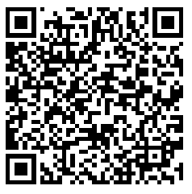

# Integração com Assinatura embutida

## Introdução

A integração com Assinatura embutida permite assinar/aprovar documentos submetidos no Signer dentro de qualquer aplicação por meio do componente `LacunaSignerWidget`.

> [!NOTE]
> O Signer deve ser configurado com uma licença do Web PKI que tenha o domínio no qual o componente será carregado.

## Instalação

Primeiro, inclua na sua página o arquivo [lacuna-signer-widget.js](https://cdn.lacunasoftware.com/libs/signer/lacuna-signer-widget-0.4.0.min.js) mais recente:

```html
<script type="text/javascript" src="https://cdn.lacunasoftware.com/libs/signer/lacuna-signer-widget-0.4.0.min.js"
    integrity="sha256-6ML+DdbMkoKycQiKiJ/tDScsdlVt0oiRFqNMoKAntzQ="
    crossorigin="anonymous"></script>
```

Em seguida, instancie a classe `LacunaSignerWidget`:

```javascript
var widget = new LacunaSignerWidget();
```

Chame então o método `on()` passando o tipo de evento que quer escutar e uma função de callback que será chamada quando o usuário assinar/aprovar o documento:

```javascript
//assinatura
widget.on(widget.events.documentSigned, function (e) {
	// ...
	//alert('Documento ' + e.id + ' assinado');
});
```

```javascript
//aprovação
widget.on(widget.events.documentApproved, function (e) {
	// ...
	//alert('Documento ' + e.id + ' aprovado');
});
```

Se preferir use o método `listen()` para escutar todos eventos com apenas um callback:

```javascript
widget.listen(function (e) {
	if (e.type === widget.events.documentSigned) {
		// ...
		//alert('Documento ' + e.id + ' assinado');
	} else if (e.type === widget.events.documentApproved) {
		// ...
		//alert('Documento ' + e.id + ' aprovado');
	}
});
```

> [!NOTE]
> Sempre verifique no backend se o documento foi de fato concluído, dado que os callbacks podem ser acionados por outros arquivos javascript.

Por fim, carregue o iFrame utilizando o método `render()`, que recebe duas entradas obrigatórias:

* `embedUrl`: a URL para ação que deseja ser realizada. Corresponde ao parâmetro embedUrl retornado pela [API Action URL](https://www.dropsigner.com/swagger/index.html#operations-Documents-post_api_documents__id__action_url)
* `elementId`: id do elemento no qual será exibido o componente de assinatura.

E duas entradas opcionais:

* `page`: numero da página na qual o documento será aberto em sua inicialização (para abrir a última página de qualquer documento, não importando o tamanho dele, atribui-se o número `'-1'`).
* `scale`: a porcentagem que definirá em qual escala o documento será aberto. Pode ser definido através de um simples string `'100'` ou através do `widget.scaleOptions.S100`

```javascript
widget.render(embedUrl, 'embed-container', page, scale);
```

Caso prefira, pode ser fornecido o elemento DOM diretamente:

```javascript
widget.renderElement(embedUrl, document.getElementById('embed-container'), page, scale);
```

## Exemplo online

<iframe width="100%" height="600" src="https://jsfiddle.net/LacunaSoftware/hgutm4fL/embedded/" allowfullscreen="allowfullscreen" frameborder="0"></iframe>

Para executar o exemplo, clique na aba **Result**. Se você ainda não tem o Web PKI instalado, será preciso seguir as intruções para instalá-lo. 
Ao usar este componente em sua própria aplicação, o usuário será redirecionado para a página de instalação e voltará à aplicação automaticamente ao final do processo.


## Exemplo online de assinatura em nuvem

Para este exemplo é utilizado o certificado de teste do BirdID (CPF 026.102.470-10, veja abaixo as instruções para pareamento).

<iframe width="100%" height="600" src="https://jsfiddle.net/LacunaSoftware/12zLfhgr/embedded/" allowfullscreen="allowfullscreen" frameborder="0"></iframe>

Para executar o exemplo, clique na aba **Result**. Para usar o usuário de teste do ambiente de homologação do BirdID use o QR code abaixo no aplicativo:

