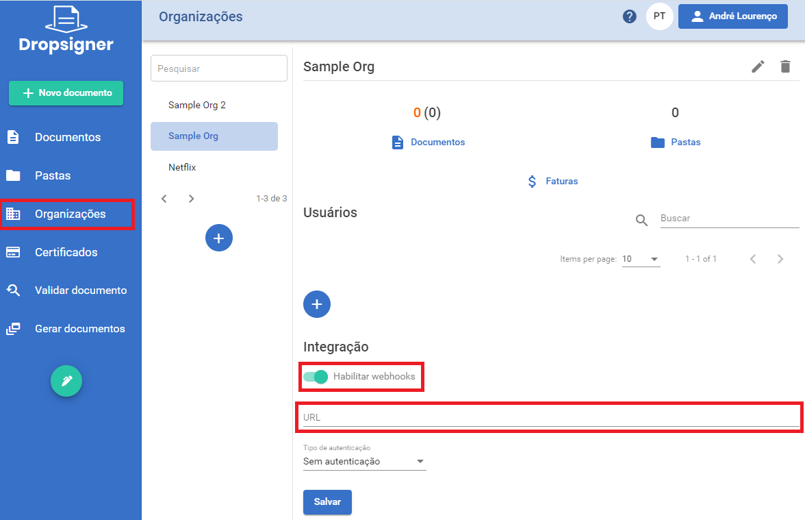

# Guia de Integração

## Introdução

O Signer é um portal de documentos que permite a realização de assinaturas digitais e eletrônicas bem como a criação de fluxos complexos. Este documento
discute as possíveis opções de integração para que sua aplicação possa aproveitar ao máximo o potencial do Signer.


## Autenticação

Todas as chamadas de API exigem uma chave de acesso de API (*API Key*). Essa chave deve ser colocada no cabeçalho de todas requisições:

```javascript
X-Api-Key: sua-aplicacao|xxxxxxxxxxxxxxxxxxxxxxxxxxxxxxxxxxxxxxxxxxxxxxxxxxxxxxxxxxxxxxxx
```

Toda chave de API está associada uma Organização previamente cadastrada no Signer. Sendo assim, o escopo dessa chave fica **restrito àquela organização**,
isto é, aquela chave só permitirá acessar/criar documentos daquela organização.

> [!NOTE]
> Para obter uma chave de API entre em contato com o administrador da sua instância.


## Opções de integração

Escolha um dos casos de uso abaixo:

<a name="sign-document" />

* [Assinar um documento](#sign-document)

* [Como posicionar uma assinatura](#document-marks)

* [Verificar o status de um documento](#check-document)

* [Enviar lembretes de assinatura](#document-reminders)

* [Download das versões de um documento](#download-document)

* [Listar documentos](#list-documents)

* [Validar assinaturas de um documento](#validate-signatures)

* [Deletar um documento](#delete-document)

### Assinar um documento

Para assinar um documento siga o passo a passo abaixo:

1- Faça o upload do arquivo a ser assinado usando a [API de Upload (POST /api/uploads)](https://www.dropsigner.com/swagger/index.html#operations-Upload-post_api_uploads). 
O arquivo deve ser enviado com uma requisição [multipart/form-data](https://ec.haxx.se/http/http-multipart). Será retornado um ID de upload que identifica aquele arquivo:

```javascript
{
	...
	"id": "3fa85f64-5717-4562-b3fc-2c963f66afa6"
}
```

Alternativamente pode ser utilizada a [API simplificada de Upload (POST /api/uploads/bytes)](https://www.dropsigner.com/swagger/index.html#operations-Upload-post_api_uploads_bytes),
na qual os bytes podem ser enviados em formato Base64.

2- Crie um documento à partir do upload usando a [API de Criação de Documentos](https://www.dropsigner.com/swagger/index.html#operations-Documents-post_api_documents). 
Nessa chamada você deve montar o fluxo do documento, isto é, definir quais serão os participantes do documento e em qual ordem devem tomar suas ações:

```javascript
POST /api/documents

{
	"files": [
	{
		"displayName": "Contrato Integração", //Nome que será dado ao documento criado
		"id": "3fa85f64-5717-4562-b3fc-2c963f66afa6", //ID do upload
		"name": "Contrato.pdf", //Nome do arquivo original
		"contentType": "application/pdf" //mime type do arquivo original
	}
	],
	"flowActions": [
	{
		"type": "Signer",//Tipo do participante, nesse caso, assinante
		"step": 1,//Ordem de assinatura
		"user": {
		"name": "John Wick",//Nome do participante
		"identifier": "81976153069",//CPF do participante
		"email": "john.wick@mailinator.com",//Email do participante
		},
		"allowElectronicSignature": true //Permite assinatura eletrônica
	}
	]
}
```

> [!TIP]
> Você pode criar mais de um documento na mesma chamada de criação, adicionando quantos arquivos forem necessários. Nesse caso, todos documentos
> terão o mesmo fluxo.

A resposta retornará o ID do documento criado associado ao ID do upload, assim você sabe exatamente qual documento corresponde a qual upload:

```javascript
[
	{
	"uploadId": "3fa85f64-5717-4562-b3fc-2c963f66afa6",
	"documentId": "b12cb1b2-5d6e-40b2-a050-097d068c4c11"
	}
]
```

Ao criar o documento, o Signer automaticamente notifica os participantes adicionados no fluxo seguindo a ordem especificada.

Cada participante receberá um e-mail com um link que permitirá a assinatura/aprovação do documento. 

> [!TIP]
> Não é preciso se autenticar para assinar ou aprovar o documento.

Para mais detalhes sobre esse caso de uso, veja nossos exemplos no github:

* C#: 
	* [Documento com um assinante](https://github.com/LacunaSoftware/SignerSamples/blob/master/dotnet/console/Console/Scenarios/CreateDocumentWithOneSignerScenario.cs)
	* [Documento com dois ou mais assinantes com ordenação](https://github.com/LacunaSoftware/SignerSamples/blob/master/dotnet/console/Console/Scenarios/CreateDocumentWithTwoOrMoreSignersWithOrderScenario.cs)
	* [Documento com dois ou mais assinantes sem ordenação](https://github.com/LacunaSoftware/SignerSamples/blob/master/dotnet/console/Console/Scenarios/CreateDocumentWithTwoOrMoreSignersWithoutOrderScenario.cs)
	* [Documento com aprovação](https://github.com/LacunaSoftware/SignerSamples/blob/master/dotnet/console/Console/Scenarios/CreateDocumentWithApproversScenario.cs)
	* [Documento com anexo](https://github.com/LacunaSoftware/SignerSamples/blob/master/dotnet/console/Console/Scenarios/CreateDocumentWithAttachmentScenario.cs)
	* [Documento com descrição](https://github.com/LacunaSoftware/SignerSamples/blob/master/dotnet/console/Console/Scenarios/CreateDocumentWithDescriptionScenario.cs)

* Java: 
	* [Documento com um assinante](https://github.com/LacunaSoftware/SignerSamples/blob/master/java/console/src/main/java/com/lacunasoftware/signer/sample/scenarios/CreateDocumentWithOneSignerScenario.java)
	* [Documento com dois ou mais assinantes com ordenação](https://github.com/LacunaSoftware/SignerSamples/blob/master/java/console/src/main/java/com/lacunasoftware/signer/sample/scenarios/CreateDocumentWithTwoOrMoreSignersWithOrderScenario.java)
	* [Documento com dois ou mais assinantes sem ordenação](https://github.com/LacunaSoftware/SignerSamples/blob/master/java/console/src/main/java/com/lacunasoftware/signer/sample/scenarios/CreateDocumentWithTwoOrMoreSignersWithoutOrderScenario.java)
	* [Documento com aprovação](https://github.com/LacunaSoftware/SignerSamples/blob/master/java/console/src/main/java/com/lacunasoftware/signer/sample/scenarios/CreateDocumentWithApproversScenario.java)
	* [Documento com anexo](https://github.com/LacunaSoftware/SignerSamples/blob/master/java/console/src/main/java/com/lacunasoftware/signer/sample/scenarios/CreateDocumentWithAttachmentScenario.java)
	* [Documento com descrição](https://github.com/LacunaSoftware/SignerSamples/blob/master/java/console/src/main/java/com/lacunasoftware/signer/sample/scenarios/CreateDocumentWithDescriptionScenario.java)
	
	
* PHP: 
	* [Documento com um assinante](https://github.com/LacunaSoftware/SignerSamples/blob/master/php/Scenarios/CreateDocumentWithOneSignerScenario.php)
	* [Documento com dois ou mais assinantes com ordenação](https://github.com/LacunaSoftware/SignerSamples/blob/master/php/Scenarios/CreateDocumentWithTwoOrMoreSignersWithOrderScenario.php)
	* [Documento com dois ou mais assinantes sem ordenação](https://github.com/LacunaSoftware/SignerSamples/blob/master/php/Scenarios/CreateDocumentWithTwoOrMoreSignersWithoutOrderScenario.php)
	* [Documento com aprovação](https://github.com/LacunaSoftware/SignerSamples/blob/master/php/Scenarios/CreateDocumentWithApproversScenario.php)
	* [Documento com anexo](https://github.com/LacunaSoftware/SignerSamples/blob/master/php/Scenarios/CreateDocumentWithAttachmentScenario.php)
	* [Documento com descrição](https://github.com/LacunaSoftware/SignerSamples/blob/master/php/Scenarios/CreateDocumentWithDescriptionScenario.php)


#### Assinatura em sua própria aplicação

Caso você queira realizar a assinatura do documento em sua própria aplicação, você pode usar a opção de **Assinatura Embutida**.

Para isso, você deve seguir os mesmos passos exibidos na seção anterior, no entanto, ao enviar o documento, recomenda-se adicionar o parâmetro
`disablePendingActionNotifications` com valor `true`. Dessa forma, não serão enviadas notificações para os participantes.

Após a criação do documento, utilize o ID do documento para obter a URL de Assinatura usando a [API de URL de Ação](https://www.dropsigner.com/swagger/index.html#operations-Documents-post_api_documents__id__action_url):

```javascript
POST /api/documents/b12cb1b2-5d6e-40b2-a050-097d068c4c11/action-url

{
	//devem ser enviadas informações que identifiquem o participante desejado
	"identifier": "81976153069",
	"emailAddress": "john.wick@mailinator.com"
}
```

A resposta irá apresentar duas URLs:

```javascript
{
	//URL para redirecionar o usuário para a página de assinatura no Signer
	"url": "https://...",
	//URL para usar com o Widget de assinatura
	"embedUrl": "https://..."
}
```

Uma vez obtida a URL `embedUrl`, utilize o **Widget de assinatura** para exibir a página de assinatura do Signer na sua aplicação.
A página [Assinatura embutida](embedded-signature.md) descreve como utilizar o *Widget*.

<a name="check-document" />
Para mais detalhes sobre esse caso de uso, veja nossos exemplos no github:

* [C#](https://github.com/LacunaSoftware/SignerSamples/blob/master/dotnet/console/Console/Scenarios/EmbeddedSignatureScenario.cs)

* [Java](https://github.com/LacunaSoftware/SignerSamples/blob/master/java/console/src/main/java/com/lacunasoftware/signer/sample/scenarios/EmbeddedSignatureScenario.java)

* [PHP](https://github.com/LacunaSoftware/SignerSamples/blob/master/php/Scenarios/EmbeddedSignatureScenario.php)

<a name="document-marks" />


### Como pré-posicionar uma assinatura no documento

Durante a criação de um documento, é possível posicionar as assinaturas de cada usuário em um determinado local deste mesmo documento. Todas as definições de atributos 
são feitas durante a criação do  `flowAction`. Há opções para definir a localização da assinatura em uma página, bem como a pagina na qual deseja pré-posicionar uma assinatura.

Para mais detalhes sobre esse caso de uso, veja nossos exemplos no github:

* [C#](https://github.com/LacunaSoftware/SignerSamples/blob/master/dotnet/console/Console/Scenarios/CreateDocumentWithPositionedSignaturesScenario.cs)

* [Java](https://github.com/LacunaSoftware/SignerSamples/blob/master/java/console/src/main/java/com/lacunasoftware/signer/sample/scenarios/CreateDocumentWithPositionedSignaturesScenario.java)

* [PHP](https://github.com/LacunaSoftware/SignerSamples/blob/master/php/Scenarios/CreateDocumentWithPositionedSignaturesScenario.php)


### Verificar o status de um documento

Para verificar o status de um documento é preciso conhecer o seu ID. Em seguida, basta fazer uma chamada à [API de Detalhes do Documento](https://www.dropsigner.com/swagger/index.html#operations-Documents-get_api_documents__id_):

```javascript
GET /api/documents/b12cb1b2-5d6e-40b2-a050-097d068c4c11

{
	"id": "b12cb1b2-5d6e-40b2-a050-097d068c4c11",
	"name": "Contrato Integração",
	"isConcluded": true,
	"creationDate": "2019-08-18T16:26:03.372Z",
	"updateDate": "2019-08-18T16:26:03.372Z",
	...
	"flowActions": [
		{
			"id": "4bf61c68-eaf1-455f-b4a1-6141554f1dae",
			"type": "Signer",
			"status": "Completed",
			"step": 1,
			...
			"user":
			{
				"id": "4d961566-9b03-450c-b144-930e0294bac2",
				"name": "John Wick",
				"identifier": "81976153069",
				"email": "john.wick@mailinator.com"
			},
			"title": "Parte",
			"allowElectronicSignature": true
		}
	]
}
```

* Para saber se o documento está concluído, verifique a propriedade `isConcluded`.
* Para saber se um participante assinou/aprovou, verifique se a propriedade `status` corresponde a `Completed` para o elemento da lista de 
ações (`flowActions`) que corresponde a ele.

***

Adicionalmente, você pode configurar um **Webhook** que será disparado toda vez que um documento de sua organização for concluído, aprovado, recusado ou assinado. Para isso, 
acesse a tela da Organização e registre a URL desejada na opção **Integração**:



<a name="document-reminders" />
Para mais detalhes sobre esses casos de uso, veja nossos exemplos no github:

* [C#](https://github.com/LacunaSoftware/SignerSamples/blob/master/dotnet/console/Console/Scenarios/CheckDocumentStatusScenario.cs)

* [Java](https://github.com/LacunaSoftware/SignerSamples/blob/master/java/console/src/main/java/com/lacunasoftware/signer/sample/scenarios/CheckDocumentStatusScenario.java)

* [PHP](https://github.com/LacunaSoftware/SignerSamples/blob/master/php/Scenarios/CheckDocumentStatusScenario.php)


### Enviar lembretes de assinatura

Uma vez verificado o status de um participante, conforme mostrado no caso de uso de [Verificação de status](#check-document),
você pode enviar lembretes periódicos para participantes do fluxo que ainda não completaram uma ação usando a [API de Envio de Lembretes](https://www.dropsigner.com/swagger/index.html#operations-Documents-get_api_documents__id_).
Para isso, informe o ID do documento e o ID da ação do participante (`flowActionId`):

```javascript
POST /api/notifications/flow-action-reminder

{
	"documentId": "b12cb1b2-5d6e-40b2-a050-097d068c4c11",
	"flowActionId": "4bf61c68-eaf1-455f-b4a1-6141554f1dae"
}
```

<a name="validate-signatures" />
Para mais detalhes sobre esse caso de uso, veja nossos exemplos no github:

* [C#](https://github.com/LacunaSoftware/SignerSamples/blob/master/dotnet/console/Console/Scenarios/NotifyFlowParticipantsScenario.cs)

* [Java](https://github.com/LacunaSoftware/SignerSamples/blob/master/java/console/src/main/java/com/lacunasoftware/signer/sample/scenarios/NotifyFlowParticipantsScenario.java)

* [PHP](https://github.com/LacunaSoftware/SignerSamples/blob/master/php/Scenarios/NotifyFlowParticipantsScenario.php)

<a name="download-document" />

### Download das versões de um documento

A partir do momento que um documento foi criado, é possível fazer o download de diferentes tipos de versões deste mesmo documento (de acordo com o estágio no qual ele se encontra). Caso queira fazer o download do documento, utilize a [API de Download de Documentos](https://www.dropsigner.com/swagger/index.html#operations-Documents-get_api_documents__id__content).

```javascript
GET /api/documents/b12cb1b2-5d6e-40b2-a050-097d068c4c11/content?type=Original
```
As opções disponíveis para download são:

* Arquivo Assinado
* Versão para impressão
* Etiquetas de assinatura
* Marcas de Assinatura
* Arquivo Original

Existem dois métodos com seus respectivos tipos de retorno de dados: O primeiro retornará uma `Stream` de dados referente ao documento e o segundo retornará o documento em um vetor de `bytes[]`.

<a name="download-document" />

Para mais detalhes sobre esse caso de uso, veja nossos exemplos no github:

* [C#](https://github.com/LacunaSoftware/SignerSamples/blob/SIG-503/dotnet/console/Console/Scenarios/DownloadDocumentVersionScenario.cs)
	
* [Java](https://github.com/LacunaSoftware/SignerSamples/blob/master/java/console/src/main/java/com/lacunasoftware/signer/sample/scenarios/DownloadDocumentVersionScenario.java)

* [PHP](https://github.com/LacunaSoftware/SignerSamples/blob/master/php/Scenarios/DownloadDocumentVersionScenario.php)


<a name="list-documents"/>

### Listar documentos

É possível listar os documentos de acordo com padrões e necessidades diferentes. O parametros utilizados estão listados na [API de Listagem de Documentos](https://www.dropsigner.com/swagger/index.html#operations-Documents-get_api_documents). Os tipos de listas que podem ser retornadas estão identificados abaixo:

* Documentos pendentes para um determinado participante
* Documentos concluídos
* Listar por pastas
* Listar por organização

Para mais detalhes sobre esse caso de uso, veja nossos exemplos no github:

* [C#](https://github.com/LacunaSoftware/SignerSamples/blob/master/dotnet/console/Console/Scenarios/ListDocumentsScenario.cs)
	
* [Java](https://github.com/LacunaSoftware/SignerSamples/blob/master/java/console/src/main/java/com/lacunasoftware/signer/sample/scenarios/ListDocumentsScenario.java)

* [PHP](https://github.com/LacunaSoftware/SignerSamples/blob/master/php/Scenarios/ListDocumentsScenario.php)

### Validar assinaturas de um documento

Você pode validar as assinaturas de um documento de duas formas: com a **chave de validação do documento** (caso ele tenha sido assinado nesta instância do Signer) ou com o **arquivo
assinado**.

#### Validação de documento com chave de validação

Para validar um documento com chave de validação, use a [API de Validação de Chave](https://www.dropsigner.com/swagger/index.html#operations-Documents-get_api_documents_keys__key__signatures) informando a chave correspondente.

Serão retornados os dados básicos do documento e as informações de cada uma das assinaturas encontradas naquele documento:

```javascript
GET /api/documents/keys/AX4F8FV8NNAX25TENE2S/signatures

{
	"id": "b12cb1b2-5d6e-40b2-a050-097d068c4c11",
	"name": "Contrato Integração",
	"filename": "Contrato.pdf",
	"mimeType": "application/pdf",
	"isConcluded": true,
	...
	"creationDate": "2020-08-18T16:38:40.538Z",
	"updateDate": "2020-08-18T16:38:40.538Z",
	"signers": [
		{
			"subjectName": "John Wick",
			"emailAddress": "john.wick@mailinator.com",
			"issuerName": "Lacuna CA",
			"identifier": "81976153069",
			"companyName": null,
			"companyIdentifier": null,
			"isElectronic": false,
			"signingTime": "2020-08-18T16:38:40.538Z",
			"certificateThumbprint": "a0sRR9cWOc0PORMhTBg49ub/5BO3W5vWQ1w7+YquK5g=",
			...
			"validationResults":
			{
				...
				"isValid": true
			}
		}
	]
}
```

#### Validação de documento com arquivo assinado

Para validar um documento assinado é preciso fazer primeiro o upload do arquivo assinado usando a [API de Upload](https://www.dropsigner.com/swagger/index.html#operations-Upload-post_api_uploads)
ou [API simplificada de Upload (POST /api/uploads/bytes)](https://www.dropsigner.com/swagger/index.html#operations-Upload-post_api_uploads_bytes) 
assim como informado na seção [Assinar um Documento](#sign-document).

Em seguida, utilize a [API de validação de arquivo assinado](https://www.dropsigner.com/swagger/index.html#operations-Documents-post_api_documents_validate_signatures).

```javascript
POST /api/documents/validate-signatures

{
  "fileId": "f5ea05d7-0a5f-4933-a6d6-9a8aa3955b14",
  "mimeType": "application/pdf"
}
```

Serão retornados os dados de cada uma das assinaturas encontradas no documento.

```javascript
[
	{
		"subjectName": "John Wick",
		"emailAddress": "john.wick@mailinator.com",
		"issuerName": "Lacuna CA",
		"identifier": "81976153069",
		"companyName": null,
		"companyIdentifier": null,
		"isElectronic": false,
		"signingTime": "2020-08-18T16:38:40.538Z",
		"certificateThumbprint": "a0sRR9cWOc0PORMhTBg49ub/5BO3W5vWQ1w7+YquK5g=",
		...
		"validationResults":
		{
			...
			"isValid": true
		}
	}
]
```
### Deletar documento

<a name="delete-document"></a>

Para deletar um documento você precisa ter acesso ao ID deste mesmo documento e fazer um chamada do tipo `DELETE`. 

```javascript
DELETE /api/documents/b12cb1b2-5d6e-40b2-a050-097d068c4c11
```
Para mais detalhes sobre esse caso de uso, veja nossos exemplos no github:

* [C#](https://github.com/LacunaSoftware/SignerSamples/blob/master/dotnet/console/Console/Scenarios/DeleteDocumentScenario.cs)
	
* [Java](https://github.com/LacunaSoftware/SignerSamples/blob/master/java/console/src/main/java/com/lacunasoftware/signer/sample/scenarios/DeleteDocumentScenario.java)

* [PHP](https://github.com/LacunaSoftware/SignerSamples/blob/master/php/Scenarios/DeleteDocumentScenario.php)

### Cancelar documento

Caso queira cancelar um documento, é necessário enviar o ID do documento através de uma requisição do tipo `POST` junto ao campo `reason`, conforme o exemplo abaixo:

```javascript
POST /api/documents/b12cb1b2-5d6e-40b2-a050-097d068c4c11/cancellation

{
    "reason": "This is a document cancellation"
}
```

Para mais detalhes sobre esse caso de uso, veja nossos exemplos no github:
* [C#](https://github.com/LacunaSoftware/SignerSamples/blob/master/dotnet/console/Console/Scenarios/CancelDocumentScenario.cs)
	
* [Java](https://github.com/LacunaSoftware/SignerSamples/blob/master/java/console/src/main/java/com/lacunasoftware/signer/sample/scenarios/CancelDocumentScenario.java)

* [PHP](https://github.com/LacunaSoftware/SignerSamples/blob/master/php/Scenarios/CancelDocumentScenario.php)

### Recusar documento

Para recusar um documento, é necessário enviar o ID do documento através de uma requisição do tipo `POST` junto ao campo `reason`, conforme o exemplo abaixo:

```javascript
POST /api/documents/b12cb1b2-5d6e-40b2-a050-097d068c4c11/refusal

{
    "reason": "This is a document refusal"
}
```

Para mais detalhes sobre esse caso de uso, veja nossos exemplos no github:
* [C#](https://github.com/LacunaSoftware/SignerSamples/blob/master/dotnet/console/Console/Scenarios/RefuseDocumentScenario.cs)
	
* [Java](https://github.com/LacunaSoftware/SignerSamples/blob/master/java/console/src/main/java/com/lacunasoftware/signer/sample/scenarios/RefuseDocumentScenario.java)

* [PHP](https://github.com/LacunaSoftware/SignerSamples/blob/master/php/Scenarios/RefuseDocumentScenario.php)

### Enviar nova versão documento

É possível enviar uma nova versão do documento para um documento já criado. Portanto, é necessário enviar o ID do documento, através de uma requisição do tipo `POST`, junto ao arquivo relativo a nova versão. Vale ressaltar que o fluxo de assinaturas será reiniciado.

Para mais detalhes sobre esse caso de uso, veja nossos exemplos no github:
* [C#](https://github.com/LacunaSoftware/SignerSamples/blob/master/dotnet/console/Console/Scenarios/AddNewDocumentVersionScenario.cs)
	
* [Java](https://github.com/LacunaSoftware/SignerSamples/blob/master/java/console/src/main/java/com/lacunasoftware/signer/sample/scenarios/AddNewDocumentVersionScenario.java)

* [PHP](https://github.com/LacunaSoftware/SignerSamples/blob/master/php/Scenarios/AddNewDocumentVersionScenario.php)

## Links Úteis

* [Referência da API](https://www.dropsigner.com/swagger)
* [Exemplos no GitHub](https://github.com/LacunaSoftware/SignerSamples)
