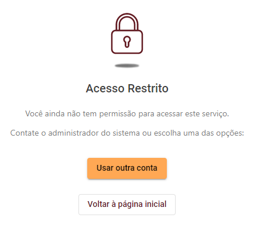
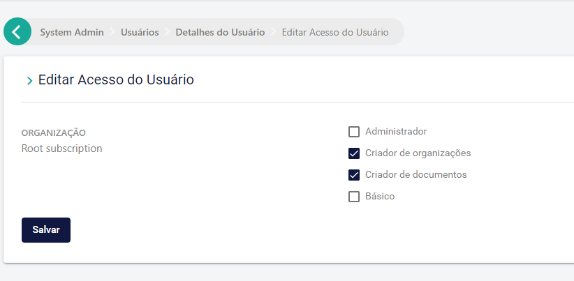

# Controle de acesso do Signer

Esta página descreve as possíveis configurações de controle de acesso dos usuários do Signer.

## Sistema Aberto

No sistema Aberto, qualquer usuário pode acessar sua instância, se cadastrar e receber automaticamente uma conta Pessoal. Todos documentos 
que forem criados por esse usuário ficam associados a essa conta. 

Adicionalmente o usuário pode criar Organizações que podem representar Empresas, Departamentos ou Grupos de trabalho.

## Sistema Fechado

No sistema Fechado, um usuário qualquer continua podendo se cadastrar, mas somente terá acesso às funcionalidades do sistema caso ele seja 
adicionado manualmente por um administrador em uma Organização. Caso contrário, ao fazer login será apresentada a tela de acesso restrito:

O administrador deve acessar a Área de Administração para cadastrar os usuários que poderão utilizar o sistema:

<!--  Caso você não tenha os dados completos do usuários, você pode cadastrá-lo em uma organização através de um **convite**. Nesse caso, somente é
necessário selecionar a organização e informar o email e papel a ser concedido ao usuário: -->

## Perfis básicos

Tanto para o sistema Aberto ou Fechado, é possível definir quais são as permissões básicas serão disponibilizadas para os usuários que se cadastrarem no sistema.
As permissões configuráveis são:

1. Criação de documentos
1. Criação de organizações*

Por padrão, esses duas permissões já são concedidas a todos usuários. No entanto, se isso não for desejado para seu caso de uso, elas podem ser desabilitadas por
configuração de instância. Nesse caso, você deverá dar essas permissões manualmente para cada usuário, concedendo um ou mais dos perfis exibidos abaixo:

1. Criador de documentos
1. Criador de organizações*

Esses perfis devem ser configurados pelo administrador da instância no menu Usuários > Detalhes do Usuário > Editar Acesso do Usuário:

Um exemplo comum, é a necessidade de disponibilizar as funcionalidades básicas de visualização de documentos, relatórios e assinatura em lote para os assinantes 
dos documentos sem permitir que eles enviem novos documentos ou criem organizações.

> [!WARNING]
> O papel de criador de organizações é ignorado no sistema Fechado, pois nessa modalidade a criação de organizações é sempre responsabilidade do administrador da instância.