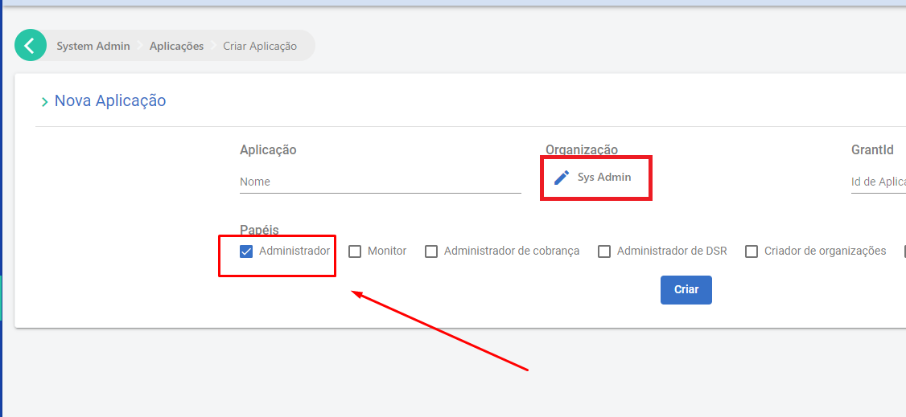

# APIs de Administração

## Introdução
As APIs de administração pode ser utilizadas para criar, gerenciar e modificar usuários e organizações do Signer.

Para utilizar essas APIs é necessário criar uma **chave de API de administração**.

## Criação de chave de API de administração

Para gerá-la, crie uma aplicação selecionado a organização `Sys Admin`:




Em seguida, gere a chave selecionando o botão "Chaves":


## Opções de operações de administração

Escolha um dos casos de uso abaixo:

* [Listar usuários](#listar-usuários)

* [Atualizar dados de usuário](#atualizar-dados-de-usuário)

* [Listar organizações](#listar-organizações)

* [Listar usuários da organização](#listar-usuários-da-organização)

* [Criar ou atualizar usuários de uma organização](#criar-ou-atualizar-usuários-de-uma-organização)

* [Remover usuário de uma organização](#remover-usuário-de-uma-organização)

Essas e outras operações estão exemplificadas no arquivo [Postman](https://www.postman.com/) a seguir: [Signer ADM APIs](https://cdn.lacunasoftware.com/signer/docs/Signer%20ADM-4.postman_collection.json).

### Listar usuários

Para listar os usuários cadastrados no sistema, obtendo assim seus dados e permissões, utilize a chamada `GET /api/users`:

```json
GET /api/users?q=
{
    "items": [
        {
            "identifier": "99999999999",
            "phone": null,
            "id": "446e14b9-a661-446a-bb52-66b6c9f1ade9",
            "subject": "17bb43bd-1dac-46ce-95d2-62007bee2aea",
            "name": "User One",
            "emailAddress": "User.One@mailinator.com",
            "parentId": null,
            "rootRoles": [],
            "parentRootRoles": null,
            "subscriptions": [
                {
                    "agentId": "446e14b9-a661-446a-bb52-66b6c9f1ade9",
                    "subscriptionId": "28dd8bc0-ef7a-44e4-b2f8-08da757b7cf1",
                    "roles": [
                        "Admin",
                        "Manager",
                        "Basic"
                    ],
                    "parentRoles": null
                }
            ]
        },
        {
            "identifier": "11096802449",
            "phone": "+55 61 99999-9999",
            "id": "7b06a7ed-43fc-45df-96f8-cb29f4778e22",
            "subject": "ee72e66e-c150-47c3-a8fd-d4d0c6e12ef5",
            "name": "User Two",
            "emailAddress": "user.two@mailinator.com",
            "parentId": null,
            "rootRoles": [],
            "parentRootRoles": null,
            "subscriptions": [
                {
                    "agentId": "7b06a7ed-43fc-45df-96f8-cb29f4778e22",
                    "subscriptionId": "7289e60f-0c1f-4a3d-4b81-08da718c9ef3",
                    "roles": [
                        "Admin",
                        "Manager",
                        "Basic"
                    ],
                    "parentRoles": null
                }
            ]
        }
    ],
    "totalCount": 2,
    "nextCursor": null
}

```

* q (query - `string`) : permite filtrar os usuários retornados por nome, CPF ou e-mail (opcional).

### Atualizar dados de usuário

Para atualizar os dados de um usuário, utilize a chamada `PUT /api/users/{subject}`:

```json
PUT /api/users/{subject}
{
  "name": "User Name",
  "identifier": "11096802449",
  "emailAddress": "user@mailinator.com",
  "phone": "+55 (61) 99999-9999"
}
```

* O parâmetro `{subject}` corresponde à informação de mesmo nome disponível quando recuperados os dados de um usuário conforme descrito em [Listar usuários](#listar-usuários).

### Listar organizações

Para listar as organizações cadastradas no sistema, utilize a chamada `GET /api/admin/organizations`:

```json
GET /api/admin/organizations?limit=1&offset=1&personal=true&q=user

{
    "items": [
        {
            "id": "5aaa9032-1ad0-4c63-3c73-08d9d088eeac",
            "name": null,
            "identifier": null,
            "owner": {
                "id": "6f9d67cc-5cea-4672-b09e-ac04ed2e348f",
                "name": "Novo User"
            }
        }
    ],
    "totalCount": 17,
    "nextCursor": null
}
```

* limit (`int`) : quantidade de itens por página (opcional).

* offset (`int`): número da página (opcional).

* q (query - `string`) : permite filtrar pelo nome da organização (opcional).

### Criar uma nova organização

Para criar uma organização, utilize a chamada `POST /api/admin/organizations`:

```json
POST /api/admin/organizations

{
  "name": "newOrg",
  "identifier": "85932577000194"
}
```

### Listar usuários da organização

Para listar os usuários de uma organização, utilize a chamada `GET /api/organizations/{id}/users`:

```json
GET /api/organizations/{id}/users?limit=1&offset=0&q=
{
    "items": [
        {
            "id": "7b06a7ed-43fc-45df-96f8-cb29f4778e22",
            "name": "User Name",
            "email": "user.name@mailinator.com",
            "identifier": "11096802449",
            "role": "",
            "parentId": null,
            "accessProfile": {
                "administrator": true,
                "manager": true,
                "parentRoles": null
            },
            "showNameWarning": false
        }
    ],
    "totalCount": 3,
    "nextCursor": null
}
```
* `{id}`: ID da organização.

* limit (`int`): quantidade de itens por página (opcional).

* offset (`int`): número da página (opcional).

* q (query - `string`): permite filtrar pelo nome do usuário (opcional).

### Criar ou atualizar usuários de uma organização

Para criar ou atualizar usuários, utilize a chamada `POST /api/organizations/{id}/users`:

```json
POST /api/organizations/{id}/users
{
  "accessProfile": {
    "administrator": true,
    "manager": true
  },
  "name": "User Name",
  "identifier": "11096802449",
  "email": "user@mailinator.com"
}
```

* `{id}`: ID da organização.

### Remover usuário de uma organização

Para remover um usuário da organização, utilize a chamada `DELETE /api/admin/organizations/{id}/users/{userID}`:

* `{id}`: ID da organização.
* `{userID}`: ID do usuário a ser removido.
