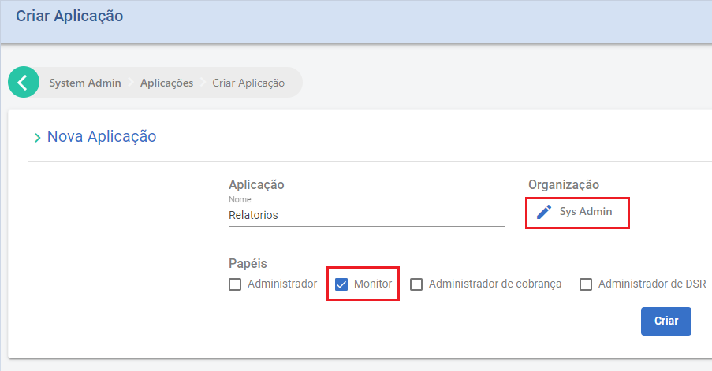

# Monitoramento de consumo

## Introdução
Para permitir o monitoramento do sistema, o Signer possui um conjunto de APIs que expõem informações e relatórios sobre 
operações realizadas pelos usuários.

Para utilizar essas APIs é necessário criar uma **chave de API de monitoramento**.

## Criação de chave de API de monitoramento

Para gerá-la, crie uma aplicação selecionado a organização `Sys Admin` e o papel `Monitor`:




> [!WARNING]
> O papel `Monitor` permitirá acesso apenas às APIs relevantes a atividades de monitoramento.

Em seguida, gere a chave selecionando o botão "Chaves":


## Opções de monitoramento

Escolha um dos casos de uso abaixo:

* [Gerar relatório de documentos](#gerar-relatorio-docs)

* [Obter totais de documentos](#obter-totais-docs)

<a name="gerar-relatorio-docs" />
### Gerar relatório de documentos

Para obter um relatório Excel de todos os documentos criados num determinado período, utilize a chamada `POST /api/reports/documents/date`:

```json
POST /api/reports/documents/date
{
    "startDateUtc": "2023-01-01",
    "endDateUtc": "2023-01-31"
}
```

* startDateUtc - `string`: data e hora (opcional) do início do período a ser considerado.

* endDateUtc - `string`: data e hora (opcional) do fim do período a ser considerado.

Como resposta é enviada um caminho para download do relatório gerado (é preciso concatenar o valor retornado com a URL base do site):

```json
{
    "location": "/api/reports/f7044565-7cd4-4628-bb17-76eedbf9fe31?access_ticket=..."
}
```

<a name="obter-totais-docs" />
### Obter totais de documentos

Para obter um relatório Excel de todos os documentos criados num determinado período, utilize a chamada `POST /api/documents/date`:

```json
POST /api/documents/date
{
    "startDateUtc": "2023-01-01",
    "endDateUtc": "2023-01-31"
}
```

* startDateUtc - `string`: data e hora (opcional) do início do período a ser considerado.

* endDateUtc - `string`: data e hora (opcional) do fim do período a ser considerado.

Como resposta são enviados os totais de documentos e envelopes criados:

```json
{
    "totalDocuments": 0,
    "totalEnvelopes": 0
}
```