# Personalização do Signer

Esta página descreve os principais aspectos que podem ser personalizados em sua instância do Signer.

## Esquema de cores

A aplicação é tematizada de acordo com um tema com duas cores principais:

* **Theme**: cor do tema.
* **Accent**: cor de contraste.

Conforme a imagem abaixo:

Os temas disponíveis são:

* default: 

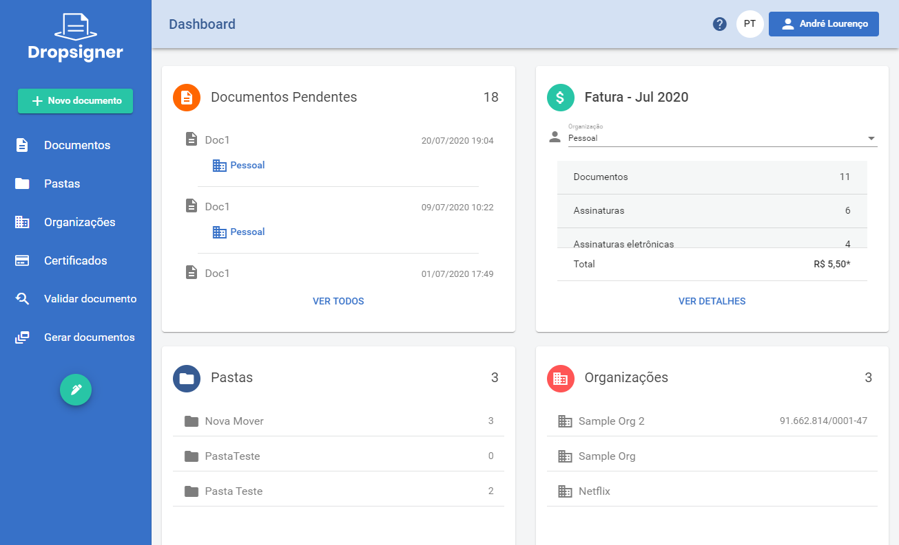

* amaranth-pacific-blue - apb:

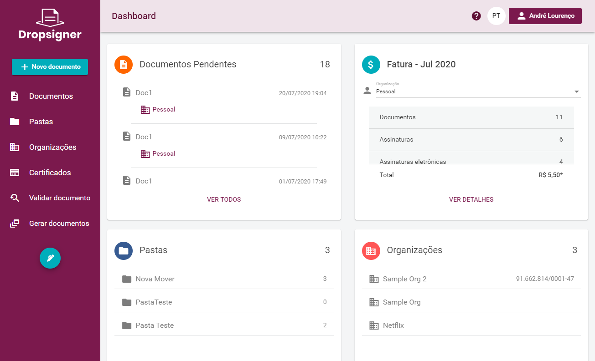

* amazon-cornell-red - acr:

* azure-lime-green - alg:

* castleton-green-orange - cgo (v1.10.1):

* cerulean-lime-green - clg:

* charcoal-amazonite - cam:

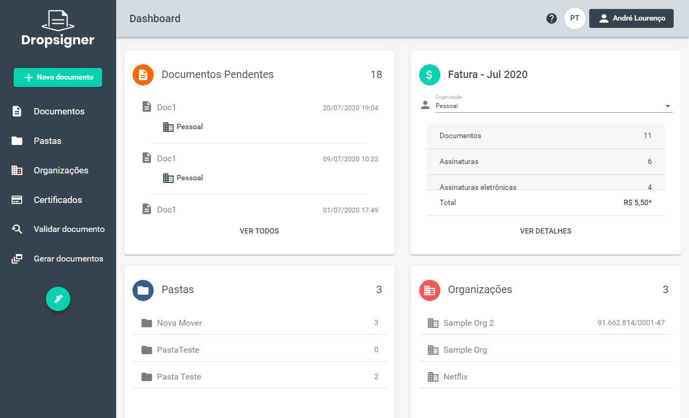

* cobalt-lemon-curry - clc:

* dark-cerulean-green - dcg:

* dark-grey-yellow - dgy:

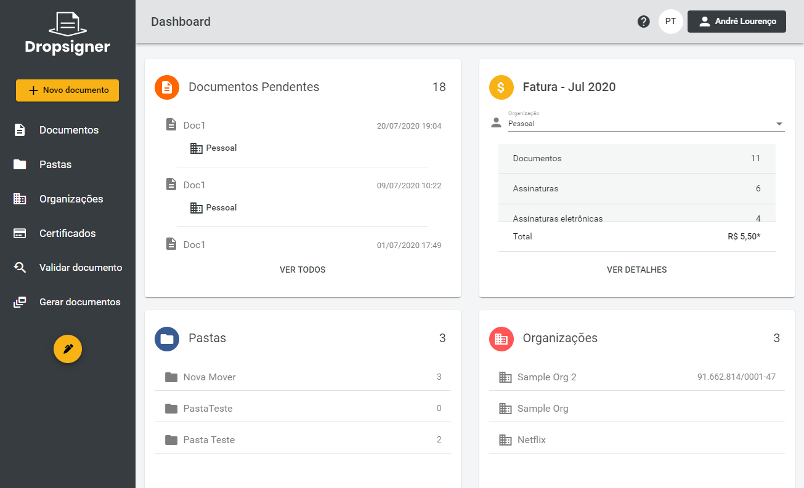

* dark-indigo-red - dir:

* english-vermillion-arsenic - eva:

* green-dark-coral - gdc:

* independence-green - idg:

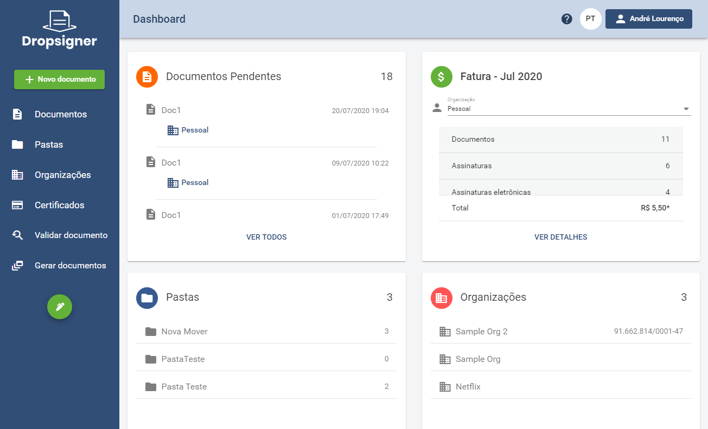

* metallic-seaweed-emerald - mse:

* onyx-satin-gold - osg:

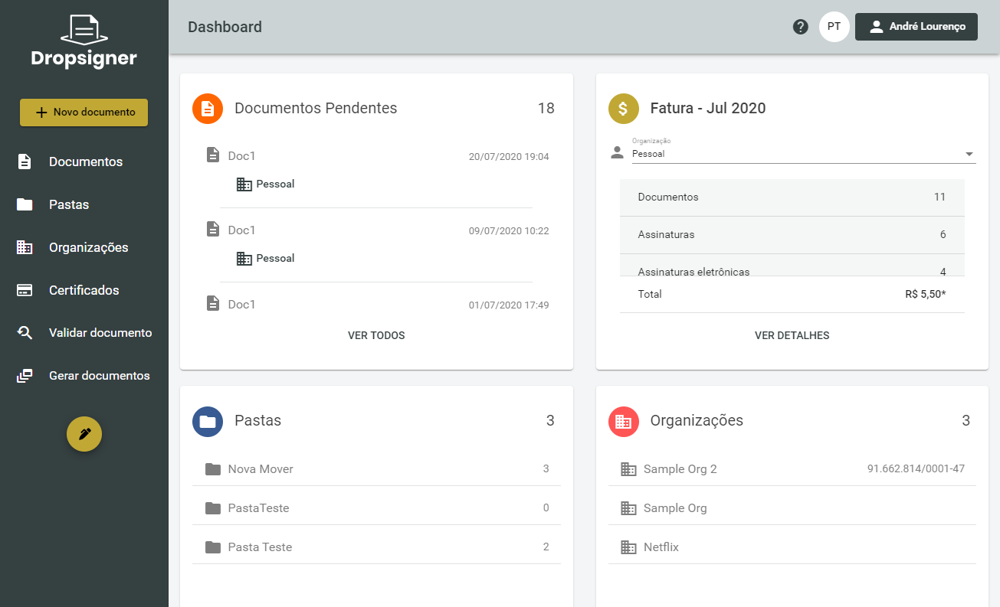

* oxford-blue-green - obg (v1.10.1):

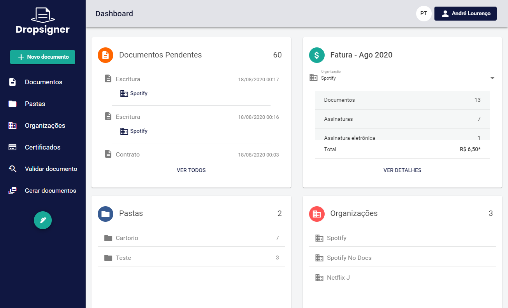

* persian-plum-sand - pps (v1.10.4):

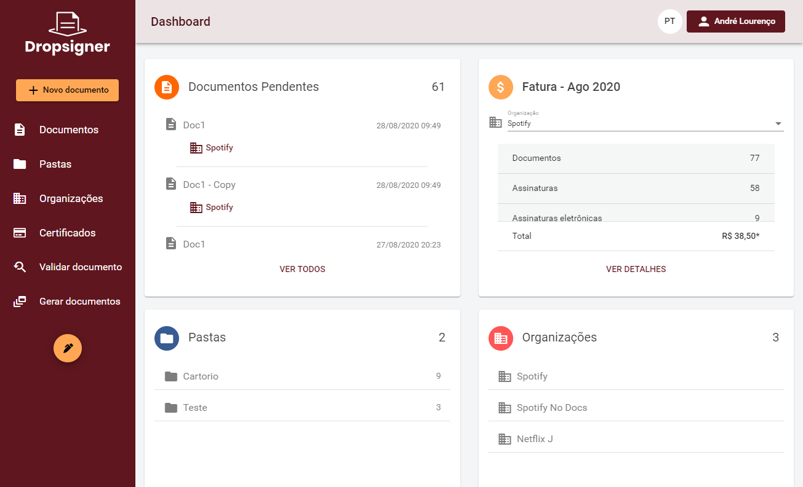

* queen-blue-mint - qbm:

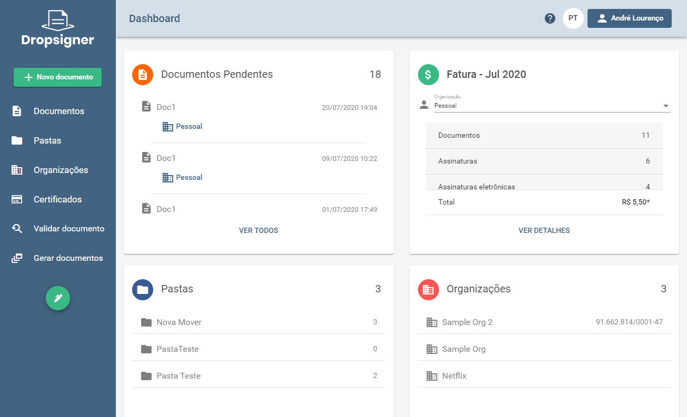

* teal-blue-gold - tbg:

* viridian-green-yellow - vgy (v1.10.2):

* international-orange-green - iog (v1.31.0):

* onyx-carrot-orange - oco (v1.31.0):

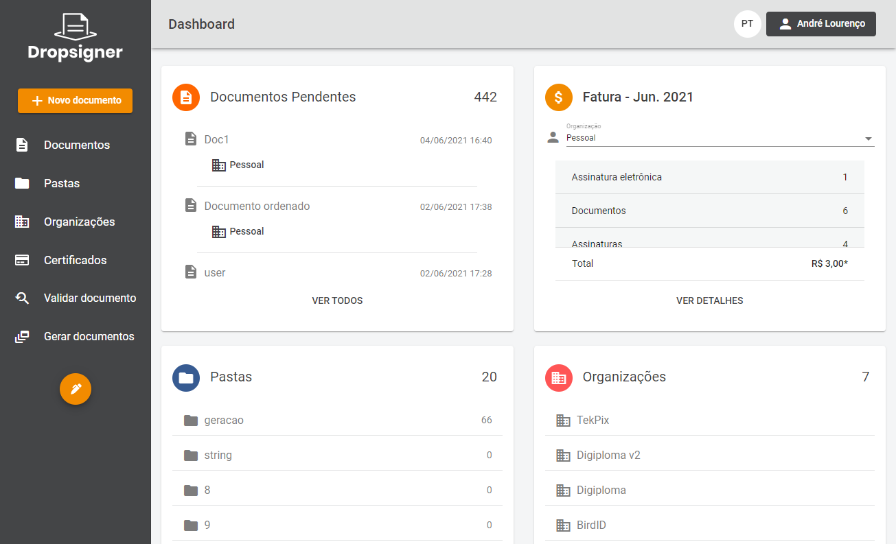

* international-orange-apricot - ioa (v1.33.0):

* generic-viridian-blue - gvb (v1.33.0):

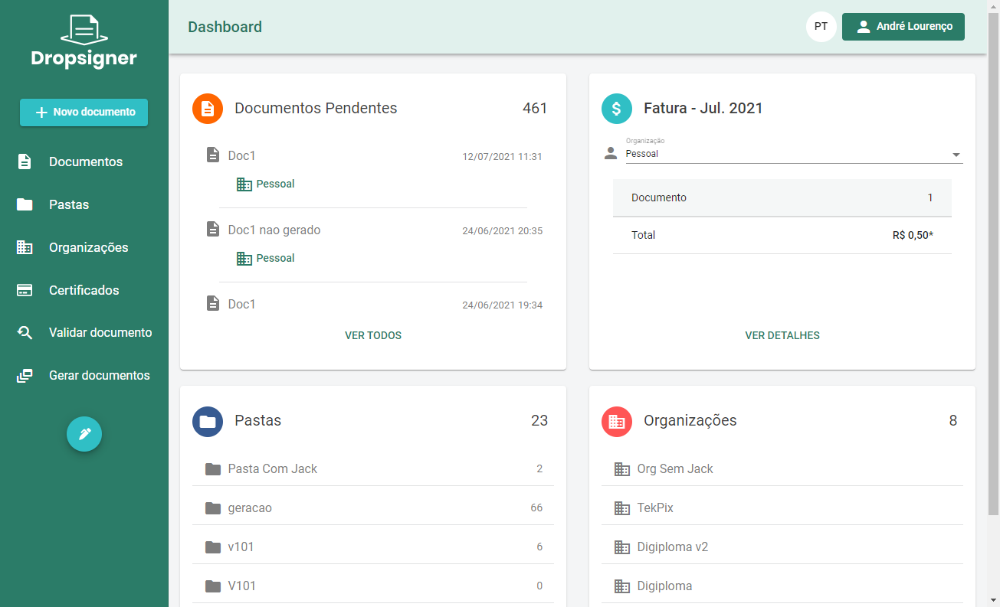

* space-cadet-yellow - scy (v1.34.0):

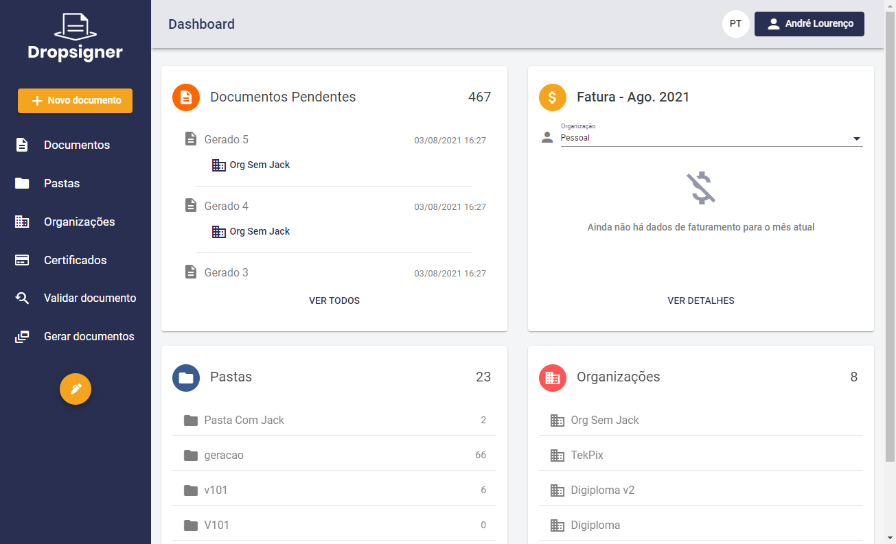

* blue-venetian-red - bvr (v1.36.0):

> [!NOTE]
> Caso seja necessário, um novo tema pode ser criado de acordo com sua necessidade, bastando informar qual são as cores theme e accent.

## Logos

A aplicação utiliza duas logos principais: 

* light-logo: para aplicação em fundo escuro.

* dark-logo: para aplicação em fundo claro.

## Configuração da Home

Existem duas formas de configurar a Home page:

* Configuração simples.
* Configuração avançada (página estática).

###  Configuração Simples

Permite personalizar a área demarcada abaixo:

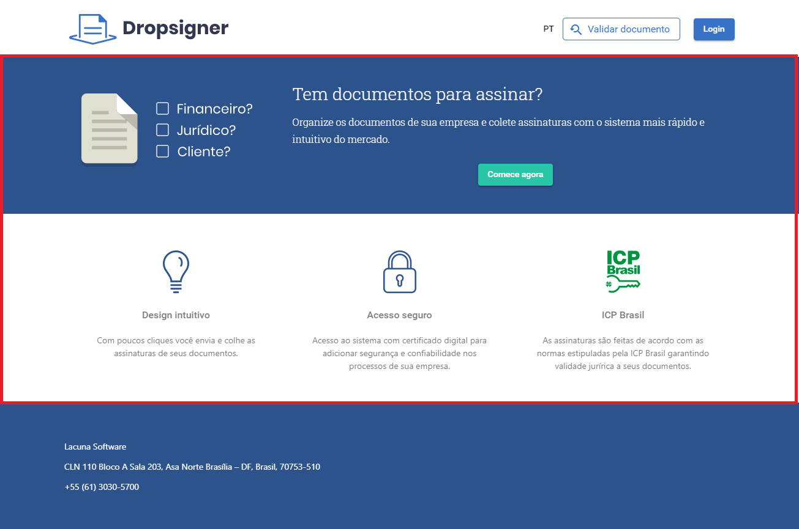

É preciso apenas fornecer uma imagem de como gostaria que ficasse ou então o HTML/CSS correspondente.

Caso deseje criar seu próprio HTML e CSS, as seguintes regras devem ser observadas:

* Criar um arquivo HTML para cada linguagem disponível, no formato `home-<language>.html`. Exemplo: `home-pt.html`, `home-es.html` e `home-en.html`.
* Os arquivos HTML não podem conter tags `script` nem *inline styles*.
* Os arquivos HTML poderão usar classes definidas na biblioteca *Bootstrap* versão `4.3.1` referentes aos seguintes módulos:
	* [Grid](https://getbootstrap.com/docs/4.3/layout/grid)
	* [Utilities for layout](https://getbootstrap.com/docs/4.3/layout/utilities-for-layout)
* A aplicação segue o padrão [Material Design](https://material.io) e, por tanto, classes definidas na biblioteca [Angular Material UI](https://material.angular.io) 
também podem ser utilizadas.
* Caso seja necessário personalizar o CSS, deve ser criado um arquivo denominado `main.css`.
* Os arquivos HTML e CSS devem ser colocados na pasta `assets` do *Blob Storage* configurado. Ao fazer a atualização, a aplicação precisa ser reiniciada.

###  Configuração Avançada (página estática)

Permite personalizar toda a home page, de maneira que a página passa a ser estática. Exemplo:

Para isso, é preciso fornecer um arquivo HTML chamado `index.html` acompanhado de uma pasta denominada `theme-assets` com todos 
recursos que o arquivo depender: imagens, CSS e JS. **Subpastas não são suportadas**, isto é, os arquivos devem ser adicionados na
raíz da pasta theme-assets:

Todos arquivos devem ser colocados na pasta `assets` do *Blob Storage* configurado. Ao fazer a atualização, a aplicação precisa ser reiniciada.

> [!WARNING]
> Ao usar esta abordagem, recomenda-se que não sejam feitas muitas alterações no cabeçalho da página, tendo em vista que existem 
> páginas da área externa da aplicação cujo cabeçalho não irá seguir esse modelo, como exemplo a tela de assinatura externa e de 
> validação de documentos.

## Configuração do footer

Permite personalizar o footer da home page, caso a configuração de home page seja a simples:

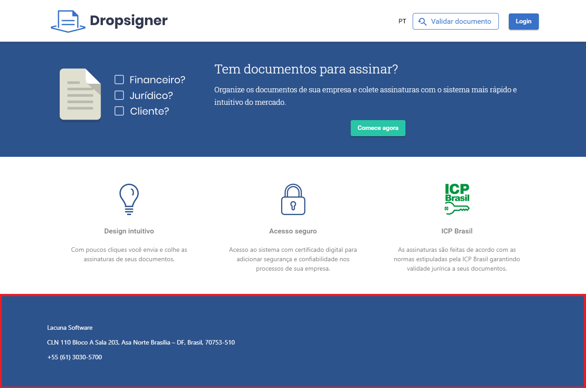

É preciso apenas fornecer uma imagem de como gostaria que ficasse ou então o HTML/CSS correspondente.

## Envio de Emails

É possível personalizar o envio de emails para que sejam enviados com seu próprio servidor SMTP. Para isso devem ser informados
os dados abaixo:

* **ServerHost**: endereço (host) do Servidor SMTP.
* **EnableSsl**: define se o servidor SMTP aceita comunicação com SSL.
* **ServerPort**: porta para comunicação com o servidor SMTP caso seja diferente do padrão (587).
* **Username**: usuário para autenticação com servidor SMTP.
* **Password**: senha do usuário para autenticação com servidor SMTP.
* **SenderAddress**: endereço de email que será utilizado para enviar emails.
* **SenderName**: nome que será exibido como remetente dos emails enviados. Recomenda-se usar o mesmo nome da aplicação.

## Envio de SMS

Caso o envio de SMS esteja habilitado (assinatura eletrônica com código via SMS) deve ser configurada sua própria conta no provedor
de SMS <a href="https://www.twilio.com" target="_blank">Twilio</a> ou <a href="https://www.totalvoice.com.br" target="_blank">Total Voice</a>.

## Domínio

Basta adicionar um registro DNS de tipo CNAME apontando para o endereço da instância que será fornecido e notificar
a equipe de implantação para que façam os ajustes necessários.