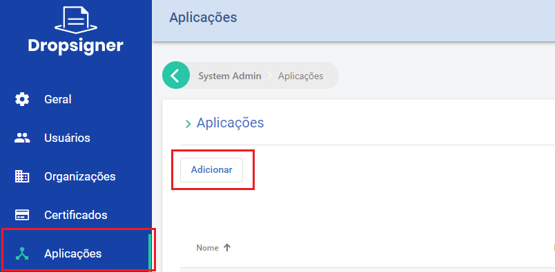
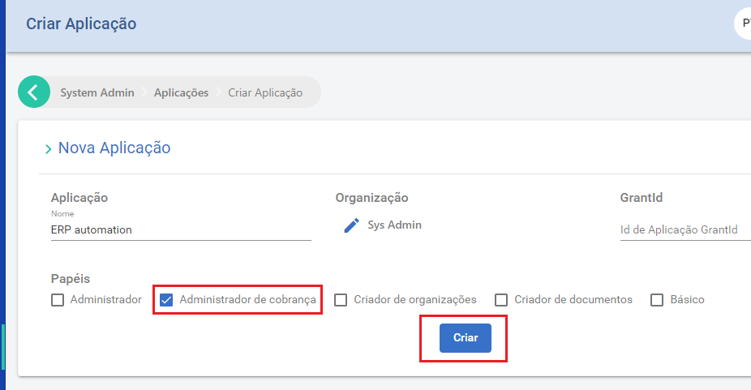

# Pagamentos no Signer

Esta página descreve as opções para obtenção de pagamentos relativos às faturas geradas pelo Sistema de Cobranças.

## Sistema de Cobranças

O Signer possui um Sistema de Cobranças flexível que permite ao administrador da instância escolher quais serviços 
serão tarifados: documento, assinatura, aprovação etc. Caso não esteja visualizando na sua instância as opções 
descritas aqui verifique se o módulo de cobrança foi habilitado.

O Sistema de Cobranças trabalha com a geração de faturas mensais sem data de duração, isto é, após a virada do mês
a fatura é fechada e fica disponível para consulta/pagamento de um usuário ou organização.

O administrador da instância pode escolher se o não pagamento das faturas irá bloquear ou não os usuários/organizações.

As opções disponíveis para processamento de pagamentos estão descritas abaixo:

### Operação Simplificada

Para instâncias com número pequeno de usuários/organizações, a gerência de pagamentos pode ser feita externalmente ao 
sistema.

Nesse modelo, fica a cargo do administrador da instância verificar as faturas fechadas, notificar o cliente responsável
e processar o pagamento de cada fatura.

Uma vez identificado que o pagamento foi realizado, a fatura pode ser consultada e seu status alterado na tela de 
detalhes da fatura pelo administrador:


### Operação via Integração

Para instâncias com um grande número de usuários/organizações, recomenda-se que a gerência de pagamentos seja feito de maneira
automatizada.

O primeiro passo para automatizar o processo é configurar o webhook de cobrança da instância. Isso deve ser feito em 
Administração > Cobrança > Integração:


Uma vez configurado o Webhook, o endereço especificado receberá uma requisição POST após o fechamento de cada fatura.

Segue abaixo um exemplo desta requisição:

<pre>
{
	"type": "InvoiceClosed",
	"data":
	{
		"id": 126,
		"month": 9,
		"year": 2020,
		"value": 5,
		"invoiceTotals": [
			{
				"transactionType": "Document",
				"price":
				{
					"transactionType": "Document",
					"pricingType": "Simple",
					"price": 0.5,
					"priceRanges": null
				},
				"total": 10,
				"value": 5
			},
			{
				"transactionType": "ElectronicSignature",
				"price":
				{
					"transactionType": "ElectronicSignature",
					"pricingType": "NoCharge",
					"price": null,
					"priceRanges": null
				},
				"total": 1,
				"value": 0
			},
			{
				"transactionType": "Signature",
				"price":
				{
					"transactionType": "Signature",
					"pricingType": "Range",
					"price": null,
					"priceRanges": [
						{
							"limit": 10,
							"price": 0
						},
						{
							"limit": 20,
							"price": 0.5
						},
						{
							"limit": null,
							"price": 0.25
						}
					]
				},
				"total": 8,
				"value": 0
			}
		],
		"organization":
		{
			"id": "6a49d03c-5f3f-428c-8221-8474366f98d0",
			"name": null,
			"identifier": null,
			"owner":
			{
				"id": "12c1d41a-77b2-404e-a155-84cc7d0f93e8",
				"name": null
			}
		},
		"billingInformation":
		{
			"type": "Individual",
			"individual":
			{
				"name": "Danilo Igor das Neves",
				"identifier": "57972418624"
			},
			"company": null,
			"contactName": "",
			"email": "daniloneves@mailinator.com",
			"phone": "+55 (84) 3619-9479",
			"streetAddress": "Rua Principal, s/n",
			"addressNumber": "696",
			"additionalAddressInfo": "Apto 110",
			"neighborhood": "Bom Descanso",
			"address": "",
			"address2": "",
			"zipCode": "59430972",
			"city": "Lagoa de Velhos",
			"state": "RN"
		}
	}
}
</pre>

Para a referência completa da requisição veja [o schema Webhooks.InvoiceClosedModel no Swagger](https://www.dropsigner.com/swagger/index.html#model-Webhooks.InvoiceClosedModel).

Para exemplos de código, veja os links abaixo:

* [C#](https://github.com/LacunaSoftware/SignerSamples/blob/master/dotnet/console/Console/Scenarios/InvoiceWebhookHandlingScenario.cs)

* [Java]() em construção.

> [!NOTE]
> O Webhook pode ser utilizado também na Operação Simplificada.

O sistema que receber o Webhook deve processar o evento da fatura e gerar a cobrança correspondente notificando o email especificado
nos dados de cobrança.

Ao detectar o pagamento da fatura, ele deve enviar uma requisição ao Signer para informar que a fatura foi paga, conforme definido
abaixo:

```javascript
PUT /api/invoices/{id}/payment

{
	"isPaid": true
}
```

Para exemplos de código, veja os links abaixo:

* [C#](https://github.com/LacunaSoftware/SignerSamples/blob/master/dotnet/console/Console/Scenarios/InvoiceWebhookHandlingScenario.cs)

* [Java]() em construção.

> [!WARNING]
> Para esta requisição será necessária uma chave de API com privilégios de administração de cobrança no sistema.

#### Criação de chave de API de administração de cobrança

Para gerá-la crie uma aplicação selecionado a organização Sys Admin: 





Em seguida gere a chave na opção "Chaves":


