# Pagamentos no Signer

Esta página descreve as opções para obtenção de pagamentos relativos às faturas geradas pelo Sistema de Cobranças.

## Sistema de Cobranças

O Signer possui um Sistema de Cobranças flexível que permite ao administrador da instância escolher quais serviços 
serão tarifados: documento, assinatura, aprovação etc. Caso não esteja visualizando na sua instância as opções 
descritas aqui verifique se o módulo de cobrança foi habilitado.

O Sistema de Cobranças trabalha com a geração de faturas mensais sem data de duração, isto é, após a virada do mês
a fatura é fechada e fica disponível para consulta/pagamento de um usuário ou organização.

O administrador da instância pode escolher se o não pagamento das faturas irá bloquear ou não os usuários/organizações.

As opções disponíveis para processamento de pagamentos estão descritas abaixo:

### Operação Simplificada

Para instâncias com número pequeno de usuários/organizações, a gerência de pagamentos pode ser feita externalmente ao 
sistema.

Nesse modelo, fica a cargo do administrador da instância verificar as faturas fechadas, notificar o cliente responsável
e processar o pagamento de cada fatura.

Uma vez identificado que o pagamento foi realizado, a fatura pode ser consultada e seu status alterado na tela de 
detalhes da fatura pelo administrador:


### Operação via Integração

Para instâncias com um grande número de usuários/organizações, recomenda-se que a gerência de pagamentos seja feito de maneira
automatizada.

O primeiro passo para automatizar o processo é configurar o webhook de cobrança da instância. Isso deve ser feito em 
Administração > Cobrança > Integração:


Uma vez configurado o Webhook, o endereço especificado receberá uma requisição POST após o fechamento de cada fatura.

Segue abaixo um exemplo desta requisição:

<pre>
{
	"type": "InvoiceClosed",
	"data":
	{
		"id": 126,
		"month": 9,
		"year": 2020,
		"value": 5,
		"invoiceTotals": [
			{
				"transactionType": "Document",
				"price":
				{
					"transactionType": "Document",
					"pricingType": "Simple",
					"price": 0.5,
					"priceRanges": null
				},
				"total": 10,
				"value": 5
			},
			{
				"transactionType": "ElectronicSignature",
				"price":
				{
					"transactionType": "ElectronicSignature",
					"pricingType": "NoCharge",
					"price": null,
					"priceRanges": null
				},
				"total": 1,
				"value": 0
			},
			{
				"transactionType": "Signature",
				"price":
				{
					"transactionType": "Signature",
					"pricingType": "Range",
					"price": null,
					"priceRanges": [
						{
							"limit": 10,
							"price": 0
						},
						{
							"limit": 20,
							"price": 0.5
						},
						{
							"limit": null,
							"price": 0.25
						}
					]
				},
				"total": 8,
				"value": 0
			}
		],
		"organization":
		{
			"id": "6a49d03c-5f3f-428c-8221-8474366f98d0",
			"name": null,
			"identifier": null,
			"owner":
			{
				"id": "12c1d41a-77b2-404e-a155-84cc7d0f93e8",
				"name": null
			}
		},
		"billingInformation":
		{
			"type": "Individual",
			"individual":
			{
				"name": "Danilo Igor das Neves",
				"identifier": "57972418624"
			},
			"company": null,
			"contactName": "",
			"email": "daniloneves@mailinator.com",
			"phone": "+55 (84) 3619-9479",
			"streetAddress": "Rua Principal, s/n",
			"addressNumber": "696",
			"additionalAddressInfo": "Apto 110",
			"neighborhood": "Bom Descanso",
			"address": "",
			"address2": "",
			"zipCode": "59430972",
			"city": "Lagoa de Velhos",
			"state": "RN"
		}
	}
}
</pre>

Para a referência completa da requisição veja [o schema Webhooks.InvoiceClosedModel no Swagger](https://www.dropsigner.com/swagger/index.html#model-Webhooks.InvoiceClosedModel).

Para exemplos de código, veja os links abaixo:

* [C#](https://github.com/LacunaSoftware/SignerSamples/blob/master/dotnet/console/Console/Scenarios/InvoiceWebhookHandlingScenario.cs)

* [Java](https://github.com/LacunaSoftware/SignerSamples/blob/master/java/console/src/main/java/com/lacunasoftware/signer/sample/scenarios/InvoiceWebhookHandlingScenario.java)

* [PHP](https://github.com/LacunaSoftware/SignerSamples/blob/master/php/Scenarios/InvoiceWebhookHandlingScenario.php)

> [!NOTE]
> O Webhook pode ser utilizado também na Operação Simplificada.

O sistema que receber o Webhook deve processar o evento da fatura e gerar a cobrança correspondente notificando o email especificado
nos dados de cobrança.

Ao detectar o pagamento da fatura, ele deve enviar uma requisição ao Signer para informar que a fatura foi paga, conforme definido
abaixo:

```javascript
PUT /api/invoices/{id}/payment

{
	"isPaid": true
}
```

Para exemplos de código, veja os links abaixo:

* [C#](https://github.com/LacunaSoftware/SignerSamples/blob/master/dotnet/console/Console/Scenarios/InvoiceWebhookHandlingScenario.cs)

* [Java](https://github.com/LacunaSoftware/SignerSamples/blob/master/java/console/src/main/java/com/lacunasoftware/signer/sample/scenarios/InvoiceWebhookHandlingScenario.java)

* [PHP](https://github.com/LacunaSoftware/SignerSamples/blob/master/php/Scenarios/InvoiceWebhookHandlingScenario.php)


> [!WARNING]
> Para esta requisição será necessária uma chave de API com privilégios de administração de cobrança no sistema.

#### Criação de chave de API de administração de cobrança

Para gerá-la crie uma aplicação selecionado a organização Sys Admin:


Em seguida gere a chave na opção "Chaves":


### Operação via Gateway de pagamentos iugu

À partir da versão [1.27.0](../changelog#1270-2021-03-25), é possível integrar o Signer diretamente com o Gateway de Pagamentos da [iugu](https://www.iugu.com/). Desta forma, 
depois que uma fatura é fechada, os próprios usuários/organizações podem realizar o pagamento com cartão de crédito, boleto bancário ou Pix.

#### Configuração no painel de controle da iugu

Para contratar a iugu, é preciso escolher um [plano de assinatura](https://www.iugu.com/planos/). Cada plano traz funcionalidades, mudanças nas tarifas e custos por transação que 
devem ser avaliados pelo administrador da instância, mas o Signer é capaz de funcionar plenamente com o plano mais básico ("Conheça a iugu").

Após realizar [cadastro na iugu](https://auth.iugu.com/new_user?service=https%3A%2F%2Falia.iugu.com%2F), é preciso acessar o [painel de controle](https://alia.iugu.com/) e gerar 
um API Token. Para isso, acesse `Configurações`> `Integração via API` e clique no botão Novo:

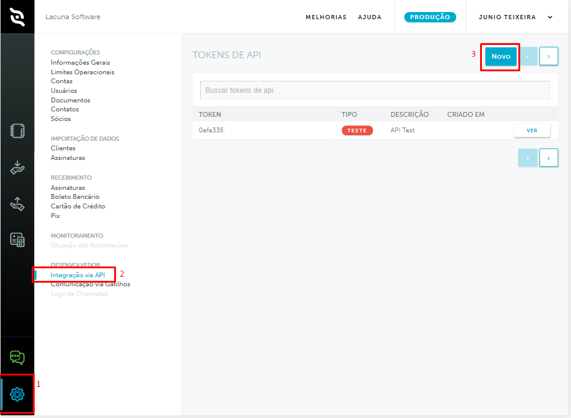

O tipo do token deve ser `Produção`. Adicione também uma descrição, exemplo: "API Signer Prod".

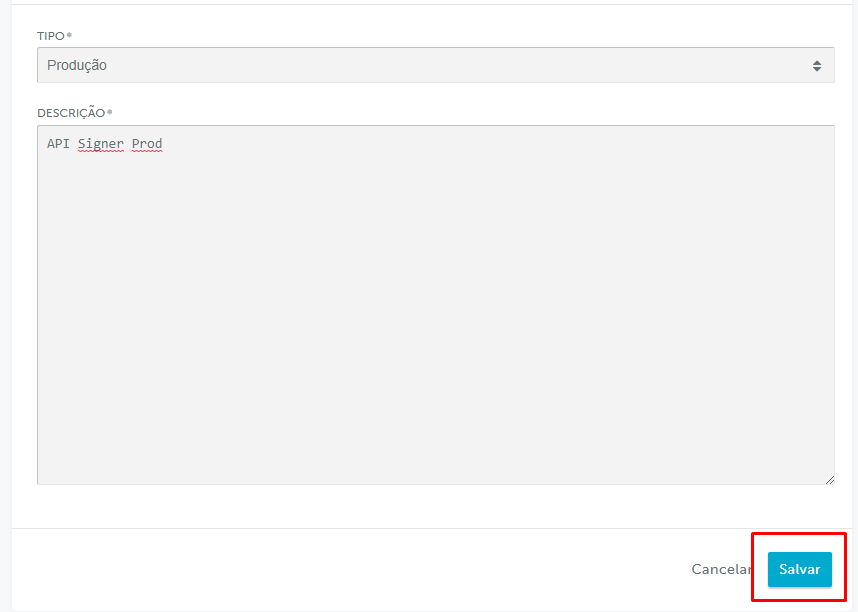

Em seguida, obtenha o ID de sua conta acessando `Configurações`> `Informações gerais`. Abaixo de `CONTA` será exibido o ID da sua conta na iugu.


O próximo passo é configurar o Webhook para notificar o Signer sobre os pagamentos. Ainda na tela de configurações, acesse `Comunicação via Gatilhos` e depois clique no botão Novo:


O campo URL deve ser preenchido com o endereço de sua instância do Signer seguido do caminho padrão de webhooks conforme o exemplo abaixo:

```
https://seu-signer.com.br/api/webhooks/iugu/invoice/changed
```

O campo autorização deve ser preenchido da seguinte forma:

```javascript
Bearer WebhooksAuthKey
```
`WebhooksAuthKey` pode ser qualquer valor, mas recomendamos que seja gerada uma string aleatória de alta entropia. Entre em contato conosco para receber instruções de como
gerar esse valor.

> [!WARNING]
> * O webhook deve ser gerado no ambiente de produção (o ambiente selecionado é exibido no topo da página).
> * O campo de autorização deve obrigatoriamente iniciar com `Bearer ` como mostrado no exemplo.
> * O evento selecionado deve ser `Mudança de estado de Fatura`.

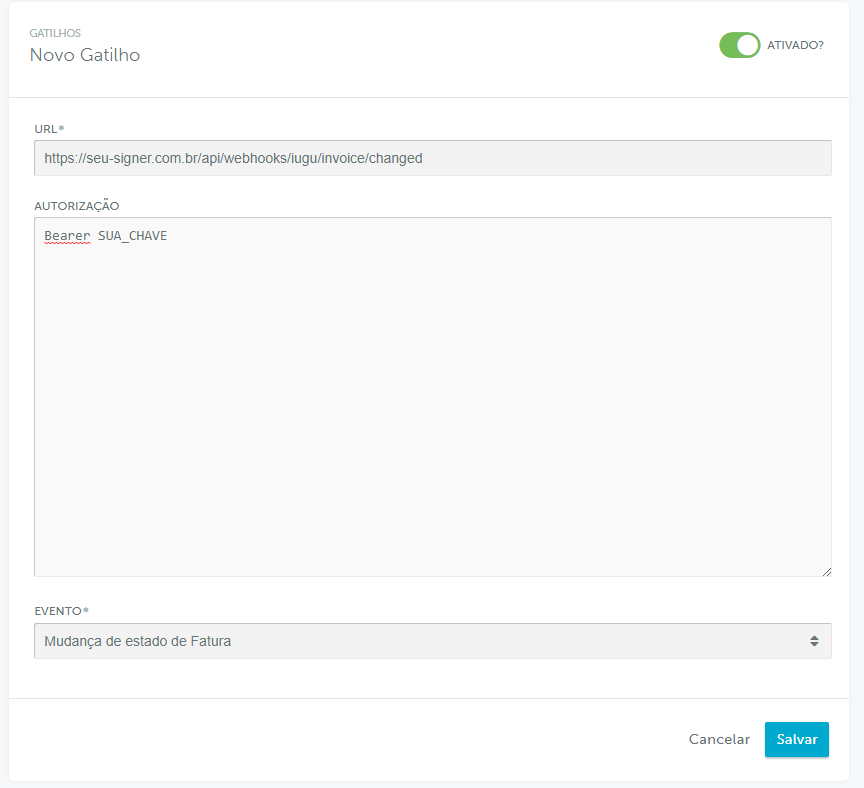

Em seguida, desabilite a cobrança automática feita diretamente pela iugu, pois o Signer já possui seu próprio sistema de cobrança. Acesse a opção `Recebimento`> 
`Régua de Cobrança` e clique em `Alterar fluxo de cobrança`.

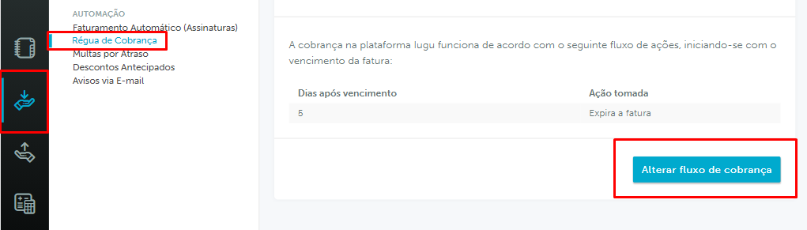

Deixe somente o fluxo "Expira a fatura" com 5 dias após o vencimento.

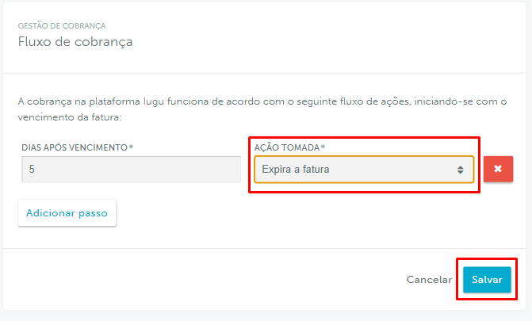

> [!NOTE]
> A opção "Expira a fatura" é um mecanismo da iugu para marcar uma fatura como expirada após alguns dias depois do vencimento. É recomendado pelo menos 5 dias, para que pagamentos 
com boletos que tenham sido feitos até o vencimento possam ter 5 dias para compensação.

O último passo é conferir se todos os meios de pagamento: boleto bancário, cartão de crédito e Pix estão habilitados. Acesse `Configurações`> `Recebimentos` e selecione
cada um dos métodos de pagamentos listados, marcando a opção "Ativo" e clicando no botão "Salvar":


#### Configuração no Signer

Usuários e organizações que já tinham dados de faturamento cadastrados antes da versão [1.27.0](../changelog#1270-2021-03-25), precisarão informar os dados novamente para que 
sejam realizadas novas validações das informações conforme necessidades da iugu.


Após os dados de faturamento serem submetidos novamente, o usuário poderá definir um método de pagamento padrão para sua conta pessoal ou de organização: 

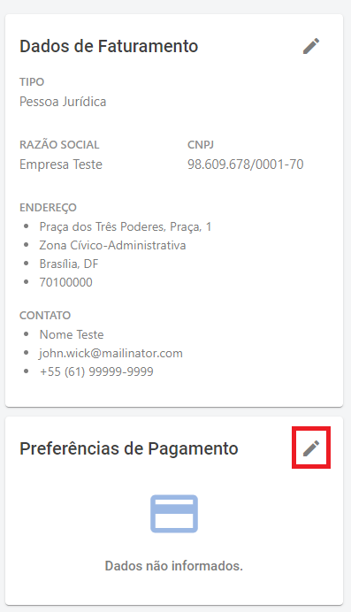

> [!NOTE]
> O método de pagamento padrão para cartões de crédito também pode ser escolhido no momento de pagamento de uma fatura.

Os meios de pagamentos disponíveis para o usuário/organização são Pix, boleto bancário e cartão de crédito. Para cartões de crédito, é possível selecionar um que já tenha sido 
cadastrado ou cadastrar um novo:


> [!NOTE]
> As bandeiras aceitas para pagamentos com cartão de crédito são:
> * American Express
> * Diners
> * Elo
> * MasterCard
> * Visa

Quando uma fatura é fechada e o usuário/organização poderá pagar aquela fatura na tela de detalhes conforme abaixo:

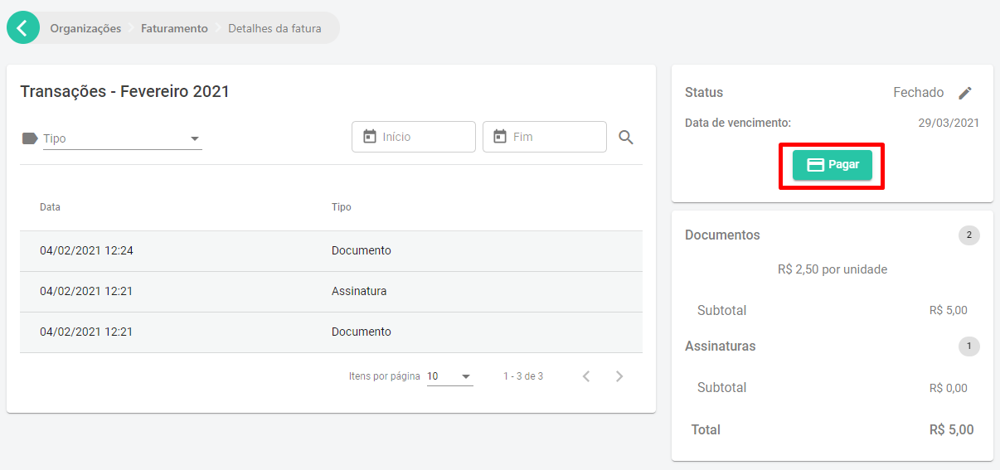

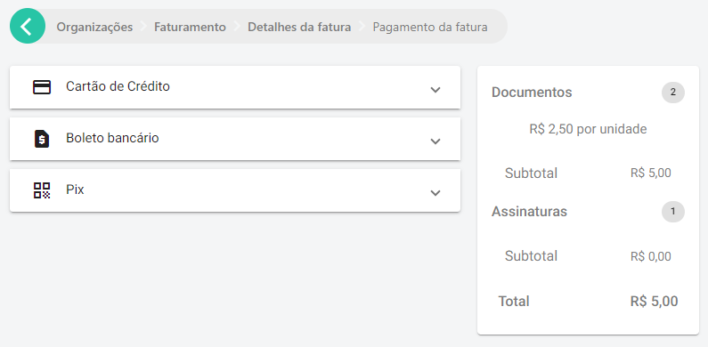

Após o pagamento, o status da fatura é atualizada com o método de pagamento utilizado, dia e horário.

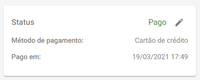

#### Falhas de pagamento com cartão de crédito

O pagamento de uma fatura com cartão de crédito pode ser negado por diversas causas. Um código de erro será exibido no momento do pagamento e pode ser consultado nessa 
[lista de erros](https://support.iugu.com/hc/pt-br/articles/206858953-Como-identificar-o-erro-da-tentativa-de-pagamento-).


> [!WARNING]
> Em alguns casos, é possível que o proprietário do cartão receba via SMS ou no APP do cartão, a informação de cobrança realizada com sucesso, porém, caso a fatura 
> do usuário/organização não conste como PAGA, este lançamento de cobrança é automaticamente estornado na fatura do cartão, dentro de 7 a 10 dias úteis.

#### Cobrança automática

O Signer possui um sistema de cobrança automática para cartão de crédito que é feito quando o usuário/organização salva um cartão de crédito como método de pagamento padrão.

A cobrança automática é agendada para a data de vencimento da fatura, mas a cobrança pode demorar um ou dois dias adicionais.

No entanto, existem alguns casos em que a cobrança automática não será feita:
* Se o método de pagamento padrão do usuário/organização no momento de fechamento da fatura não for cartão de crédito.
* Se a fatura for paga antes do dia de vencimento.
* Se o usuário/organização trocar o método de pagamento da fatura para boleto bancário. Caso o boleto seja gerado, a cobrança automática será cancelada somente para essa fatura.

Uma forma de verificar se a cobrança automática está agendada, é consultar nos detalhes da fatura se são exibidas as informações de cobrança automática como abaixo:


#### Modo de teste

Sua instância pode ser configurada para o modo de teste a fim de testar a integração e as credenciais da iugu. Para isso utilize as credenciais do ambiente de teste lembrando
de definir nas [configurações da instância](./settings#iugu-settings) a opção de teste também.

No modo de teste, apenas cartões de créditos de teste podem ser utilizados conforme definido na página [Usar cartões em modo teste](https://support.iugu.com/hc/pt-br/articles/212456346-Usar-cart%C3%B5es-de-teste-em-modo-de-teste).

Para testar o pagamento com Pix, basta utilizar o botão que aparece abaixo do QR code:


Será copiada uma URL com estrutura semelhante à exibida abaixo:

```javascript
http://faturas.iugu.com/iugu_pix/a32c46b6-ab85-469e-bafc-601c1a4e96ae/test/pay
```

Acesse essa URL no navegador para simular a realização do pagamento.

Para testar o pagamento com o boleto, obtenha a URL da mesma forma que no pix, mas troque `test` por `sample` e `iugu_pix` por `iugu_bank_slip` conforme abaixo:

```javascript
http://faturas.iugu.com/iugu_bank_slip/a32c46b6-ab85-469e-bafc-601c1a4e96ae/sample/pay
```

## Sistema de Nota Fiscal de Serviços Eletrônica (NFS-e)

Permite a emissão e cancelamento de NFS-e para faturas pagas diretamente no Signer com uma integração ao [NFE.io](https://nfe.io/)

### Integração do Signer com o NFE.io

Atualmente as principais capitais do Brasil já possuem integração, porém a lista completa de prefeituras já integradas precisa ser solicitada à equipe comercial do NFE.io, juntamente com os preços. 

#### Primeiros passos

1. Faça o credenciamento na prefeitura para emissão de NFS-e, utilize o [documento da NFE.io](https://nfe.io/docs/documentacao/nota-fiscal-servico-eletronica/credenciamento-prefeitura/).
2. Crie uma conta - https://nfe.io/docs/nossa-plataforma/criar-conta/
3. Crie uma empresa - https://nfe.io/docs/nossa-plataforma/criar-empresa/ 
4. Insira os dados fiscais - https://nfe.io/docs/nossa-plataforma/alterar-empresa/ 
5. Faça o upload do certificado digital - https://nfe.io/docs/nossa-plataforma/upload-certificado/ 
6. [Entre em contato com a NFE.io](https://nfe.io/contato/) para negociação de preços e ativação da conta para produção.
7. Ainda em contato com o NFE.io, consulte se a prefeitura utilizada para emitir a nota exige o CNAE (Classificação Nacional de Atividades Econômicas). Caso seja necessário utilize a [busca online CNAE](https://concla.ibge.gov.br/busca-online-cnae.html) do IBGE.
8. Caso existam dúvidas específicas sobre NFS-e, a NFE.io disponibiliza um [documento](https://nfe.io/docs/documentacao/nota-fiscal-servico-eletronica/conceitos/) que resume explicações sobre a Nota Fiscal de Serviço.

#### Obtenção de credenciais

Para configurar a integração será preciso obter a chave de acesso e o id de sua empresa. Acesse o menu Empresas, depois clique no nome da empresa que deseja emitir a NFS-e.

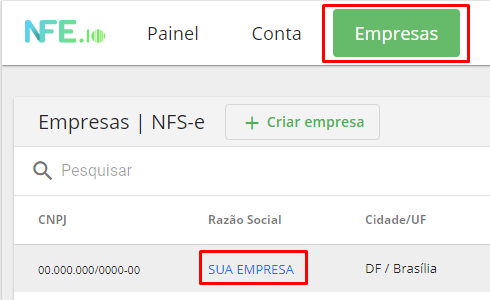

Depois, deslize pela página até encontrar a seção `Chaves de Acesso`. Nela são exibidas: a chave de acesso (Api Key) e o ID de empresa (CompanyId).

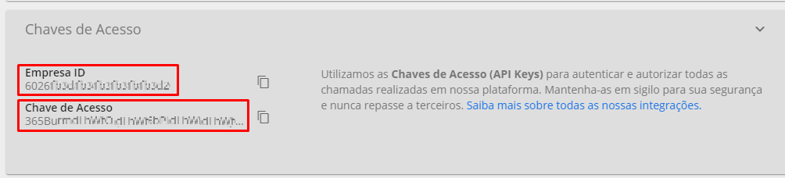

#### Criação do Webhook

O próximo passo é a criação do webhook, serviço responsável por notificar o Signer quando as NFS-e forem emitidas ou canceladas. Acesse a opção Conta, deslize a página 
e selecione a seção `Webhooks`:


Depois clique no botão Criar Webhook:


Selecione o tipo de webhook como `NFS-e` e configure os campos conforme a imagem abaixo:


O campo endereço (URL) deve ser preenchido com o endereço de sua instância do Signer seguido do caminho padrão de webhooks conforme o exemplo abaixo:

```
https://seu-signer.com.br/api/webhooks/nfeio/nfse/changed
```

Por fim, o campo senha para autenticação da mensagem (HMAC) pode ser uma senha qualquer, mas é recomendado que tenha pelo menos 8 dígitos.

#### Código de serviço

O Código de Serviço é um número que define o tipo de serviço prestado para ser utilizado na NFS-e. Esse código é fornecido pela prefeitura na qual será emitida a nota, 
assim como a alíquota de imposto municipal.

O NFE.io disponibiliza uma lista de serviços cadastrados para a cidade que será emitida a NFS-e. Acesse o menu Empresas, selecione a empresa que emitirá a NFS-e 
e clique na seção `Lista de serviços cadastrados`.


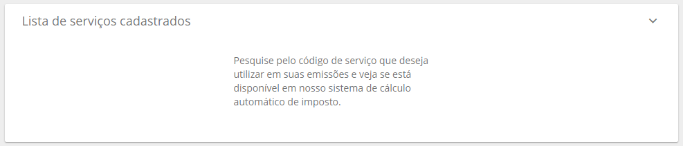

Como mencionado anteriormente, cada prefeitura possui sua própria lista de códigos e sua descrição. Usando Brasília como exemplo, o Signer se enquadra no código ``0103`` , mas caso haja dúvidas sugerimos que consulte o contador de sua empresa.


### Emissão e cancelamento de NFS-e no Signer

#### Emitir notas

Depois que todos os parâmetros tenham sido configurados com o NFE.io e o Signer, será possível emitir notas diretamente pela página de Detalhes da fatura, para faturas pagas. 

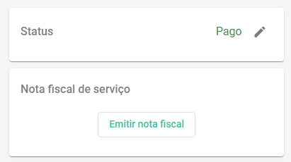

> [!NOTE]
> * Para emitir ou cancelar notas é preciso ser o administrador da instância.
> * O sistema de notas fiscais não depende de integração com a iugu para funcionar.
> * Caso a instância do Signer também possua integração com a iugu, ao realizar o pagamento da fatura, automaticamente será feito o pedido de emissão da NFS-e.

> [!WARNING]
> A emissão e o cancelamento de NFS-es depende do sistema da prefeitura. Se o sistema da prefeitura estiver instável, algumas notas podem demorar horas ou até dias 
> para serem emitidas/canceladas.

Também é possível emitir uma NFS-e para uma fatura com a requisição abaixo:

```javascript
POST /api/invoices/{id}/receipts
```

Quando a nota fiscal é emitida, um e-mail do próprio NFE.io é enviado ao usuário/organização responsável pela fatura com o PDF e o XML da NFS-e. Além disso, é 
possível baixar ou visualizar a nota na página de Detalhes da fatura:

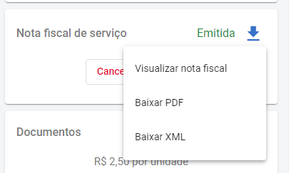

#### Cancelar notas

Depois que uma NFS-e é emitida, seu cancelamento pode ser feito na tela de Detalhes da fatura.


Também é possível cancelar uma NFS-e para uma fatura com a requisição abaixo:

```javascript
DELETE /api/invoices/{id}/receipts
```

> [!WARNING]
> O cancelamento só pode ser feito depois que a nota é emitida, caso ainda esteja em processo de emissão deverá aguardar até que seja emitida. A mesma lógica se aplica 
para uma nova emissão realizada após um cancelamento.