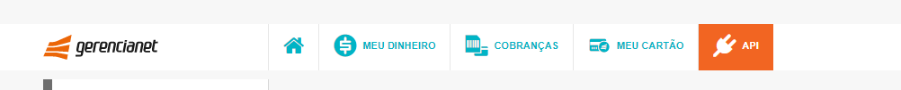

# Integração com Zoom no Signer

O Signer permite a realização de assinaturas eletrônica autenticando o usuário através de um pagamento realizado com a tecnologia [Pix](https://www.bcb.gov.br/estabilidadefinanceira/pix).

Para a geração dos QR codes Pix, é utilizada a integração com as APIs do [Gerencianet](https://gerencianet.com.br/).

<a name="account-config" />
## Configuração da conta

Para esta integração é preciso de uma conta do Gerencianet. Você pode abrir uma conta nova baixando o aplicativo deles no Google Play ou App Store.

Para habilitar a integração, você precisará das seguintes informações:

1. Credenciais de API: `Client ID` e `Client Secret`.
1. Certificado de autenticação.
1. Chave Pix.

### Credenciais de API

Uma vez criada sua conta, acesse a interface Web e, no menu principal, selecione a opção API:

No menu lateral, selecione a opção `Minhas aplicações` e clique no botão `Nova Aplicação`:

1. No nome da aplicação insira o nome da sua instância.
1. Desative a API de emissões (Boletos e Carnês).
1. Ative a API Pix e habilite os seguintes escopos de produção e homologação:
  * `Alterar Cobrança`
  * `Consultar Cobrança`
  * `Consultar Payload`
  * `Alterar Pix`
  * `Consultar Pix`
  * `Enviar Pix`
  

Os valores `Client ID` e `Client Secret` serão exibidos na aba Produção da aplicação criada.

### Certificado de autenticação

Ainda na interface web, no menu lateral, selecione a opção `Meus certificados`.

Na aba Produção, clique no botão `Novo Certificado`.

Informe o nome do certificado usando o nome da sua instância. Use o caractere `-` ao invés de espaços (se houver).

Baixe o certificado e armazene em um local seguro. 

> [!WARNING]
> Conforme é exibido na mensagem após a criação, o certificado não poderá ser obtido novamente.

### Chave Pix

No aplicativo utilizado para criar a conta, faça o login e e entre na área Pix. 

Selecione `Minhas Chaves` e clique no botão `+` para cadastrar uma chave Pix.

Selecione o tipo `Chave aleatória` e conclua a operação.