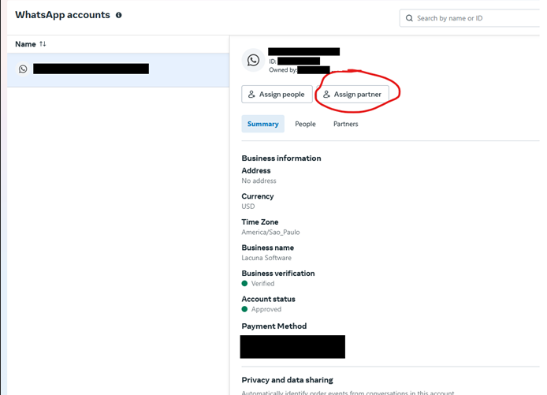
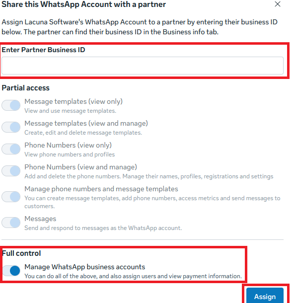

# Integração com Whatsapp

Na versão 1.56.0 foi adicionada a possibilidade de integração para enviar notificações via Whatsapp. 

Para isso, o sistema utiliza a [Whatsapp Business API](https://developers.facebook.com/docs/whatsapp) disponibilizada pela própria Meta.

Abaixo são listados os pré-requisitos desse tipo de integração:

* Ter uma [Meta Business Account](https://business.facebook.com/) verificada.

* Ter uma Whatsapp Business Account associada à Meta Business Account.

* Ter um número de telefone (celular ou fixo) verificado e associado à sua Whatsapp Business Account.

## Configuração da conta de Whatsapp

* Acesse a página de [Configurações de Negócio](https://business.facebook.com/settings) da sua Meta Business Account.

* Selecione o item `Contas` e em seguida `Contas do Whatsapp`. Clique no botão `Adicionar` para cadastrar o número que será utilizado para enviar
mensagens de Whatsapp. 

* Caso sua Business Account não esteja verificada ainda, inicie o procedimento de verificação  (pode demorar cerca de dois dias úteis).

* Após verificar sua conta e o número que será utilizado, acesse o [Gerenciador do Whatsapp](https://business.facebook.com/wa/manage/home) da conta 
de Whatsapp criada.

## Configuração de modelos de mensagens

Por exigência da Meta, todas mensagens iniciadas pela aplicação devem ser registradas previamente por meio de modelos. Caso contrário, só poderão ser
enviadas caso o usuário entre em contato previamente com seu número de whatsapp (iniciando assim uma [Conversa](https://developers.facebook.com/docs/whatsapp/conversation-types)).

Uma vez verificado seu número de Whatsapp, acesse a [Gestão de Modelos](https://business.facebook.com/wa/manage/message-templates/) para registrar os modelos
das mensagens que serão enviados pela aplicação.

Como a aplicação suporta 3 idiomas (Português, Inglês e Espanhol), cada modelo deve ter três versões: Portuguese (BR), English e Spanish.

Os modelos possuem parâmetros e, por isso, na criação, deve ser enviado um exemplo dos valores de cada um desses parâmetros. É importante que os valores sejam os mesmos
entre as versões de idiomas do mesmo modelo. 

Além disso, quaisquer URLs que forem adicionadas como exemplos de parâmetros precisam ser funcionais e coerentes com os demais parâmetros.

Os modelos serão revisados pela equipe Meta. Esse processo demora em média dois dias úteis.

Entre em contato com nosso suporte para obter a lista de modelos que devem ser cadastrados, bem como o nome e conteúdo dos templates. Você terá liberdade para mudar o
conteúdo dos modelos desde que não altere a quantidade nem a ordem dos parâmetros.

## Configuração do Parceiro de tecnologia

* Após configurada a conta e os modelos, é preciso definir a Lacuna Software como parceiro de tecnologia para que o Signer possa acessar a API da Meta.

1. Acesse o [painel de contas de Whatsapp](https://business.facebook.com/latest/settings/whatsapp_account) de sua Business Account.
1. Escolha a conta desejada e clique no botão "Associar parceiro (Assign partner)":

1. Na janela que se abre, informe o código de parceiro da Lacuna Software (solicite ao suporte) e marque a opção "Controle total (Full Control)":

1. Por fim, entre em contato com nossa equipe de suporte informando que a associação já foi realizada, para que possamos habilitar a integração.

Se você tem uma instância On-Premises, veja a seção de [Configurações de Whatsapp](https://docs.lacunasoftware.com/en-us/articles/signer/on-premises/settings.html#whatsapp-settings)
para saber como definir as configurações que habilitam a integração.