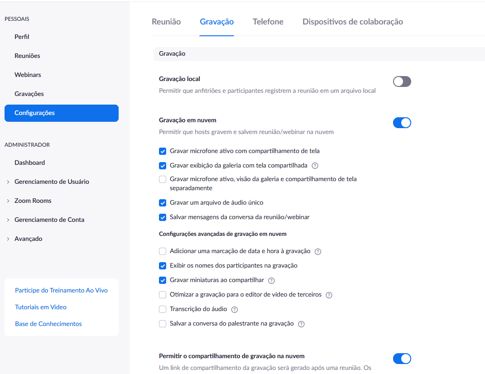
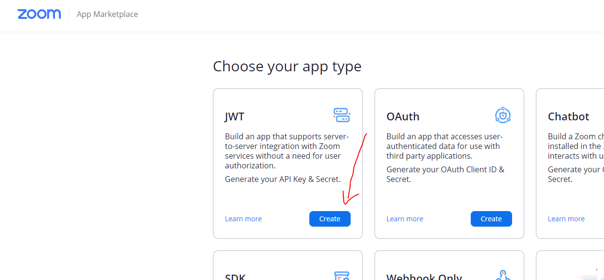
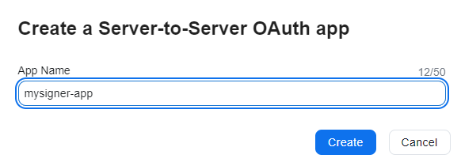
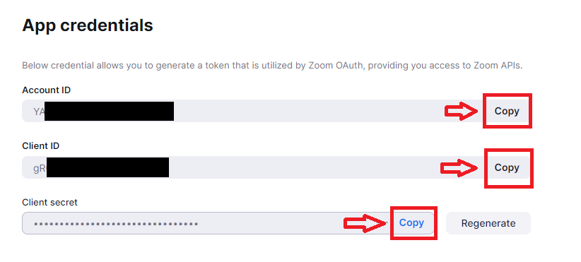
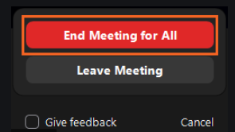

# Integração com Zoom no Signer

O Signer permite integração com [Zoom](https://zoom.us/) para realizar e armazenar video conferências relacionadas a documentos.

<a name="account-config" />
## Configuração da conta

Para esta integração é preciso de uma conta do Zoom com plano igual ou superior ao Profissional.

Além disso as configurações da conta devem permitir o recurso `Gravação em nuvem` conforme as imagens abaixo:

Nesta integração, cada usuário/licença da conta é considerado como uma sala de reunião. Quando um usuário solicita a criação
de uma conferência, o sistema lista todos os usuários e tenta encontrar um que não esteja em uma conferência no momento. Por
isso, caso deseje realizar conferências simultâneas é importante ter mais de um usuário/licença.

> [!TIP]
> Ao configurar os usuários da conta, não esqueça de atribuir-lhes a licença, caso contrário conferências realizadas
> com aquele usuário não salvarão o vídeo na nuvem.

<a name="credentials" />
## Obtenção de credenciais

Para habilitar a integração no assinador é preciso obter uma credencial JWT que permite que o Assinador chame as APIs do Zoom.
Para isso siga o procedimento abaixo:

1. Após fazer o login na sua conta, acesse [https://marketplace.zoom.us/](https://marketplace.zoom.us/)
1. Selecione a opção `Develop an App` no canto superior direito da tela
1. Selecione a opção `JWT App`:

1. Dê um nome para seu aplicativo (pode ser o mesmo nome de sua instância do Assinador)

1. Informe as informações básicas e as de contato do desenvolvedor
1. Selecione o painel `App Credentials`
1. Por fim, defina o tempo de expiração para um longo período e copie o token JWT:

<a name="operation" />
## Funcionamento

Para criar uma conferência, acesse a tela de detalhes de um documento e clique no botão iniciar conferência:

> [!NOTE]
> Somente o criador do documento (para conta pessoal) ou alguém com permissão de gerente ou administrador (para conta de organização)
> pode realizar essa ação.

Em seguida, serão exibidos dois links: o primeiro para acessar como o anfitrião (host) da conferência e outro para enviar/compartilhar 
com os participantes:

No Zoom, ao final da conferência use a opção `End Meeting for All`:

Uma vez encerrada a reunião, o vídeo da reunião aparecerá na tela de detalhes do documento: 

> [!NOTE]
> O tempo para aparecer varia em função do tamanho da reunião, para reuniões pequenas demora cerca de 15 a 20 minutos. 
> Para reuniões grandes pode demorar até 24 horas.
